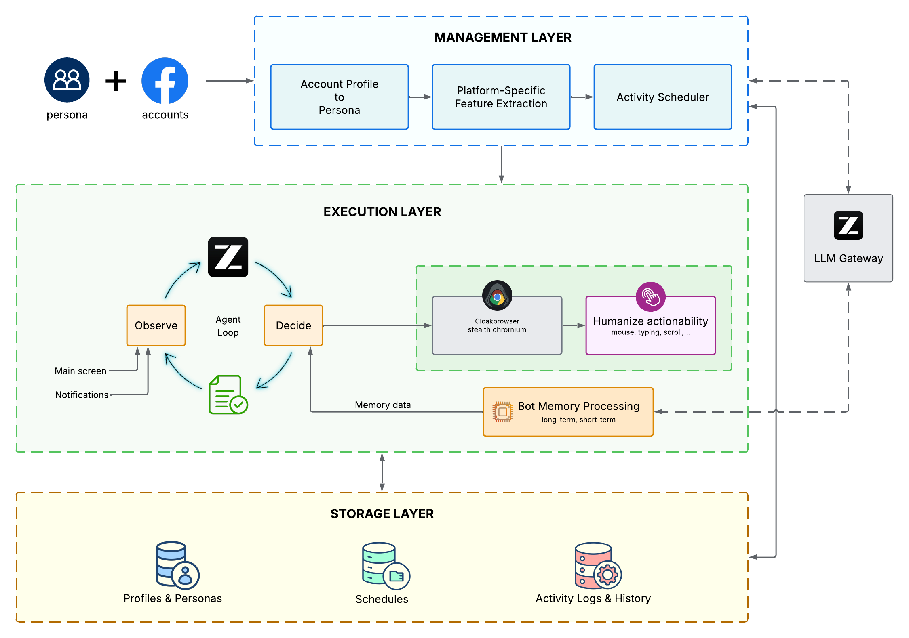
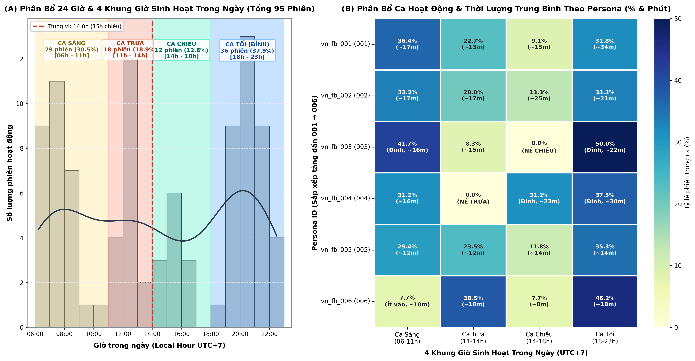
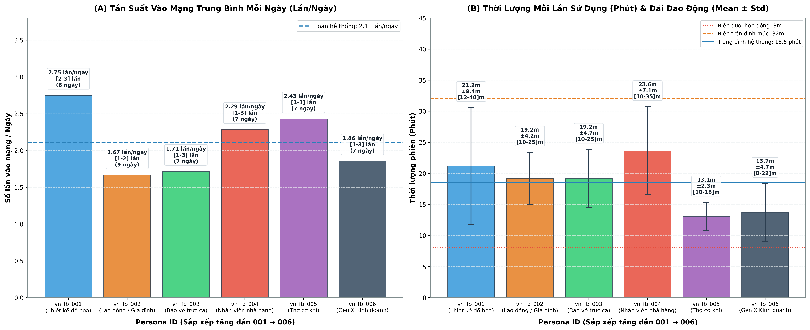
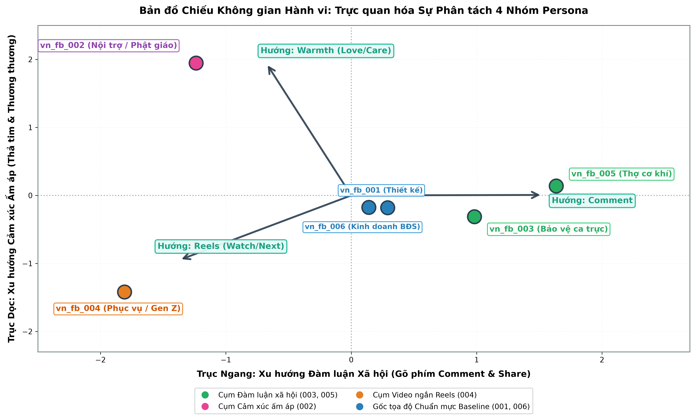
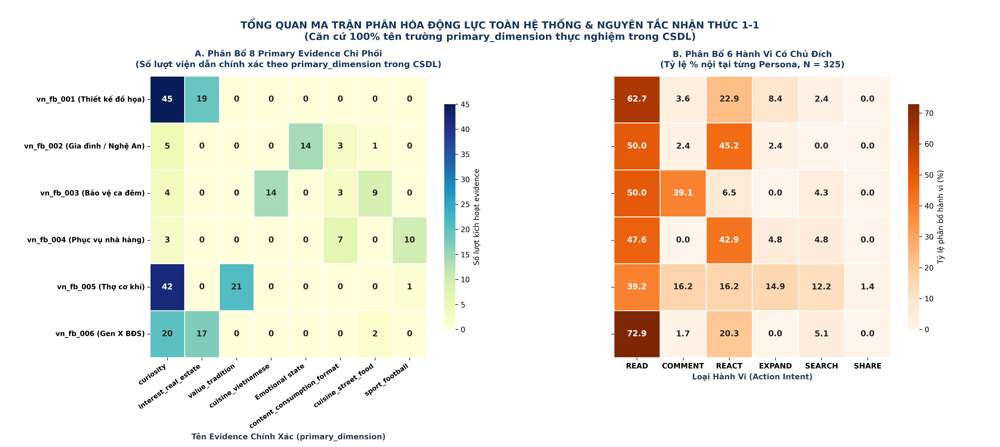
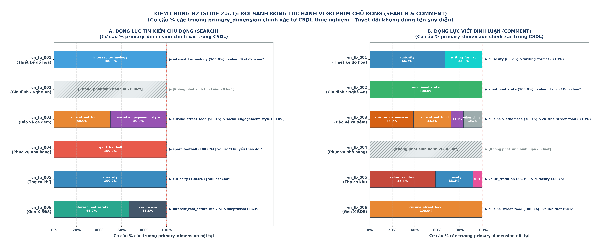
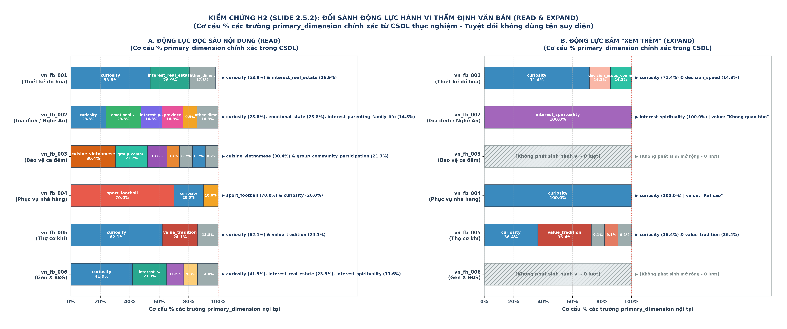
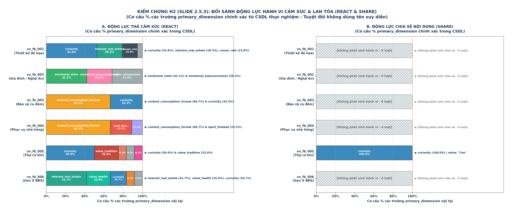
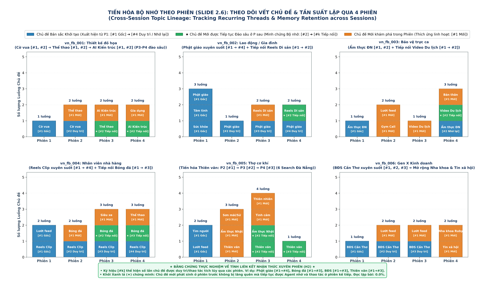
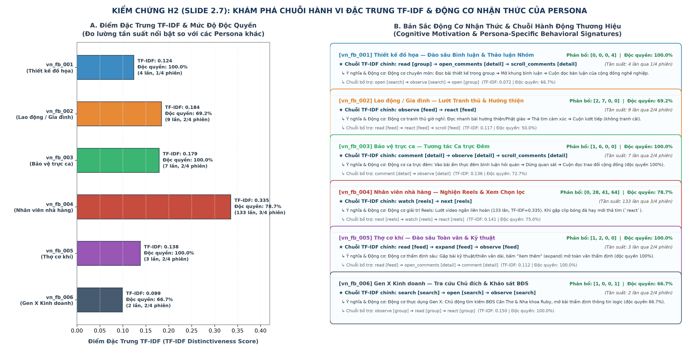

# SLIDE DECK BÁO CÁO NỘI BỘ: KIỂM CHỨNG TÍNH NHẤT QUÁN 6 PERSONA AGENTS TRÊN FACEBOOK

> **Tài liệu trình bày nội bộ nhóm**  
> **Cấu trúc mỗi trang gồm 2 phần đồng nhất:**  
> 1. **Nội dung hiển thị trên Slide:** Hình ảnh trực quan, tiêu đề, số liệu và gạch đầu dòng ngắn gọn, gãy ý.  
> 3. **Thông tin chi tiết & Chuẩn bị Q&A:** Dữ liệu nền, giải thích kỹ thuật và các câu hỏi phản biện dự trù để tự tin trao đổi cùng nhóm.

---

## MỤC LỤC CÁC SLIDE TRÌNH BÀY

* **PHẦN MỞ ĐẦU: ĐẶT BÀI TOÁN & BỘ DỮ LIỆU**
  * [Slide 0: Khung Thử nghiệm 6 Persona Agents](#-slide-0-khung-thử-nghiệm-6-persona-agents)
* **PHẦN 1: TẦNG VẬN HÀNH ($H_1$ - LỊCH TRÌNH & THỜI LƯỢNG)**
  * [Slide 1.1: Phân bổ 4 Khung giờ Sinh hoạt 24h](#-slide-11-phân-bổ-4-khung-giờ-sinh-hoạt-24h)
  * [Slide 1.2: Tần suất Online & Thời lượng Phiên](#-slide-12-tần-suất-online--thời-lượng-phiên)
* **PHẦN 2: TẦNG HÀNH VI & NHẬN THỨC ($H_2$ - TÍNH NHẤT QUÁN VỚI HỒ SƠ)**
  * [Slide 2.1: Phân bổ Bề mặt Giao diện (Surface)](#-slide-21-phân-bổ-bề-mặt-giao-diện-surface)
  * [Slide 2.2.1: Bảng Phân bổ Hành động & Cường độ Tương tác (AER)](#-slide-221-bảng-phân-bổ-hành-động--cường-độ-tương-tác-aer)
  * [Slide 2.2.2: Bản đồ Không gian Hành vi — Phân tách Tự nhiên 4 Cụm Persona](#-slide-222-bản-đồ-không-gian-hành-vi--phân-tách-tự-nhiên-4-cụm-persona)
  * [Slide 2.2.3: Đối sánh Tính Nhất quán Hồ sơ & Thận trọng Phương pháp luận](#-slide-223-đối-sánh-tính-nhất-quán-hồ-sơ--thận-trọng-phương-pháp-luận)
  * [Slide 2.3: Lướt nhanh (Scanning) vs Đọc sâu (Deep Reading)](#-slide-23-lướt-nhanh-scanning-vs-đọc-sâu-deep-reading)
  * [Slide 2.4: Động lực học Cuộn trang (Scroll Dynamics)](#-slide-24-động-lực-học-cuộn-trang-scroll-dynamics)
  * [Slide 2.5: Ma trận Động lực Nhận thức Toàn hệ thống](#-slide-25-ma-trận-động-lực-nhận-thức-toàn-hệ-thống)
  * [Slide 2.5.1: Đối sánh Hành vi Gõ phím (Search & Comment)](#-slide-251-đối-sánh-hành-vi-gõ-phím-search--comment)
  * [Slide 2.5.2: Đối sánh Thẩm định Văn bản (Read & Expand)](#-slide-252-đối-sánh-thẩm-định-văn-bản-read--expand)
  * [Slide 2.5.3: Đối sánh Hành vi Cảm xúc & Lan tỏa (React & Share)](#-slide-253-đối-sánh-hành-vi-cảm-xúc--lan-tỏa-react--share)
  * [Slide 2.6: Tính Liên kết Bộ nhớ Xuyên phiên (Memory Continuity)](#-slide-26-tính-liên-kết-bộ-nhớ-xuyên-phiên-memory-continuity)
  * [Slide 2.7: Chuỗi Thao tác Đặc trưng TF-IDF](#-slide-27-chuỗi-thao-tác-đặc-trưng-tf-idf)
* **PHẦN TỔNG KẾT: ĐÁNH GIÁ & HƯỚNG ỨNG DỤNG**
  * [Slide 3.0: Tổng kết Kiểm chứng $H_1 - H_2$ & Ứng dụng Thực tế](#-slide-30-tổng-kết-kiểm-chứng-h_1---h_2--ứng-dụng-thực-tế)

---

## 🖥️ SLIDE 0: KHUNG THỬ NGHIỆM 6 PERSONA AGENTS

### 1. Nội dung hiển thị trên Slide

* **Chủ đề:** Khảo sát hành vi của 6 Autonomous Persona Agents trên môi trường Facebook thực tế.
* **Mục tiêu đánh giá:**
  * **Tầng 1 ($H_1$):** Lịch trình sinh hoạt — Vào mạng đúng giờ, đúng nhịp sinh học và đặc thù công việc.
  * **Tầng 2 ($H_2$):** Hành vi & nhận thức — Lướt, đọc, tương tác nhất quán với hồ sơ nhân vật.
* **Quy mô dữ liệu thử nghiệm:**
  * **24 phiên chạy thực tế** trên trình duyệt, trải đều **95 khung giờ (daily windows)**.
  * **1,611 hành động (actions)** được ghi nhận kèm chuỗi suy luận (Chain-of-Thought).
* **6 Persona đại diện:**
  * `001`: Thiết kế đồ họa (Nữ, 26t, HCM) — Tư duy logic, cờ vua, kiến trúc AI.
  * `002`: Lao động tự do (Nữ, 42t, Nghệ An) — Gia đình, tâm linh Phật giáo, tình cảm.
  * `003`: Bảo vệ trực ca (Nam, 28t, Đà Nẵng) — Trực đêm, ẩm thực đường phố, thích bình luận.
  * `004`: Phục vụ nhà hàng (Nam, 22t, HCM) — Lệch ca, thích Reels video ngắn và bóng đá.
  * `005`: Thợ cơ khí (Nam, 31t, Đà Nẵng) — Khoa học kỹ thuật, thiên văn, tri ân lịch sử.
  * `006`: Kinh doanh BĐS (Nam, 52t, Cần Thơ) — Gen X thận trọng, khảo sát giá nhà đất, tin sức khỏe.

### 2. Lời thoại người nói (Speaker Script)
> *"Hôm nay em xin báo cáo kết quả thử nghiệm 6 Persona Agent tự động sử dụng Facebook thực tế.
> 
> Mục tiêu cốt lõi của đợt thử nghiệm này là kiểm tra xem: Khi để Agent chạy tự do trên Facebook thật, hành vi của chúng có giữ được tính nhất quán với hồ sơ nhân vật hay không, hay lại hành xử như bot spam ngẫu nhiên?
> 
> Bọn em chia bài toán thành 2 tầng kiểm chứng:
> - Tầng 1 ($H_1$): Kiểm tra nhịp sinh hoạt — xem giờ giấc online và thời lượng phiên có khớp với đời thực của từng ngành nghề không.
> - Tầng 2 ($H_2$): Kiểm tra hành vi khi trên mạng xã hội — từ việc chọn xem gì, cuộn nhanh hay chậm, đến lý do tại sao lại bấm like hay bình luận.
> 
> Đợt này nhóm chạy được 24 phiên hoàn chỉnh, ghi nhận 95 lượt kịch bản được lên lịch và hơn 1,600 hành động có đầy đủ nhật ký suy luận. Sau đây em xin đi vào chi tiết tầng vận hành lịch trình ở Slide 1.1."*

---

## 🖥️ SLIDE 1.1: PHÂN BỔ 4 KHUNG GIỜ SINH HOẠT 24H

### 1. Nội dung hiển thị trên Slide

* **Phân bổ theo ca toàn hệ thống ($N = 95$ phiên):**
  * 🌙 **Ca Tối (18h–23h):** 36 phiên (37.9%) — Khung giờ online nhiều nhất.
  * 🌅 **Ca Sáng (06h–11h):** 29 phiên (30.5%) — Bắt đầu ngày mới, cập nhật tin tức.
  * ☀️ **Ca Trưa (11h–14h):** 18 phiên (18.9%) — Nghỉ giữa ca.
  * ☕ **Ca Chiều (14h–18h):** 12 phiên (12.6%) — Giờ làm việc tập trung, ít online nhất.
  * 💤 **Đêm muộn (23h–06h):** 0 phiên (0.0%) — Nghỉ ngơi tự nhiên, không chạy xuyên đêm.
* **Phân hóa rõ rệt theo tính chất công việc:**
  * `004` (Phục vụ nhà hàng): **0.0% ca trưa** (cao điểm phục vụ khách); dồn vào xế chiều (31.2%) và tối (37.5%).
  * `003` (Bảo vệ ca trực): **0.0% ca chiều**; tập trung sáng sớm (41.7%) và tối/đêm (50.0%).
  * `006` (Kinh doanh BĐS): **Chỉ 7.7% ca sáng**; chủ yếu online giờ nghỉ trưa (38.5%) và tối (46.2%).
  * `001`, `002`, `005`: Lịch trình rải đều theo các khung nghỉ ngơi thông thường.

### 2. Lời thoại người nói (Speaker Script)
> *"Ở Slide 1.1, nhìn vào biểu đồ Panel A các anh chị sẽ thấy lịch online của Agent tập trung chính vào ca tối (gần 38%) và ca sáng sớm (hơn 30%), trong khi khung 23h đêm đến 6h sáng hoàn toàn không chạy, phản ánh đúng nhịp sinh học nghỉ ngơi thông thường.

> Điểm ấn tượng nhất là ở Panel B: Sự phân bổ giờ vào mạng của 6 Persona được điều hướng mượt mà bởi 2 nhóm thuộc tính cốt lõi trong hồ sơ: Đặc thù công việc (career_role, work_arrangement) và Ràng buộc đời sống (children, generational_cohort), chia thành 2 nhóm rất rõ nét:

> Nhóm 1: Bị bó buộc chặt bởi ca kíp On-site trực tiếp (004 & 003):
Cậu nhân viên nhà hàng 004 (Lĩnh vực: Dịch vụ ăn uống, Hình thức: On-site): Ca trưa 11h–14h đạt đúng 0.0% phiên vì đây là cao điểm bưng bê phục vụ khách; thời gian online được dồn sang xế chiều khi quán vắng khách (31.2%) và tối muộn (37.5%).
Anh bảo vệ 003 (Lĩnh vực: Bảo vệ, Hình thức: On-site): Hoàn toàn vắng bóng ở ca chiều (0.0%), nhưng tập trung tới 50% vào ca tối và hơn 41% vào sáng sớm khi bắt đầu hoặc bàn giao ca trực.
Nhóm 2: Linh hoạt thời gian hoặc có ràng buộc gia đình, lứa tuổi (001, 002, 005, 006):
Bạn thiết kế 001 (Thiết kế đồ họa, Hình thức: Hybrid) làm việc máy tính linh hoạt nên lịch online rải đều qua các cữ nghỉ sáng - trưa - tối.
Chị lao động 002 có thuộc tính "Số con" là "Từ 3 con trở lên" nên thời gian ban ngày bị phân mảnh bởi việc nhà và chăm sóc con cái, chỉ tranh thủ vào mạng ở các cữ ngắn.
Bác kinh doanh 006 thuộc thế hệ "Gen X (55-64 tuổi)" với phong thái điềm đạm, sáng sớm lo công việc đời thường nên online rất ít (chỉ 7.7%), chủ yếu tập trung vào giờ nghỉ trưa (38.5%) và buổi tối (46.2%).
Nhờ gắn chặt với các trường nghề nghiệp và hoàn cảnh sống, nhịp sinh hoạt của từng Agent hiện lên rất chân thực và có căn cứ rõ ràng."*

---

## 🖥️ SLIDE 1.2: TẦN SUẤT ONLINE & THỜI LƯỢNG PHIÊN

### 1. Nội dung hiển thị trên Slide

* **Tần suất online mỗi ngày (`daily_windows`):**
  * Trung bình hệ thống: **2.11 lần/ngày** (biên độ từ 1 đến 3 lần).
  * Cao nhất: `001` (Thiết kế đồ họa) đạt **2.75 lần/ngày** — làm việc máy tính linh hoạt.
  * Thấp nhất: `002` (Nội trợ/Gia đình) đạt **1.67 lần/ngày** & `003` (Bảo vệ) đạt **1.71 lần/ngày** — bị gò bó bởi việc nhà và ca trực.
* **Thời lượng mỗi phiên (`duration_min`):**
  * Trung bình hệ thống: **18.7 phút/phiên** (nằm trong khoảng lướt mạng thông thường 10–30 phút).
  * Dài nhất: `004` (Nhân viên quán / mê Reels) đạt **23.6 ± 7.1 phút** — xu hướng xem video ngắn liên tục.
  * Ngắn & đều nhất: `005` (Thợ cơ khí) đạt **13.1 ± 2.3 phút** — tác phong nhanh gọn.
* **Cơ chế kết thúc phiên:**
* **Kết luận Tầng 1 ($H_1$):** Lịch trình và thời lượng vận hành phù hợp với kịch bản đời thực đặt ra.

### 2. Lời thoại người nói (Speaker Script)
> *"Tiếp theo ở Slide 1.2, chúng ta xem xét hai chỉ số vận hành quan trọng: một ngày vào mạng mấy lần (`daily_windows`) và mỗi lần lướt bao lâu (`duration_min`). Hai chỉ số này được chi phối trực tiếp bởi 2 nhóm thuộc tính: **Mức độ linh hoạt công việc & kỹ năng số** (`work_arrangement`, `tech_savviness`) cùng **Khẩu vị tiêu thụ nội dung** (`media_diet`, `streaming_hours_per_week`):
> 
> - **Về Tần suất vào mạng (Panel A - bình quân 2.11 lần/ngày):**
>   + Bạn thiết kế `001` có tần suất online cao nhất (2.75 lần/ngày) -- hoàn toàn phù hợp với thuộc tính "Hình thức làm việc hiện tại" là "Hybrid" và "Độ am hiểu và kỹ năng sử dụng thiết bị số và ứng dụng mạng." là "Rất quen thuộc", làm việc thường xuyên trên máy tính nên dễ dàng tranh thủ vào mạng.
>   + Ngược lại, chị nội trợ `002` (1.67 lần/ngày) và anh bảo vệ `003` (1.71 lần/ngày) có tần suất thấp nhất hệ thống -- do bị ràng buộc bởi công việc lao động chân tay, việc nhà con cái ("Từ 3 con trở lên") và tâm lý "Ngại sử dụng" thiết bị số của `003`.
> 
> - **Về Thời lượng mỗi phiên (Panel B - bình quân 18.7 phút):**
>   + Cậu phục vụ `004` có thời lượng phiên dài nhất (23.6 ± 7.1 phút) -- khớp hoàn toàn với thuộc tính "Loại hình nội dung yêu thích nhất" là "Video ngắn" và mức tiêu thụ video cao ("16-30 giờ/tuần"), rất dễ bị cuốn theo luồng gợi ý liên hoàn của Reels.
>   + Trong khi đó, anh thợ cơ khí `005` có thời lượng ngắn và kỷ luật nhất (13.1 ± 2.3 phút) -- nhất quán với thuộc tính "Tổng thời gian xem phim, video và livestream hàng tuần." ở mức rất thấp (chỉ "3-7 giờ/tuần") và tác phong "Quyết định nhanh", lướt nhanh đúng mục tiêu kỹ thuật rồi dừng.
> 
> Như vậy, ở Tầng 1, các Agent đã thể hiện được việc sử dụng mạng xã hội có chừng mực và đúng thói quen đời thường, phù hợp với đặc điểm hồ sơ persona."*

### 3. Thông tin chi tiết & Chuẩn bị Q&A
* **Dữ liệu nền & Bối cảnh kỹ thuật:**
  * Phân phối thời lượng: Phần lớn nằm trong khoảng 10–30 phút, phản ánh đúng dữ liệu hành vi lướt mạng xã hội ở Việt Nam.
* **Dự phòng câu hỏi thảo luận:**
  * *Hỏi: Tại sao độ lệch chuẩn thời lượng của `004` lại cao hơn hẳn các persona khác (±7.1 phút)?*  
    *Đáp:* Vì `004` phụ thuộc vào bảng tin Reels. Nếu gặp chuỗi video bóng đá đúng sở thích, agent tiếp tục xem; nếu gặp chuỗi video không đúng gu, agent sẽ dừng phiên sớm hơn.
---

## 🖥️ SLIDE 2.2.1: BẢNG PHÂN BỔ HÀNH ĐỘNG & CƯỜNG ĐỘ TƯƠNG TÁC (AER)

### 1. Nội dung hiển thị trên Slide

* **Bảng Phân bổ Tỷ lệ Hành vi của 6 Persona Agents (% trên tổng hành vi mỗi người):**

| Nhóm Hành động Ghi nhận | 001  (Thiết kế) | 002  (Nội trợ) | 003  (Bảo vệ) | 004  (Phục vụ) | 005  (Cơ khí) | 006  (Kinh doanh) |
| :--- | :---: | :---: | :---: | :---: | :---: | :---: |
| 💬 **Bình luận (Comment)** | 1.0% | 0.5% | **4.9%** | 0.0% | **5.7%** | 0.5% |
| 🔄 **Chia sẻ (Share)** | 0.0% | 0.0% | 0.0% | 0.0% | **0.5%** | 0.0% |
| ❤️ **Thả tim / Thương thương (Love, Care)** | 0.0% | **3.8%** | 0.3% | 0.0% | 0.5% | 0.0% |
| 👍 **Bấm Thích (Like)** | 6.4% | 6.5% | 0.3% | 1.7% | 2.8% | 5.3% |
| 😄 **Cảm xúc khác (Haha, Wow, Sad, Angry)** | 0.0% | 0.0% | 0.3% | 0.5% | 2.4% | 0.5% |
| 📖 **Đọc sâu bài viết (Read & Expand)** | **19.7%** | 12.0% | 6.3% | 2.7% | **18.9%** | **20.9%** |
| 🎬 **Lướt & Xem Video (Reels: Watch/Next)** | 0.3% | 25.5% | 22.1% | **84.5%** | 0.0% | 0.0% |
| 📜 **Cuộn trang Newsfeed (Scroll)** | **33.1%** | 21.7% | **35.7%** | 1.9% | **31.1%** | **33.5%** |
| 👀 **Quan sát & Đọc lướt (Observe)** | 15.4% | 14.7% | 16.6% | 5.3% | 12.3% | 21.8% |
| 🔍 **Tìm kiếm chủ động (Search)** | 1.0% | 0.0% | 0.5% | 0.2% | **4.7%** | 1.9% |
| 🧭 **Điều hướng khác (Mở / Đóng tab & popup)** | 23.1% | 15.2% | 13.1% | 3.2% | 21.2% | 15.5% |
| **Tổng số hành vi ghi nhận ($N = 100\%$)** | **299** | **184** | **367** | **412** | **212** | **206** |
| 🎯 **Tỷ lệ Tương tác Chủ động (AER)** | **7.4%** | **10.9%** | **5.7%** | **2.2%** | **11.8%** | **8.8%** |

* **Đặc trưng phân hóa cốt lõi nhận diện từ bảng:**
  * 🎬 **Cậu phục vụ Gen Z (`004`):** Thao tác Reels áp đảo tới **84.5%**, hầu như không cuộn Feed (1.9%) và **0.0% comment** $\rightarrow$ AER thấp nhất hệ thống (**2.2%**).
  * 💬 **Bộ đôi Đàm luận (`005` & `003`):** Tỷ lệ gõ comment cao gấp 5–10 lần phần còn lại (**5.7%** và **4.9%**); `005` là người duy nhất bấm **Share** và tích cực gõ **Search** (**4.7%**) $\rightarrow$ Đạt đỉnh AER (**11.8%**).
  * ❤️ **Chị nội trợ gia đình (`002`):** Chiếm trọn cảm xúc ấm áp Love/Care (**3.8%** hành vi bản thân, gom 77.8% toàn bộ) $\rightarrow$ AER cao thứ nhì (**10.9%**).
  * 🏠 **Nhóm Chuẩn mực Baseline (`001` & `006`):** Tỷ lệ đọc sâu (**19.7%–20.9%**), cuộn feed (**33%–34%**), và Like lịch sự (**5%–6%**) rất cân bằng $\rightarrow$ AER ổn định mức **7.4%–8.8%**.

### 2. Lời thoại người nói (Speaker Script)
> *"Tại Slide 2.2.1, Dữ liệu phân bổ hành động của 6 Persona vào một bảng đối sánh.
> 
> Nhìn dọc theo từng cột nhân vật, sẽ thấy sự phân hóa phong cách diễn ra cực kỳ sắc nét ngay từ những nút bấm thô nhất:
> 
> - **Đầu tiên là cột của cậu phục vụ trẻ tuổi `004`:** Video Reels chiếm tới **84.5%** toàn bộ thời lượng thao tác của cậu. Cậu lướt qua hàng trăm clip, hầu như không dừng lại cuộn bài feed thông thường và hoàn toàn không bao giờ gõ bình luận (0.0%). Vì vậy, tỷ lệ tương tác chủ động AER ở mức thấp nhất, chỉ **2.2%**.
> - **Ở hai cột của anh thợ cơ khí `005` và bác bảo vệ `003`:** Chúng ta thấy tỷ lệ bình luận nhảy vọt lên **5%–6%**, gom tới 85% lượng comment của toàn mạng xã hội. Riêng anh thợ `005` còn tích cực gõ ô tìm kiếm chiếm **4.7%** và là người duy nhất bấm nút Chia sẻ bài viết, đẩy chỉ số AER lên cao nhất (11.8%).
> - **Ở cột của chị nội trợ `002`:** Đây là persona duy nhất tập trung thả tim và thương thương với tỷ lệ **3.8%**, đúng với tâm lý phụ nữ hướng về gia đình và tín ngưỡng Phật giáo giàu lòng nhân ái.
> - **Và hai cột ngoài cùng của bạn thiết kế `001` và bác kinh doanh `006`:** Tỷ lệ cuộn feed đều đặn khoảng một phần ba (33%), đọc bài chiếm 20%, bấm Like lịch sự 5%–6%. Họ giữ vai trò là nhóm người dùng phổ thông chuẩn mực.
> 
> Bảng số liệu trực quan này cho thấy hành vi của Agent đã tự động tách tầng rõ rệt, không hề có sự rập khuôn hay tương tác bừa bãi."*

### 3. Thông tin chi tiết & Chuẩn bị Q&A
* **Dữ liệu nền & Bối cảnh kỹ thuật:**
  * Công thức AER: $\text{AER} = \frac{\text{reacts} + \text{comments} + \text{shares}}{\text{bước tiếp cận bài viết}}$.
  * Chuẩn hóa phần trăm: Mỗi cột Persona cộng lại vừa vặn xấp xỉ $100\%$, phản ánh cơ cấu 'ngân sách chú ý' (attention budget) của từng nhân vật.
* **Dự phòng câu hỏi thảo luận:**
  * *Hỏi: Tại sao tỷ lệ AER của `004` lại chỉ có 2.2% trong khi tổng số hành vi ghi nhận nhiều nhất ($N = 412$)?*  
    *Đáp:* Vì hành vi chủ đạo của `004` là xem video Reels. Thuật toán Reels liên tục tải video mới khiến số lượt tiếp cận rất cao, nhưng thói quen của người trẻ khi xem Reels là xem và quẹt qua (`watch`/`next`), ngưỡng để dừng lại thả tim hay comment cao hơn rất nhiều so với đọc bài Feed thông thường.
  * *Hỏi: Bảng phân bổ này có đủ để kết luận về phong cách Agent chưa?*  
    *Đáp:* Bảng này cho thấy phân phối thô rất rõ nét. Để trực quan hóa sự tương quan đa chiều và phân nhóm không gian, chúng ta sẽ xem bản đồ ở Slide 2.2.2 ngay sau đây.*

---

## 🖥️ SLIDE 2.2.2: BẢN ĐỒ KHÔNG GIAN HÀNH VI — PHÂN TÁCH TỰ NHIÊN 4 CỤM PERSONA

### 1. Nội dung hiển thị trên Slide

* **Trực quan hóa Không gian Hành vi qua 2 Trục Cốt lõi:**
  * **Trục ngang:** Xu hướng **Đàm luận xã hội** (hướng vector `Comment` & `Share` $\rightarrow$ chủ động gõ phím, trao đổi quan điểm).
  * **Góc phần tư trên dương:** Xu hướng **Cảm xúc ấm áp** (hướng vector `Love` & `Care` $\rightarrow$ biểu đạt thấu cảm, gia đình).
  * **Góc phần tư âm:** Xu hướng **Tiêu thụ Video ngắn** (hướng vector `Watch` & `Next` $\rightarrow$ lướt Reels thụ động, ít bấm nút).
* **Trực quan nhận diện 4 Nhóm Hành vi Phân hóa Rõ rệt:**
  * 💬 **Cụm 1 — Đàm luận xã hội (`005` & `003`):** Lệch hẳn sang cực dương bên phải. Anh thợ cơ khí và bác bảo vệ là 2 nhân vật năng nổ comment và share nhất (chiếm **85.7% lượng comment toàn bộ**).
  * ❤️ **Cụm 2 — Cảm xúc ấm áp (`002`):** Nằm một mình ở góc phần tư trên-dương. Chị nội trợ 42t tập trung biểu đạt tình cảm qua thả tim và thương thương (chiếm **77.8% Love/Care toàn bộ**).
  * 🎬 **Cụm 3 — Tiêu thụ Video ngắn (`004`):** Nằm riêng biệt ở góc phần tư dưới-trái. Cậu phục vụ Gen Z lướt video ngắn áp đảo (chiếm **83.5% hành vi bản thân**), hầu như không bình luận.
  * 🏠 **Gốc tọa độ — Chuẩn mực Baseline (`001` & `006`):** Nằm sát tâm $(0, 0)$. Bạn thiết kế đồ họa và bác kinh doanh BĐS giữ phong cách lướt đọc Feed và bấm Like lịch sự, đóng vai trò mốc chuẩn mực.
* **Nhận định then chốt:** Bản đồ hành vi thô phân tách 6 Agent thành 4 phong cách tương tác trên mạng xã hội, khẳng định các Agent không bị đồng hóa thành những con bot có hành vi giống hệt nhau.

### 2. Lời thoại người nói (Speaker Script)
> *"Sang Slide 2.2.2, nhóm muốn cùng các anh chị kiểm tra một câu hỏi rất thực tế: **Liệu 6 Agent này có bị hành xử rập khuôn như những con bot vô hồn hay không?**
> 
> Để trả lời, em đã trực quan hóa các hành vi tương tác cốt lõi lên một bản đồ không gian 2 trục qua phương pháp pca. Các mũi tên màu xanh thể hiện hướng tác động của từng hành vi, còn các chấm màu là vị trí của từng nhân vật.
> 
> Nhìn trực quan lên biểu đồ, thấy ngay 4 nhóm tách biệt rất rõ ràng:
> - **Về phía bên phải (hướng mũi tên Comment):** Anh thợ cơ khí `005` và anh bảo vệ `003` tạo thành nhóm đàm luận xã hội — đây là 2 nhân vật rất chăm chỉ gõ chữ và thảo luận.
> - **Ở phía trên đỉnh (hướng mũi tên Thả tim và Thương thương):** Chị nội trợ `002` đứng riêng biệt thành một cực cảm xúc ấm áp, luôn hướng về gia đình và tôn giáo.
> - **Ở góc dưới bên trái (hướng mũi tên Video ngắn):** Cậu phục vụ trẻ `004` tách hẳn ra với thói quen lướt Reels liên tục nhưng hầu như không bao giờ bình luận.
> - **Và ngay tại tâm biểu đồ $(0, 0)$:** Bạn thiết kế `001` và bác doanh nhân `006` đứng sát nhau, đại diện cho phong cách lướt đọc tin tức và bấm Like lịch sự chuẩn mực.
> 
> Biểu đồ trực quan này chứng minh rằng: chỉ từ những tương tác rất tự nhiên, các Agent đã tự động rẽ nhánh thành 4 phong cách sống độc lập, tạo tiền đề để chúng ta đối sánh sâu với hồ sơ ở slide tiếp theo."*

### 3. Thông tin chi tiết & Chuẩn bị Q&A
* **Dữ liệu nền & Bối cảnh kỹ thuật:**
  * Bảng tọa độ phân bố 6 Persona trên không gian hành vi:
    * `001` (Thiết kế): $X = +0.29,\ Y = -0.18$ (sát tâm mốc chuẩn).
    * `002` (Nội trợ): $X = -1.24,\ Y = +1.95$ (cực ấm áp).
    * `003` (Bảo vệ): $X = +0.98,\ Y = -0.31$ (cực đàm luận).
    * `004` (Phục vụ): $X = -1.81,\ Y = -1.42$ (cực Reels).
    * `005` (Cơ khí): $X = +1.63,\ Y = +0.14$ (cực đàm luận).
    * `006` (Kinh doanh): $X = +0.14,\ Y = -0.18$ (sát tâm mốc chuẩn).
* **Dự phòng câu hỏi thảo luận:**
  * *Hỏi: Tại sao không dùng thuật toán gom cụm như K-Means mà đã chia thành 4 nhóm?*  
    *Đáp:* Với cỡ mẫu thử nghiệm $N=6$, chạy thuật toán gom cụm hình thức sẽ mang tính khiên cưỡng. Trực quan hóa lên biểu đồ cho thấy khoảng cách giữa các nhóm tách biệt rất xa và bám sát các vector hành vi trực quan, người xem nhìn vào là nhận diện được ngay 4 mẫu hình phong cách.
  * *Hỏi: Vị trí gốc tọa độ $(0, 0)$ có ý nghĩa gì trên bản đồ?*  
    *Đáp:* Gốc tọa độ là tâm trung bình của toàn bộ tập dữ liệu. `001` và `006` nằm sát tâm nghĩa là họ không thiên lệch cực đoan về một hành vi đặc thù nào (không nghiện cmt, không nghiện reels, không chỉ thả tim), mà phân phối hành vi của họ mang tính phổ quát và cân bằng nhất.

---

## 🖥️ SLIDE 2.2.3: ĐỐI SÁNH TÍNH NHẤT QUÁN HỒ SƠ & THẬN TRỌNG PHƯƠNG PHÁP LUẬN

### 1. Nội dung hiển thị trên Slide
* **Phân tách 4 Nhóm từ Không gian PCA 3 Chiều:**
  * 🏠 **Nhóm Gốc tọa độ $(0, 0)$ (`001`, `006`):** Tọa độ sát tâm, phân phối hành vi gần với mức trung bình chung (Đọc Feed + Bấm Like) $\rightarrow$ Đóng vai trò **Mốc đối chứng (Baseline)**, không cần so sánh đối đầu.
  * 🎯 **3 Cụm Phân hóa Lệch tâm:** Tiến hành so sánh tương phản **Mỗi cụm với Phần còn lại (One-vs-Rest)** để kiểm tra tính nhất quán với hồ sơ:

* **Bảng So sánh Tương phản 3 Cụm vs Phần còn lại:**

| Cụm Persona Mục tiêu | Phân phối Hành động Khác biệt  *(Cụm mục tiêu vs Phần còn lại)* | Trường Persona Quyết định Sự khác biệt  *(Trích xuất từ Hồ sơ JSONL)* |
| :--- | :--- | :--- |
| **🎬 Cụm Video ngắn**  `vn_fb_004`  *(Nhân viên quán, 22t)* | • **Reels:** **83.5%** actions (344 lượt) vs **9.9%** (125 lượt ở 5 người khác).  • **Comment:** **0.0%** (0 lượt) vs **2.8%** (35 lượt ở phần còn lại).  $\rightarrow$ Chiếm **73.3%** tổng hành vi Reels toàn bộ. | • *"Loại hình nội dung yêu thích nhất"*: **Video ngắn**.  • *"Cách thường tham gia và tương tác"*: **Tàu ngầm (Chỉ xem và like, không post không cmt)**.  • Độ tuổi 22 (Gen Z), làm việc ca kíp mệt mỏi cần giải trí thụ động nhanh. |
| **💬 Cụm Đàm luận**  `vn_fb_003` & `005`  *(Bảo vệ & Thợ cơ khí)* | • **Comment:** **30 lượt** (5.2% actions) vs **5 lượt** (0.5% actions ở 4 người khác).  $\rightarrow$ Gom tới **85.7% lượng comment toàn mạng** (30/35 lượt).  • `005` là **persona duy nhất bấm Share bài viết** toàn bộ. | • `003`: *"Cách thường tham gia"*: **Chiến thần bình luận dạo (Tương tác tích cực các post)** (trực ca đêm cần giao lưu, hỏi quán xá).  • `005`: *"Cách thường tham gia"*: **Người thích chia sẻ (Thường share bài, clip hay)** & xử lý dựa trên logic/dữ liệu (đàm luận kỹ thuật, share bài thiên văn). |
| **❤️ Cụm Cảm xúc ấm áp**  `vn_fb_002`  *(Nội trợ / Gia đình, 42t)* | • **Love + Care:** **7 lượt** (3.8% actions) vs **2 lượt** (0.1% actions ở 5 người khác).  $\rightarrow$ Gom tới **77.8% cảm xúc ấm áp toàn bộ** (7/9 lượt).  • 3 persona (`001, 004, 006`) hoàn toàn bằng **0 lượt**. | • *"Tín ngưỡng tôn giáo"*: **Phật giáo**.  • *"Tâm trạng nổi bật tại thời điểm tương tác"*: **Lo âu / Bồn chồn** (dùng Phật giáo và tình cảm gia đình làm điểm tựa tinh thần, giàu lòng trắc ẩn và thấu cảm). |

* **Lưu ý Thận trọng về Phương pháp luận (Methodological Caveats):**
  * **Cỡ mẫu thử nghiệm nhỏ ($N = 6$ Persona):** Phân tích mang tính chất **EDA khám phá sơ bộ (Exploratory Data Analysis)** để xác nhận vòng lặp Agent có tự động rẽ nhánh hành vi theo hồ sơ hay không, **chưa đủ cơ sở suy diễn thống kê để khái quát hóa toàn bộ quần thể người dùng**.
  * **Kế hoạch mở rộng:** Cần mở rộng quy mô ($N = 30 - 50$ Persona) và theo dõi qua nhiều tuần để kiểm tra tính bền vững của các cụm hành vi.

### 2. Lời thoại người nói (Speaker Script)
> *"Tại Slide 2.2.3, sau khi chạy PCA, chúng ta thấy dữ liệu tự nhiên tách thành 4 nhóm rất rõ nét.
> 
> Trong đó, nhóm nằm sát gốc tọa độ là bạn thiết kế `001` và bác `006`: phân phối hành vi của họ gần như trùng với mức trung bình chung — chủ yếu lướt đọc Feed và bấm Like lịch sự — nên chúng em giữ làm mốc đối chứng (Baseline).
> 
> Với 3 cụm lệch tâm còn lại, nhóm tiến hành so sánh đối chiếu từng cụm với phần còn lại của mạng xã hội để tìm nguyên nhân gốc rễ:
> 
> - **Thứ nhất, cậu phục vụ `004` so với 5 người còn lại:** Cậu dồn tới 83.5% hành động cho Reels video ngắn (trong khi 5 người kia bình quân chưa tới 10%), và comment đúng bằng 0%. Sự khác biệt một trời một vực này bắt nguồn từ đúng 2 trường thuộc tính: 'Nội dung thích nhất là Video ngắn' và thói quen 'Tàu ngầm Gen Z'.
> 
> - **Thứ hai, cặp đôi anh bảo vệ `003` và anh thợ `005` so với 4 người còn lại:** Hai anh gom tới gần 86% toàn bộ comment của hệ thống (30 trên 35 lượt bình luận), trong khi 4 người kia cộng lại chỉ được 5 comment lẻ tẻ. Nguyên nhân là hồ sơ của anh `003` ghi rõ 'chiến thần bình luận dạo' để giao lưu ca đêm, còn anh `005` là 'người thích chia sẻ kiến thức' và cũng là người duy nhất bấm Share bài thiên văn.
> 
> - **Thứ ba, chị nội trợ `002` so với phần còn lại:** Chị nắm gần 78% cảm xúc ấm áp (thả tim và thương thương), trong khi 3 người khác hoàn toàn bằng 0. Điều này xuất phát từ thuộc tính 'Phật giáo' và 'Tâm trạng lo âu cần điểm tựa gia đình', dùng mạng xã hội để lan tỏa sự đồng cảm.
> 
> Dù vậy,có lưu ý: Đây là bước EDA khám phá trên mẫu nhỏ 6 Persona để xác nhận tính nhất quán của kiến trúc Agent, chưa phải kết luận quy luật tổng quát."*

### 3. Thông tin chi tiết & Chuẩn bị Q&A
* **Dữ liệu nền & Bối cảnh kỹ thuật:**
  * Tọa độ PCA gốc: `001` (+0.29, -0.18) và `006` (+0.14, -0.18) có khoảng cách Euclidean tới gốc tọa độ $(0, 0)$ nhỏ nhất ($d < 0.35$). Trong khi `004` ($d = 2.30$), `002` ($d = 2.31$), `005` ($d = 1.64$) nằm ở khoảng cách rất xa, xác nhận sự lệch tâm có ý nghĩa toán học.
* **Dự phòng câu hỏi thảo luận:**
  * *Hỏi: Tại sao nhóm gần gốc tọa độ lại không đem ra so sánh One-vs-Rest?*  
    *Đáp:* Trong phân tích PCA, điểm nằm gần gốc $(0, 0)$ mang giá trị biến thiên gần bằng 0 trên các trục thành phần chính, tức là hành vi của họ phản ánh hành vi trung bình của cả tập mẫu (lướt đọc Feed và bấm Like phổ thông). Việc dùng họ làm mốc chuẩn mực (Baseline) giúp làm nổi bật độ lệch đặc thù của 3 cụm còn lại mà không làm loãng thông tin.
  * *Hỏi: Các trường thuộc tính Persona này có bị 'gài' trực tiếp vào code hành động không?*  
    *Đáp:* Hoàn toàn không. Toàn bộ hồ sơ được đưa vào dạng văn bản tự nhiên (System Prompt). Agent tự suy luận qua chuỗi Chain-of-Thought dựa trên bài viết trước mắt để quyết định hành động, chứng minh năng lực hiểu và hóa thân nhân vật của mô hình ngôn ngữ.
---

## 🖥️ SLIDE 2.5: MA TRẬN ĐỘNG LỰC NHẬN THỨC TOÀN HỆ THỐNG

### 1. Nội dung hiển thị trên Slide

* **Quy mô khảo sát:** $N = 325$ hành vi tập trung cao (`read`: 178, `react`: 74, `comment`: 35, `expand`: 20, `search`: 17, `share`: 1).
* **Nguyên tắc nhận thức 1-1:** 100% quyết định tập trung đều gắn với một lý do chính (`primary_evidence`) trích xuất từ chuỗi Chain-of-Thought (CoT), kết nối trực tiếp căn tính nhân vật với hành vi.
* **Tóm tắt động lực cốt lõi theo 6 Persona:**

| Persona | Số hành vi | Top động lực nhận thức chi phối (`primary_dimension`) | Phong cách nhận thức chủ đạo |
| :--- | :---: | :--- | :--- |
| **`001`** *(Thiết kế)* | 83 | `curiosity` (54.2%), `interest_real_estate` (22.9%) | **Duy lý & Thẩm mỹ:** Đọc sâu cờ vua, công nghệ AI kiến trúc, BĐS. |
| **`002`** *(Gia đình)* | 42 | `Emotional state` (33.3%), `curiosity` (11.9%), `emotional_expressiveness` (11.9%) | **Tâm linh & Gia đình:** Cầu an tượng Phật bà, viện dưỡng lão, chúc phúc. |
| **`003`** *(Bảo vệ)* | 46 | `cuisine_vietnamese` (30.4%), `cuisine_street_food` (19.6%) | **Ẩm thực đường phố:** Bình luận tìm quán ăn đêm, giao lưu bình dân. |
| **`004`** *(Nhân viên)* | 21 | `sport_football` (47.6%), `content_consumption_format` (33.3%) | **Thể thao & Video ngắn:** Tương tác highlight bóng đá, giải trí nhanh. |
| **`005`** *(Thợ cơ khí)* | 74 | `curiosity` (56.8%), `value_tradition` (28.4%) | **Kỹ thuật & Lịch sử:** Đa dạng hành vi, dẫn đầu tìm kiếm và xem thêm. |
| **`006`** *(Kinh doanh)* | 59 | `curiosity` (33.9%), `interest_real_estate` (28.8%) | **Thực dụng & Thận trọng:** Tỷ lệ đọc sâu cao nhất (72.9%), khảo sát giá căn hộ. |

### 2. Lời thoại người nói (Speaker Script)
> *"Tại Slide 2.5, chúng ta đi sâu vào câu hỏi: Điều gì trong suy nghĩ đã thúc đẩy Agent dừng lại và tương tác?
> 
> Toàn bộ 325 hành vi có chủ đích đều tuân theo nguyên tắc 1-1: Mỗi hành động bắt buộc phải gắn với một căn cứ nhận thức cụ thể trong chuỗi suy luận CoT.
> 
> Khi nhìn vào bảng tổng hợp ma trận động lực:
> - Mỗi nhân vật vận hành theo một vector quan tâm độc lập:
>   + Bạn thiết kế `001` tập trung vào cờ vua logic và ứng dụng AI kiến trúc.
>   + Chị nội trợ `002` hướng về đạo hiếu gia đình và tâm linh hướng thiện.
>   + Anh bảo vệ `003` bị chi phối bởi ẩm thực và nhu cầu giao lưu bình dân.
>   + Cậu phục vụ `004` chỉ quan tâm đến bóng đá và video giải trí ngắn.
>   + Anh thợ `005` đam mê khoa học thiên văn và tri ân các dấu mốc lịch sử.
>   + Bác đầu tư `006` rất thực tế, tập trung khảo sát giá đất và thông số căn hộ.
> 
> Để làm rõ sự khác biệt này, ở 3 slide tiếp theo em xin đối sánh trực diện theo từng cặp hành vi cụ thể."*

### 3. Thông tin chi tiết & Chuẩn bị Q&A
* **Dữ liệu nền & Bối cảnh kỹ thuật:**
  * Trường trích xuất: `primary_dimension` và `primary_value` được parser tự động bóc tách từ trường JSON output của LLM trong mỗi bước quyết định.
  * Động lực phổ biến toàn mạng: `curiosity` (36.6%), `interest_real_estate` (11.1%), `value_tradition` (6.5%), `cuisine` (8.0%).
* **Dự phòng câu hỏi thảo luận:**
  * *Hỏi: Tại sao không gom 6 persona thành 2 nhóm lớn cho gọn slide?*  
    *Đáp:* Thực tế dữ liệu cho thấy mỗi persona có định hướng hành vi độc lập: dù `001`, `005`, `006` cùng có tính tò mò cao nhưng đối tượng quan tâm hoàn toàn khác nhau (thẩm mỹ, kỹ thuật, tài chính). Trình bày độc lập theo từng persona giúp giữ đúng bản sắc thực tế của dữ liệu.

---

## 🖥️ SLIDE 2.5.1: ĐỐI SÁNH HÀNH VI GÕ PHÍM (SEARCH & COMMENT)

### 1. Nội dung hiển thị trên Slide

* **`SEARCH` (Tìm kiếm chủ động — Bù đắp khoảng trống thông tin ngoài Feed):**
  * `005` (Cơ khí): **100% `curiosity`** — Chủ động tìm hiện tượng thiên văn Sao Hỏa đối lập tại Đà Nẵng.
  * `006` (BĐS): **66.7% `interest_real_estate` + 33.3% `skepticism`** — Tra cứu quy hoạch Nam Cần Thơ và giá đất Cái Răng.
  * `001` (Thiết kế): **100% `interest_technology`** — Tìm phần mềm AI dựng hình kiến trúc 3D.
  * `003` (Bảo vệ): **50% `cuisine_street_food` + 50% `social_engagement`** — Tìm quán bún trộn quanh khu vực trực đêm.
  * `004` (Nhà hàng): **100% `sport_football`** — Tìm clip highlight bóng đá khi Reels chưa gợi ý.
  * `002` (Gia đình): **0 lượt search** — Tiếp nhận thụ động nội dung có sẵn trên Newsfeed.
* **`COMMENT` (Viết bình luận — Nhu cầu kết nối & bày tỏ quan điểm):**
  * `003` (Bảo vệ): **Hơn 72% vì ẩm thực** (`cuisine_vietnamese` 38.9%, `cuisine_street_food` 33.3%) — Hỏi địa chỉ quán xá bằng ngôn ngữ thân mật đời thường.
  * `005` (Cơ khí): **58.3% `value_tradition` + 33.3% `curiosity`** — Bình luận trang nghiêm tri ân Đại tướng Võ Nguyên Giáp.
  * `001` (Thiết kế): **66.7% `curiosity` + 33.3% `writing_format`** — Góp ý chuyên môn về góc phối cảnh 3D và ánh sáng.
  * `006` (BĐS): Bình luận xưng "chú/tôi" hỏi giá bán và video thực tế căn hộ Cara River Park.
  * `002` (Gia đình): Gửi lời chúc bình an, sức khỏe (`Emotional state` 100%).
  * `004` (Nhà hàng): **0 lượt comment** — Thói quen xem lướt, không gõ chữ.

### 2. Lời thoại người nói (Speaker Script)
> *"Slide 2.5.1 đối sánh hai hành vi đòi hỏi nỗ lực nhận thức cao nhất là Tìm kiếm và Viết bình luận — nơi Agent phải trực tiếp gõ phím:
> 
> - Với Tìm kiếm (`SEARCH`): Agent tìm kiếm khi Newsfeed chưa có nội dung mong muốn. Anh thợ `005` tìm tin thiên văn địa phương; bác `006` tra quy hoạch đất đai; bạn thiết kế `001` tìm công cụ AI 3D; anh bảo vệ `003` tìm quán ăn đêm gần chỗ trực. Chị `002` không phát sinh tìm kiếm vì hài lòng với nội dung gia đình có sẵn.
> - Với Viết bình luận (`COMMENT`):
>   + Anh bảo vệ `003` chiếm phần lớn comment toàn hệ thống, chủ yếu hỏi địa chỉ quán ăn đêm với giọng văn thân mật.
>   + Anh cơ khí `005` bình luận trang trọng bày tỏ lòng biết ơn dưới các bài viết lịch sử.
>   + Bạn thiết kế `001` bình luận góp ý chuyên môn về góc phối cảnh hình ảnh.
>   + Cậu thanh niên `004` hoàn toàn không bình luận (0 lượt), đúng thói quen chỉ xem video ngắn.
> 
> Dữ liệu cho thấy khi gõ chữ, mỗi Agent đều bộc lộ văn phong và mục đích rất riêng."*

### 3. Thông tin chi tiết & Chuẩn bị Q&A
* **Dữ liệu nền & Bối cảnh kỹ thuật:**
  * Tổng số lượt: `search`: 17 lượt, `comment`: 35 lượt.
  * Ghi chú dữ liệu của `006`: Trong log thực nghiệm, một lượt comment hỏi giá căn hộ của `006` bị mô hình gắn nhãn nhầm vào trường `cuisine_street_food` do bài đăng có bối cảnh ẩm thực địa phương, nhưng nội dung bình luận thực tế vẫn là hỏi giá nhà đất.
* **Dự phòng câu hỏi thảo luận:**
  * *Hỏi: Agent tự viết nội dung comment tiếng Việt như thế nào?*  
    *Đáp:* LLM nhận nội dung bài viết và các comment trước đó, kết hợp với trường `Emotional state`, `writing_format` và hồ sơ persona để sinh ra bình luận tiếng Việt tự nhiên, phù hợp bối cảnh.

---

## 🖥️ SLIDE 2.5.2: ĐỐI SÁNH THẨM ĐỊNH VĂN BẢN (READ & EXPAND)

### 1. Nội dung hiển thị trên Slide

* **`READ` (Đọc sâu nội dung tuyển chọn — Trục tiếp nhận thông tin chính):**
  * `001` (Thiết kế): **53.8% `curiosity` + 26.9% `interest_real_estate`** — Đọc thế cờ vua hiểm, công nghệ đồ họa, căn hộ TP.HCM.
  * `006` (BĐS): **41.9% `curiosity` + 23.3% `interest_real_estate`** — Đọc kỹ giá thuê Cái Răng 8.5tr/tháng, bài viết dưỡng sinh.
  * `005` (Cơ khí): **62.1% `curiosity` + 24.1% `value_tradition`** — Đọc ký ức chiến hào Điện Biên Phủ, kiến thức vũ trụ.
  * `003` (Bảo vệ): **30.4% `cuisine_vietnamese` + 21.7% `group_community`** — Đọc công thức nấu ăn, tin tức Đà Nẵng.
  * `002` (Gia đình): **23.8% `curiosity` + 23.8% `Emotional state`** — Đọc bài viện dưỡng lão, câu chuyện thiện nguyện.
  * `004` (Nhà hàng): **70.0% `sport_football`** — Đọc tin chuyển nhượng và tỷ số bóng đá.
* **`EXPAND` (Bấm "Xem thêm" — Vượt ngưỡng lười để đọc trọn vẹn bài dài):**
  * `005` (Cơ khí): **36.4% `curiosity` + 36.4% `value_tradition`** — Mở toàn văn diễn biến chiến dịch lịch sử và bài kỹ thuật.
  * `001` (Thiết kế): **71.4% `curiosity`** — Bấm mở bài viết Taekwondo ứng dụng VR, bài toán thế cờ phức tạp.
  * `004` (Nhà hàng): Bấm xem kết cục bài viết hành trình đi bộ từ Anh về Việt Nam.
  * `002` (Gia đình): Bấm xem trọn vẹn bài kinh chú Phật giáo dưới chân bài viết.
  * `003` & `006`: **0 lượt expand** — Thói quen lướt nhanh hoặc chỉ xem tin vắn có sẵn.

### 2. Lời thoại người nói (Speaker Script)
> *"Ở Slide 2.5.2, chúng ta xem xét cặp hành vi tiếp nhận văn bản: Đọc sâu (`READ`) và Bấm 'Xem thêm' (`EXPAND`):
> 
> - Với Đọc sâu: Bạn thiết kế `001` và bác `006` cùng có tỷ lệ đọc sâu cao cho các chủ đề logic và bất động sản. Anh thợ cơ khí `005` nghiền ngẫm bài viết lịch sử và khoa học. Chị `002` đọc chuyện viện dưỡng lão và con cái. Còn cậu phục vụ `004` chỉ đọc tin vắn thể thao trước khi quay lại xem Reels.
> - Với Bấm 'Xem thêm' (`EXPAND`): Đây là bộ lọc tương đối khắt khe, người dùng thường chỉ bấm khi thực sự tò mò. Anh thợ `005` bấm xem thêm nhiều nhất để đọc trọn vẹn bài lịch sử dài. Bạn thiết kế `001` bấm mở bài viết công nghệ VR. Chị `002` mở đọc bài kinh Phật. Ngược lại, anh bảo vệ `003` và bác `006` không bấm lượt nào do thói quen thích đọc tin ngắn gọn.
> 
> Sự chọn lọc này cho thấy Agent tiếp nhận thông tin đúng theo nhu cầu nội tại."*

### 3. Thông tin chi tiết & Chuẩn bị Q&A
* **Dữ liệu nền & Bối cảnh kỹ thuật:**
  * Tổng số lượt: `read`: 178 lượt, `expand`: 20 lượt.
  * `expand` trên DOM là hành động click vào nút "Xem thêm" / "See more" khi văn bản bài viết vượt quá số dòng hiển thị mặc định của Facebook.
* **Dự phòng câu hỏi thảo luận:**
  * *Hỏi: Tại sao bác doanh nhân `006` đọc sâu nhiều (72.9%) mà lại có 0 lượt `expand`?*  
    *Đáp:* Bác `006` chủ yếu đọc các bài đăng rao bán bất động sản ngắn gọn trong nhóm Cần Thơ (đầy đủ diện tích, giá tiền hiển thị ngay đầu bài), nên không cần bấm mở rộng nội dung dài.

---

## 🖥️ SLIDE 2.5.3: ĐỐI SÁNH HÀNH VI CẢM XÚC & LAN TỎA (REACT & SHARE)

### 1. Nội dung hiển thị trên Slide

* **`REACT` (Thả cảm xúc — Ghi nhận đồng cảm bộc phát):**
  * `001` (Thiết kế): **52.6% `curiosity` + 26.3% `interest_real_estate`** — Like bài giải cờ vua thế hiểm, bài vật liệu nội thất PU vân đá.
  * `002` (Gia đình): **42.1% `Emotional state` (lo âu) + 26.3% `emotional_expressiveness`** — Thả tim tượng Bồ tát Quán Thế Âm 33m sông Tiền, Đền Hoàng Mười để cầu an.
  * `005` (Cơ khí): **50.0% `curiosity` + 25.0% `value_tradition`** — Like phi hành gia Charlie Duke, like tri ân Đại tướng, like máy CNC gỗ 2.5D.
  * `006` (BĐS): **41.7% `interest_real_estate` + 25.0% `value_health`** — Like giá trái cây sạch địa phương, cảnh quan thiên nhiên Ba Vì.
  * `004` (Nhà hàng): **66.7% `content_consumption_format`** — Haha pha bỏ lỡ bóng đá, like HLV thể thao.
  * `003` (Bảo vệ): Tiết kiệm nhất (3 lượt) — Wow pha hành động kịch tính, like món cá rô muối sả.
* **`SHARE` (Chia sẻ bài viết — Hành vi hiếm hoi, rào cản xã hội cao):**
  * `005` (Cơ khí): **Duy nhất 1 lượt toàn mạng (100% `curiosity`)** — Chia sẻ bài hiện tượng Sao Hỏa đối lập về trang cá nhân để hỏi kinh nghiệm hội thiên văn Đà Nẵng.
  * `001, 002, 003, 004, 006`: **0 lượt share** — Giữ không gian riêng tư, tránh làm phiền bạn bè.

### 2. Lời thoại người nói (Speaker Script)
> *"Khép lại phân tích động lực tại Slide 2.5.3 là cặp hành vi cảm xúc và lan tỏa: Thả cảm xúc (`REACT`) và Chia sẻ (`SHARE`):
> 
> - Về Thả cảm xúc:
>   + Chị nội trợ `002` thả tim vào tượng Phật bà và các bài cầu an xuất phát từ tâm trạng lo toan cho gia đình.
>   + Bạn thiết kế `001` like bài giải cờ vua và vật liệu thiết kế nội thất.
>   + Bác `006` like thông tin giá cả nông sản địa phương và bài viết dưỡng sinh tuổi già.
>   + Hai bạn trẻ `003` và `004` phản xạ cảm xúc theo định dạng video và ẩm thực đường phố.
> - Về Chia sẻ bài viết:
>   + 5 trong số 6 Persona không bấm chia sẻ bài nào — điều này rất khớp với thực tế người dùng mạng hiện nay là hạn chế share để tránh làm phiền bảng tin người khác.
>   + Lượt share duy nhất thuộc về anh thợ `005` khi thấy sự kiện thiên văn hiếm gặp, anh share về tường để hỏi ý kiến hội nhóm thiên văn địa phương.
> 
> Như vậy, các tương tác cảm xúc hoàn toàn có căn cứ và phù hợp tâm lý thực tế."*

### 3. Thông tin chi tiết & Chuẩn bị Q&A
* **Dữ liệu nền & Bối cảnh kỹ thuật:**
  * Tổng số lượt: `react`: 74 lượt, `share`: 1 lượt.
  * Bảng ánh xạ: Mỗi lượt react đều có trường `target_sentiment` và `reaction_type` trong log để kiểm tra tính phù hợp giữa nội dung bài và loại icon cảm xúc.
* **Dự phòng câu hỏi thảo luận:**
  * *Hỏi: Tại sao trường `Emotional state` của `002` là 'Lo âu / Bồn chồn' mà lại thả tim nhiều?*  
    *Đáp:* Trong hồ sơ persona, `002` là người phụ nữ hay lo nghĩ việc gia đình. Khi lướt gặp các bài viết về tâm linh, Phật giáo cầu an hay lời chúc sức khỏe, phản xạ thả tim/thương thương đóng vai trò như một hành động tìm kiếm sự bình an tinh thần.

---

## 🖥️ SLIDE 2.6: TÍNH LIÊN KẾT BỘ NHỚ XUYÊN PHIÊN (MEMORY CONTINUITY)

### 1. Nội dung hiển thị trên Slide

* **Các chỉ số đo lường bộ nhớ qua 24 phiên thực nghiệm:**
  * ⚓ **Tỷ lệ duy trì luồng bản sắc gốc (`Baseline Retention`):** **55.1%** tổng lượt luồng xuất phát từ chủ đề Phiên 1 (duy trì 4/4 phiên ở `002` Phật giáo, `004` Reels; 3/3 phiên ở `006` BĐS).
  * 🚀 **Tỷ lệ tiếp nối chủ đề mới (`Emerging Topic Adoption`):** **31.3%** chủ đề nảy sinh ở phiên trước tiếp tục được theo đuổi ở các phiên kế tiếp (khối màu xanh lục ★).
  * 🔄 **Dung lượng tích lũy:** Ghi nhận **61 lượt cập nhật bộ nhớ (`memory_deltas`)** xuyên suốt.
* **Bằng chứng quay lại thực thể cố định (Entity Revisit):**
  * `001` (Thiết kế): Phiên 3 phát sinh luồng AI Kiến trúc $\to$ Phiên 4 quay lại đúng **Group ID `203414773608506`** để tìm kiếm tiếp.
  * `005` (Cơ khí): Phiên 2 phát sinh Thiên văn $\to$ Phiên 3 đọc bài Sao Hỏa $\to$ Phiên 4 tìm kiếm 6 lần về Hội Thiên văn SAL Đà Nẵng và chia sẻ bài.
  * `003` (Bảo vệ): Phiên 1 tìm Ẩm thực Đà Nẵng $\to$ Phiên 2-3 gián đoạn $\to$ Phiên 4 nhớ lại và kích hoạt lại chủ đề ẩm thực.

### 2. Lời thoại người nói (Speaker Script)
> *"Tại Slide 2.6, chúng ta giải quyết một câu hỏi quan trọng: Qua các ngày khác nhau, Agent có nhớ những gì mình đã làm hôm trước không, hay mỗi lần bật lên lại như một trang giấy trắng?
> 
> Biểu đồ ở đây chứng minh bộ nhớ của Agent hoạt động rất rõ nét qua 3 điểm:
> - Thứ nhất, tính duy trì bản sắc đạt 55%: Chị nội trợ `002` giữ mạch Phật giáo suốt 4/4 phiên; cậu phục vụ `004` giữ mạch Reels và bóng đá liên tục. Bác đầu tư `006` duy trì mạch BĐS Cần Thơ qua các phiên.
> - Thứ hai, quan trọng nhất là các khối xanh lục: Khi một chủ đề mới nảy sinh ở phiên trước, Agent không quên mà tiếp tục theo đuổi ở phiên sau. Ví dụ anh thợ `005` phiên 2 bắt đầu quan tâm thiên văn, sang phiên 3 đọc bài Sao Hỏa, đến phiên 4 tìm kiếm hội thiên văn Đà Nẵng và chia sẻ bài. Bạn thiết kế `001` ở phiên 4 quay lại đúng Group ID ngành kiến trúc từng xem ở phiên 3.
> 
> Bộ nhớ xuyên phiên giúp hành vi của Agent có tính tích lũy như người thật."*

### 3. Thông tin chi tiết & Chuẩn bị Q&A
* **Dữ liệu nền & Bối cảnh kỹ thuật:**
  * Cơ chế kỹ thuật: CSDL SQLite lưu trữ bảng `active_threads`, `memory_deltas` và tập hợp hash của `read_posts`. Khi khởi động phiên mới, hệ thống nạp lại snapshot này vào context prompt.
  * Cửa sổ quan sát: $N = 4$ phiên liên tiếp cho mỗi persona.
* **Dự phòng câu hỏi thảo luận:**
  * *Hỏi: Nếu chạy dài hạn 30–60 ngày thì bộ nhớ có bị tràn context LLM không?*  
    *Đáp:* Hiện tại với 4 phiên thì context chưa bị quá tải. Khi mở rộng dài hạn, nhóm cần bổ sung cơ chế nén bộ nhớ (memory summarization) và phân rã theo thời gian (decay factor) để giữ lại các luồng thông tin quan trọng nhất.
  * *Hỏi: Tại sao anh bảo vệ `003` lại bị đứt đoạn chủ đề ẩm thực ở phiên 2 và 3?*  
    *Đáp:* Hồ sơ của `003` có chỉ số duy trì thói quen ở mức Thấp và tâm trạng mệt mỏi sau ca trực, nên hành vi có tính giải trí ngắt quãng. Tuy nhiên đến phiên 4, nhu cầu ăn uống đời thực lại kéo anh quay về chủ đề ẩm thực.

---

## 🖥️ SLIDE 2.7: CHUỖI THAO TÁC ĐẶC TRƯNG TF-IDF

### 1. Nội dung hiển thị trên Slide

* **Phương pháp trích xuất (Nén lặp & TF-IDF):**
  * Nén các thao tác lặp cơ học (`scroll ➔ scroll` hay `watch ➔ watch`) thành một trạng thái chuyển đổi ý định.
  * Áp dụng TF-IDF để giảm điểm các thao tác đại trà, làm nổi bật **chuỗi hành vi độc quyền mang bản sắc riêng**.
* **Chuỗi thao tác thương hiệu của 6 Persona:**
  * `001` (Thiết kế): `read [group] ➔ open_comments [detail] ➔ scroll_comments [detail]` (độc quyền **100.0%**, TF-IDF = **0.124**) — Đọc bài trong nhóm đồ họa ➔ Mở bình luận ➔ Cuộn đọc trao đổi chuyên môn.
  * `002` (Gia đình): `observe [feed] ➔ react [feed]` (9 lần, độc quyền **69.2%**) — Xem lướt và thả tim nhanh bài viết thiện lành.
  * `003` (Bảo vệ): `comment [detail] ➔ observe [detail] ➔ scroll_comments [detail]` (độc quyền **100.0%**) — Để lại bình luận hỏi quán rồi cuộn đọc các ý kiến khác.
  * `004` (Nhà hàng): `watch [reels] ➔ next [reels]` (133 lần, TF-IDF = **0.335**) — Trục xem video ngắn liên hoàn.
  * `005` (Cơ khí): `read [feed] ➔ expand [feed] ➔ observe [feed]` (độc quyền **100.0%**) — Bấm "Xem thêm" mở toàn văn bài kỹ thuật dài.
  * `006` (BĐS): `search [search] ➔ open [search] ➔ observe [search]` (độc quyền **66.7%**) — Gõ tìm kiếm BĐS Cần Thơ & phòng khám, mở xem chi tiết.

### 2. Lời thoại người nói (Speaker Script)
> *"Ở Slide 2.7, nhóm áp dụng thuật toán TF-IDF để bóc tách những chuỗi thao tác đặc trưng của từng người:
> 
> Nếu chỉ đếm các hành động thông thường, chúng ta chỉ thấy ai cũng cuộn rồi lướt. Bằng cách nén các bước lặp và tính điểm TF-IDF, những thao tác đại trà bị phạt điểm thấp, giúp làm nổi bật chuỗi hành vi đặc thù:
> - Anh cơ khí `005` đạt độ độc quyền 100% ở chuỗi: Đọc bài $\to$ Bấm 'Xem thêm' $\to$ Dừng lại thẩm định. Đây là người duy nhất chuyên bấm xem bài dài.
> - Anh bảo vệ `003` cũng đạt độ độc quyền 100% ở chuỗi: Viết comment $\to$ Quan sát $\to$ Cuộn đọc tiếp bình luận của người khác.
> - Bạn thiết kế `001` đạt độ độc quyền 100% ở chuỗi đào sâu chuyên môn: Đọc bài trong Group $\to$ Mở bình luận $\to$ Cuộn đọc trao đổi của cộng đồng đồ họa/kiến trúc.
> - Cậu phục vụ `004` có chuỗi xem rồi chuyển video Reels liên tục với điểm TF-IDF cao nhất toàn hệ thống (0.335, 133 lần).
> - Bác kinh doanh `006` nổi bật với chuỗi tìm kiếm chủ đích để tra cứu giá nhà đất.
> 
> Điều này khẳng định mỗi Persona đã hình thành một thói quen thao tác mang đậm dấu ấn riêng."*

### 3. Thông tin chi tiết & Chuẩn bị Q&A
* **Dữ liệu nền & Bối cảnh kỹ thuật:**
  * Công thức tính: $\text{TF-IDF}(t, p) = \text{TF}(t, p) \times \log\left(\frac{N + 1}{\text{DF}(t) + 1}\right)$, trong đó $t$ là chuỗi hành động n-gram, $p$ là persona, $N = 6$.
  * Độ độc quyền (Exclusivity): Tỷ lệ số lần chuỗi đó xuất hiện ở persona mục tiêu so với tổng số lần xuất hiện ở cả 6 persona.
* **Dự phòng câu hỏi thảo luận:**
  * *Hỏi: Tại sao lại dùng thuật toán TF-IDF cho chuỗi hành vi của người dùng?*  
    *Đáp:* TF-IDF thường dùng trong NLP để tìm từ khóa đặc trưng cho văn bản. Ở đây mỗi persona được xem như một văn bản và chuỗi hành vi như một từ. Cách làm này giúp triệt tiêu các thao tác thông thường mà ai cũng làm (như cuộn trang) và làm nổi bật thao tác đặc trưng của từng cá nhân.

## 🖥️ SLIDE 3.0: TỔNG KẾT KIỂM CHỨNG $H_1 - H_2$ & ỨNG DỤNG THỰC TẾ

### 1. Nội dung hiển thị trên Slide

* **Bảng tổng hợp kết quả kiểm chứng 2 tầng:**

| Tầng kiểm chứng | Chỉ số đo lường chính | Kết quả thực nghiệm ghi nhận | Đánh giá mức độ phù hợp |
| :--- | :--- | :--- | :--- |
| **TẦNG 1: $H_1$** Lịch trình & Thời lượng | • 4 Khung giờ sinh hoạt 24h • Tần suất online mỗi ngày • Thời lượng phiên hoạt động • Cơ chế kết thúc tự chủ | • Tối 37.9%, Sáng 30.5%, Chiều 12.6%, Đêm 0% • Trung bình 2.11 lần/ngày (1.67 – 2.75) • Trung bình 18.7 phút/phiên (13.1m – 23.6m) • 100% phiên kết thúc qua `agent_stop` | **Phù hợp tốt với $H_1$** Khớp với nhịp sinh học và đặc thù ca làm việc của từng nghề nghiệp. |
| **TẦNG 2: $H_2$** Hành vi & Nhận thức | • Phân bổ Bề mặt Giao diện • Cường độ & Phong cách tương tác • Tỷ lệ Đọc sâu vs Lướt nhanh • Động lực học thao tác cuộn • Cơ sở nhận thức qua CoT • Bộ nhớ xuyên phiên • Chuỗi thao tác TF-IDF • Tiền đề kích hoạt tương tác | • Chi phối rõ theo sở thích (Reels, Group, Feed) • Tương tác chủ động 2.2% – 11.8%; Cmt 0% – 58.1% • Đọc sâu 6.5% – 47.0%; Lưu 1.0 – 5.5 bài/phiên • Quãng cuộn 595 – 1,719 px; Trễ dừng 7.7s – 10.7s • 100% quyết định tập trung có lý do CoT 1-1 • Duy trì chủ đề gốc 55.1%; Đọc trùng bài 0.0% • Xuất hiện chuỗi thao tác độc quyền cao • 100% tương tác có tiền đề tiếp xúc nội dung | **Phù hợp tốt với $H_2$** Hành vi phân hóa rõ ràng theo cá tính, lứa tuổi và lối sống của từng nhân vật. |

* **3 Hướng ứng dụng thực tế:**
  1. **Kiểm thử An toàn Nền tảng (Platform Safety & Red Teaming):** Đóng vai các nhóm người dùng nhạy cảm để kiểm tra xem thuật toán gợi ý có phân phối nội dung độc hại hay lừa đảo hay không.
  2. **Mô phỏng Đón nhận Thị trường & Truyền thông (Social Simulation):** Đánh giá phản ứng thử nghiệm của các phân khúc người dùng trước một chiến dịch truyền thông hoặc thông điệp sản phẩm.
  3. **Xây dựng Persona Bot có kiểm soát:** Tạo ra các đại diện AI có hành vi điều độ, tôn trọng môi trường mạng và không tạo spam.

### 2. Lời thoại người nói (Speaker Script)
> *"Để tổng kết lại toàn bộ báo cáo, bảng tại Slide 3.0 tóm lược hai kết luận chính:
> 
> - Ở Tầng 1 ($H_1$): Lịch trình và thời lượng online của các Persona Agent đã bám sát nhịp sinh học và đặc thù ca làm việc ngoài đời, phiên dừng hoàn toàn tự nhiên.
> - Ở Tầng 2 ($H_2$): Các khía cạnh hành vi từ không gian lướt, tốc độ cuộn, tỷ lệ đọc sâu, đến căn cứ nhận thức trong từng nút like, comment và bộ nhớ xuyên phiên đều phản ánh đúng hồ sơ nhân vật ban đầu.
> 
> Kết quả thử nghiệm này mở ra 3 hướng ứng dụng thực tế cho team mình:
> 1. Kiểm thử an toàn nền tảng và thuật toán gợi ý nội dung.
> 2. Mô phỏng phản ứng của các nhóm người dùng trong nghiên cứu thị trường.
> 3. Phát triển các thế hệ bot thông minh có hành vi tự nhiên và có kiểm soát.
> 
> Em xin cảm ơn các anh chị đã lắng nghe và rất mong nhận được câu hỏi cũng như góp ý từ mọi người ạ!"*

### 3. Thông tin chi tiết & Chuẩn bị Q&A
* **Dữ liệu nền & Bối cảnh kỹ thuật:**
  * Giới hạn thử nghiệm hiện tại: Cỡ mẫu 23 phiên hoàn chỉnh / 95 daily windows; thời gian chạy liên tục 4 phiên/persona; môi trường Facebook web trên desktop.
* **Dự phòng câu hỏi thảo luận:**
  * *Hỏi: Hạn chế lớn nhất của đợt thử nghiệm này là gì?*  
    *Đáp:* Có 3 hạn chế chính:
    1. Cửa sổ quan sát 4 phiên mới chỉ bắt được các chủ đề thường nhật, chưa đo được chu kỳ dài hạn (8–12 phiên) của các sự vụ thưa như khám răng hay mua sắm lớn.
    2. Chi phí token LLM cho phần reasoning tương đối cao khi chạy liên tục nhiều phiên.
    3. Phụ thuộc vào tính ổn định của DOM Facebook (nếu Facebook đổi class hoặc cấu trúc giao diện thì parser cần cập nhật theo).
  * *Hỏi: Kế hoạch tiếp theo của nhóm là gì?*  
    *Đáp:* Nhóm dự kiến:
    1. Tối ưu chi phí bằng cách phân tầng mô hình (dùng model nhỏ cho việc parse DOM và model lớn cho phần ra quyết định tương tác CoT).
    2. Thử nghiệm kịch bản đa agent (Multi-Agent Interaction) cùng tham gia thảo luận trong một Group.
    3. Mở rộng thêm 2–3 persona đặc thù khác như sinh viên đại học hoặc người hưu trí.
