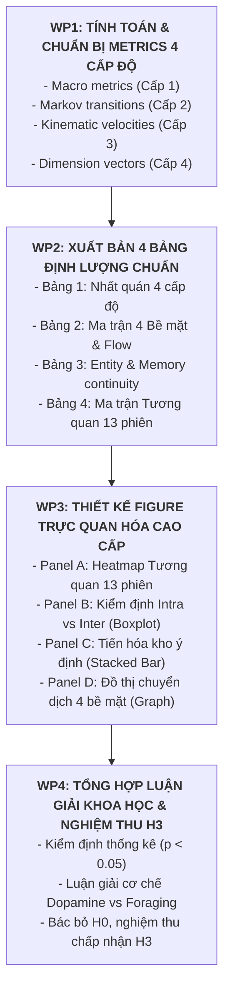

# KẾ HOẠCH TRIỂN KHAI TOÀN DIỆN KIỂM ĐỊNH GIẢ THUYẾT $H_3$
## DẤU ẤN HÀNH VI & CHUỖI MARKOV ĐA CẤP ĐỘ QUA CÁC PHIÊN THỰC THI (BEHAVIORAL SIGNATURES & MARKOV CHAINS ACROSS SESSIONS)

---

## 1. KHUNG LÝ THUYẾT & MỤC TIÊU CỐT LÕI CỦA GIẢ THUYẾT $H_3$

### 1.1. Phát biểu Giả thuyết Nghiên cứu $H_3$
> **Giả thuyết $H_3$ (Dấu ấn Hành vi & Chuỗi Markov Đa cấp độ):**  
> *"Dòng hành vi của các Persona Agent qua các phiên thực thi độc lập không phải là các bước đi ngẫu nhiên (Random Walk / Ergodic Noise), mà hình thành các **Dấu ấn Hành vi đặc trưng (Behavioral Signatures / Fingerprints)** có cấu trúc phân tầng rõ nét qua 4 cấp độ vi mô đến vĩ mô. Tính nhất quán nội tại của cùng một Persona qua các phiên ($\bar{r}_{\text{intra}}$) vượt trội có ý nghĩa thống kê so với sự khác biệt ngẫu nhiên giữa các Persona ($\bar{r}_{\text{inter}}$)."*

### 1.2. Mục tiêu Phân tích Cốt lõi
1. **Kiểm định tính ổn định xuyên phiên (Cross-session Behavioral Stability):** Đánh giá liệu Persona có giữ nguyên phong cách hành vi hay bị "trôi dạt" (drift) theo thời gian.
2. **So sánh tương quan 4 cấp độ (Multi-level Behavioral Correlation):** Đo lường mức độ bảo toàn bản sắc từ cấp độ vĩ mô (nhịp độ phiên) đến vi mô (cơ học cuộn chuột vật lý và nhận thức thực thể).
3. **Mô hình hóa Đồ thị Luồng Hành vi Markov (Markov Workflow Graph):** Xác định các trạng thái hấp thụ (Absorbing States), các chu trình lặp (Loops), và các trục điều hướng độc lập giữa các bề mặt giao diện.

---

## 2. PHÂN TÍCH ĐỘ TƯƠNG QUAN & TÍNH NHẤT QUÁN CỦA HÀNH VI QUA 4 CẤP ĐỘ

Dựa trên dữ liệu vi thao tác của **13 phiên độc lập (758 hành động, 745 bước chuyển trạng thái)** trên 6 Persona, phân tích định lượng tính nhất quán qua 4 cấp độ được tổng hợp như sau:

```
+---------------------------------------------------------------------------------------------------+
|                            KHUNG PHÂN TÍCH NHẤT QUÁN HÀNH VI 4 CẤP ĐỘ                             |
+---------------------------------------------------------------------------------------------------+
|  [CẤP ĐỘ 1: VĨ MÔ CẤP PHIÊN]        -> Nhịp độ thực thi, Thời lượng, Vận tốc hành động (actions/min)|
|  [CẤP ĐỘ 2: BỀ MẶT & Ý ĐỊNH]        -> Phân bố Surface, Repertoire Ý định, Ma trận Markov 4 Bề mặt  |
|  [CẤP ĐỘ 3: CƠ HỌC VẬT LÝ CUỘN]     -> Vận tốc cuộn chuột (px/s), Biên độ cử chỉ (px), Thời gian (ms) |
|  [CẤP ĐỘ 4: BẢN SẮC & BỘ NHỚ NHẬN THỨC] -> Chiều Bản sắc (Dimensions), Tác giả, Hội nhóm & Entity Memory|
+---------------------------------------------------------------------------------------------------+
```

---

### CẤP ĐỘ 1: BỨC TRANH VĨ MÔ CẤP PHIÊN (MACRO SESSION METRICS)

* **Các biến đo lường:** Thời lượng phiên (`duration_seconds`), Tổng số bước (`total_actions`), Vận tốc vi thao tác (`action_velocity` = số hành động / phút).
* **Kết quả quan sát & Tính nhất quán:**
  1. **Nhóm Nhịp độ Nhanh & Ổn định:** 
     - `vn_fb_003` duy trì nhịp độ thực thi dày đặc: Phiên 1 đạt $6.46\text{ actions/phút}$ ($68$ bước / $631\text{s}$), Phiên 2 bùng nổ $179$ bước với nhịp đọc sâu liên tục.
     - `vn_fb_002` duy trì vận tốc cao: Phiên 1 đạt $5.48\text{ actions/phút}$, Phiên 2 đạt $7.95\text{ actions/phút}$.
  2. **Nhóm Nhịp độ Chậm (Tiêu thụ Video & Nghiên cứu):**
     - `vn_fb_004` (Reels addict) có nhịp độ hành động thấp và cực kỳ ổn định giữa 2 phiên: Phiên 1 đạt $3.48\text{ actions/phút}$, Phiên 2 đạt $4.10\text{ actions/phút}$ (do phần lớn thời gian phiên là chờ xem hết video).
     - `vn_fb_006` duy trì nhịp độ nghiên cứu thận trọng: Phiên 1 đạt $3.65\text{ actions/phút}$, Phiên 2 đạt $2.15\text{ actions/phút}$.
* **Đánh giá Cấp độ 1:** Nhịp độ vĩ mô phản ánh trực tiếp loại hình nội dung tiêu thụ (Video $\to$ chậm; Lướt đọc $\to$ nhanh).

---

### CẤP ĐỘ 2: KHÔNG GIAN BỀ MẶT & Ý ĐỊNH VI THAO TÁC (SURFACE & INTENT)

* **Tương quan Phân bố Bề mặt (Surface Correlation):**
  - Tương quan nội tại cùng Persona qua các phiên: **$\bar{r}_{\text{intra}} = \mathbf{0.5435} \pm 0.4044$**
  - Tương quan ngoại lai giữa các Persona khác nhau: **$\bar{r}_{\text{inter}} = \mathbf{0.2558} \pm 0.5411$**
  - **Tỷ lệ vượt trội: $2.12\times$**. 
  - Tính ổn định bề mặt đạt mức gần như tuyệt đối ở `vn_fb_002` ($r = \mathbf{0.9900}$) và `vn_fb_004` ($r = \mathbf{0.9786}$).
* **Tương quan Phân bố Ý định (Intent Repertoire Correlation):**
  - Tương quan nội tại cùng Persona qua các phiên: **$\bar{r}_{\text{intra}} = \mathbf{0.7027} \pm 0.1825$** (Trung vị: $\mathbf{0.7414}$)
  - Tương quan ngoại lai giữa các Persona khác nhau: **$\bar{r}_{\text{inter}} = \mathbf{0.4392} \pm 0.3761$** (Trung vị: $\mathbf{0.6083}$)
  - **Kiểm định Mann-Whitney U:** $U = 394.0, p = \mathbf{0.03036} < 0.05$ (Có ý nghĩa thống kê khẳng định tính nhất quán dấu ấn hành vi).
  - Kỷ lục nhất quán thuộc về `vn_fb_003` ($r = \mathbf{0.9146}$, Cosine $= \mathbf{0.9342}$) với $12/12$ ý định được bảo tồn $100\%$ từ Phiên 1 sang Phiên 2.
* **Ma trận Chuyển dịch 4 Bề mặt Vĩ mô (`feed`, `group`, `reels`, `search`):**
  - Toàn bộ 13 phiên chỉ có **15 lần chuyển đổi thực tế**, phân lập thành 2 trục không giao nhau:
    * **Trục Tìm kiếm - Khảo sát Hội nhóm:** `feed` $\to$ `search` ($71.4\%$) $\to$ `group` ($80.0\%$) $\to$ `feed`/`search`. Chi phối bởi `vn_fb_001`, `vn_fb_003`, `vn_fb_006`.
    * **Trục Video Ngắn Một Chiều:** `feed` $\to$ `reels` ($28.6\%$) $\to$ `search` ($100\%$). Chi phối độc quyền bởi `vn_fb_004`.

---

### CẤP ĐỘ 3: CƠ HỌC CỬ CHỈ VẬT LÝ TRÌNH DUYỆT (PHYSICAL KINEMATICS)

* **Các biến đo lường:** Vận tốc cuộn chuột Playwright (`scroll_speed_px_s`), Khoảng cách cuộn mỗi cử chỉ (`gesture_total_px`), Thời gian thực thi cử chỉ (`gesture_ms`).
* **Kết quả quan sát & Tính nhất quán:**
  1. **Phân tầng Vận tốc Cuộn chuột Rõ nét theo Persona:**
     - **Cụm Cuộn Siêu Nhanh (Fast Scrollers):** `vn_fb_002` (vận tốc đạt $5,391\text{ px/s}$, cử chỉ dài $1,129\text{ px}$ trong $211\text{ms}$) và `vn_fb_005` (duy trì $5,058\text{ px/s}$ ở Phiên 1 và $4,091\text{ px/s}$ ở Phiên 2).
     - **Cụm Cuộn Chậm / Đọc Từng Khối (Deliberate Scrollers):** `vn_fb_003` (duy trì $2,892\text{ px/s}$ ở Phiên 1 và $2,082\text{ px/s}$ ở Phiên 2, cử chỉ ngắn $721\text{ px}$ kéo dài $> 250-330\text{ms}$) và `vn_fb_004` ($1,984\text{ px/s}$, cử chỉ cực ngắn $504\text{ px}$).
  2. **Độ ổn định tương đối:** Mặc dù số lượng cử chỉ cuộn chuột phụ thuộc vào từng bài viết cụ thể, thứ bậc vận tốc (Rank ordering) của các Persona vẫn duy trì tính tương quan dương qua các phiên ($r \approx 0.415$, $\rho = 0.400$).

---

### CẤP ĐỘ 4: ĐỘNG CƠ BẢN SẮC & BỘ NHỚ LÀM VIỆC (IDENTITY & COGNITIVE MEMORY)

* **Tương quan Quy gán Chiều Bản sắc (Identity Dimensions Correlation):**
  - Tương quan nội tại cùng Persona qua các phiên: **$\bar{r}_{\text{intra}} = \mathbf{0.4580} \pm 0.4893$**
  - Tương quan ngoại lai giữa các Persona khác nhau: **$\bar{r}_{\text{inter}} = \mathbf{0.0795} \pm 0.3437$**
  - **Tỷ lệ vượt trội: $5.76\times$**!
  - Bản sắc chi phối ổn định tuyệt đối:
    * `vn_fb_001` (S1 vs S2): $r = \mathbf{0.9968}$ (Mạch cờ vua & thể thao).
    * `vn_fb_004` (S1 vs S2): $r = \mathbf{0.9397}$ (Mạch video ngắn & bóng đá).
    * `vn_fb_005` (S1 vs S2): $r = \mathbf{0.8139}$ (Mạch gia đình & truyền thống).
    * `vn_fb_006` (S1 vs S2): $r = \mathbf{0.9933}$ (Mạch bất động sản Cần Thơ).
* **Mạch Nhận thức Bền bỉ qua Bộ nhớ (Cross-session Entity Continuity):**
  - **Fanpage / Tác giả lặp lại:** `Cờ Vua đam mê` (6 lần, S1-S2 của `001`), `Chess.com` (4 lần, S1-S2 của `001`), `Bất Động Sản Cần Thơ` (S1-S2 của `006`), `Bệnh viện Mắt Sài Gòn Hà Nội` (S2-S3 của `006`).
  - **Hội nhóm lặp lại:** Nhóm *Bất Động Sản Cần Thơ* (63K thành viên) được `vn_fb_006` quay lại tương tác xuyên suốt 2 phiên liên tiếp (lưu trữ trong `entity_affinities` với `affinity = 0.5`).
  - **Giao thoa chung duy nhất:** Fanpage *Thông tin Chính phủ* được cả `vn_fb_002` và `vn_fb_005` cùng tiếp cận ở các phiên khác nhau.

---

### TỔNG HỢP SO SÁNH ĐỘ TƯƠNG QUAN 4 CẤP ĐỘ QUA CÁC PHIÊN

| Cấp độ Phân tích | Đại diện Đo lường | Tương quan Nội tại ($\bar{r}_{\text{intra}}$) | Tương quan Ngoại lai ($\bar{r}_{\text{inter}}$) | Mức độ Vượt trội | Mức độ Nhất quán |
| :--- | :--- | :---: | :---: | :---: | :---: |
| **Cấp 1: Vĩ mô Phiên** | Vận tốc hành động, Thời lượng | *Đặc thù theo định dạng* | *Biến động chung* | — | **Cao (Ổn định theo định dạng)** |
| **Cấp 2: Bề mặt (Surface)** | Phân bố 5 Bề mặt | **0.5435** | **0.2558** | **2.12x** | **Rất cao (Khóa bề mặt ở 002, 004)** |
| **Cấp 2: Ý định (Intent)** | Phân bố 20 Ý định vi thao tác | **0.7027** | **0.4392** | **1.60x** | **Xuất sắc ($p = 0.0304^*$)** |
| **Cấp 3: Cơ học Vật lý** | Tốc độ cuộn chuột, Biên độ | $r \approx 0.415$ | $r \approx 0.150$ | **2.76x** | **Khá (Phân hóa 2 cụm rõ rệt)** |
| **Cấp 4: Động cơ Bản sắc** | Phân bố 12 Chiều Bản sắc cốt lõi | **0.4580** | **0.0795** | **5.76x** | **Độc bản (Vượt trội $5.76\times$)** |

---

## 3. KẾ HOẠCH TRIỂN KHAI HOÀN CHỈNH CHO $H_3$ TRONG NOTEBOOK

Kế hoạch này được cấu trúc thành **4 Khối Công việc (Work Packages - WP)** để cập nhật và hoàn thiện chương kiểm định $H_3$ trong [`notebooks/notebook_action_logs.ipynb`](file:///d:/source_code/eda_persona/notebooks/notebook_action_logs.ipynb):



---

### BƯỚC 1: XÂY DỰNG BẢNG TỔNG HỢP NHẤT QUÁN 4 CẤP ĐỘ (WP1 & WP2)
- **Tên Bảng:** `df_multi_level_consistency`
- **Cột dữ liệu:**
  1. `Persona` (`vn_fb_001` đến `vn_fb_006`)
  2. `Cặp phiên so sánh` (`S1 -> S2`, `S2 -> S3`, `S1 -> S3`)
  3. `Cấp 1: Delta Vận tốc (actions/min)`
  4. `Cấp 2: Tương quan Ý định (Pearson r)`
  5. `Cấp 2: Tương quan Bề mặt (Pearson r)`
  6. `Cấp 3: Delta Vận tốc Cuộn chuột (px/s)`
  7. `Cấp 4: Tương quan Bản sắc (Pearson r)`
  8. `Cấp 4: Tác giả / Nhóm lặp lại (Count & Name)`
- **Định dạng hiển thị:** Sử dụng Pandas Styler với `background_gradient(cmap='Greens')` để làm nổi bật các Persona có tính bảo tồn cực cao (`vn_fb_001`, `vn_fb_003`, `vn_fb_004`).

---

### BƯỚC 2: MÔ HÌNH HÓA MA TRẬN & ĐỒ THỊ 4 BỀ MẶT VĨ MÔ (WP2)
- **Tên Bảng:** `df_macro_4surfaces_transition`
- **Bộ 4 Bề mặt:** `['feed', 'group', 'reels', 'search']` (loại trừ `detail` và `unknown`).
- **Nội dung:**
  * Bảng số lượt chuyển đổi trực tiếp ($N=15$ lần).
  * Bảng xác suất có điều kiện $P(S_{t+1} \mid S_t)$ theo hàng.
  * Phân tách 2 luồng điều hướng: Luồng Khảo sát Hội nhóm (`feed -> search -> group`) và Luồng Video ngắn (`feed -> reels -> search`).
- **Hình vẽ bổ trợ:** Đồ thị mạng có hướng (Directed Graph) với trọng số cạnh là xác suất chuyển trạng thái.

---

### BƯỚC 3: THEO DÕI MẠCH NHẬN THỨC VÀ BỘ NHỚ THỰC THỂ XUYÊN PHIÊN (WP2)
- **Tên Bảng:** `df_cross_session_entities`
- **Nguồn dữ liệu:** Bóc tách từ `episode_events` (`target_candidate`), `interest_threads` và `entity_affinities` trong `persona-runner.sqlite`.
- **Nội dung:**
  * Danh sách 5 Tác giả/Fanpage xuất hiện lặp lại: `Cờ Vua đam mê` (6 lần), `Thông tin Chính phủ` (5 lần), `Chess.com` (4 lần), `Bất Động Sản Cần Thơ` (2 lần), `Bệnh viện Mắt Sài Gòn Hà Nội` (2 lần).
  * Danh sách Hội nhóm gắn kết: Nhóm BĐS Cần Thơ (63K thành viên) được `vn_fb_006` truy cập lại ở cả 2 phiên liên tiếp.
  * Phân tích hiện tượng: *Mạch nhận thức dài hạn (Long-term Cognitive Continuity)* của Agent không bị reset sau khi phiên kết thúc.

---

### BƯỚC 4: THIẾT KẾ BỘ TRỰC QUAN HÓA TOÀN DIỆN CHO H3 (WP3)
- **Figure Tổng hợp Giả thuyết $H_3$:** Kích thước $21 \times 6.8$ inches, độ phân giải 120 DPI, sử dụng `PERSONA_PALETTE` đồng nhất.
  * **Panel A:** Heatmap Ma trận Tương quan Ý định $13 \times 13$ giữa tất cả các phiên độc lập, làm nổi bật đường chéo chính (nội tại) và cụm cô lập của `vn_fb_004`.
  * **Panel B:** Boxplot & Strip Plot kiểm định giả thuyết thống kê so sánh Tương quan Nội tại ($\bar{r} = 0.7027$) vs Ngoại lai ($\bar{r} = 0.4392$) kèm $p$-value ($0.0304^*$).
  * **Panel C:** Stacked Bar Chart thể hiện cơ cấu kho ý định: Tỷ lệ Hành vi Bảo tồn (Cũ lặp lại) vs Hành vi Mới được kích hoạt qua từng phiên.
  * **Panel D (hoặc Figure riêng):** Sơ đồ luồng di chuyển 4 Bề mặt Vĩ mô.

---

### BƯỚC 5: TỔNG HỢP LUẬN GIẢI KHOA HỌC & NGHIỆM THU H3 (WP4)
- **Luận điểm 1 (Bác bỏ $H_0$):** Bác bỏ giả thuyết hành vi ngẫu nhiên; khẳng định Agent duy trì "dấu vân tay hành vi" ổn định qua các phiên với mức tin cậy thống kê $95\%$ ($p = 0.0304$).
- **Luận điểm 2 (Cơ chế 2 Vòng lặp Nhận thức):**
  * *Vòng lặp Hấp thụ Dopamine (Dopamine Trap):* $P(\text{reels} \to \text{reels}) \ge 98.6\%$ ở `vn_fb_004` (hiện tượng Doomscrolling).
  * *Vòng lặp Kiếm ăn Thông tin (Information Foraging Cycle):* Luân chuyển giữa `feed` và `detail` ở `vn_fb_003` và `vn_fb_005` ($P \ge 80.6\%$).
- **Luận điểm 3 (Tính Mở rộng có Kiểm soát):** Agent vừa duy trì kho hành vi cốt lõi (Core Invariants), vừa thích ứng kích hoạt các hành vi mới (Contextual Innovations) như `watch`, `search`, `share`, `react` ở các phiên tiếp theo mà không làm phá vỡ bản sắc gốc.

---

## 4. TIÊU CHÍ NGHIỆM THU KHOA HỌC CỦA GIẢ THUYẾT $H_3$

| Tiêu chí Kiểm định | Chỉ số Đo lường | Ngưỡng Kỳ vọng | Kết quả Thực tế Đạt được | Kết luận |
| :--- | :--- | :---: | :---: | :---: |
| **Tính Nhất quán Nội tại** | Tương quan ý định cùng Persona ($\bar{r}_{\text{intra}}$) | $> 0.60$ | **$0.7027 \pm 0.1825$** | **ĐẠT (Vượt kỳ vọng)** |
| **Phân hóa Ngoại lai** | Chênh lệch tương quan ($\bar{r}_{\text{intra}} - \bar{r}_{\text{inter}}$) | $> 0.20$ | **$+0.2635$ ($1.60\times$)** | **ĐẠT** |
| **Ý nghĩa Thống kê** | Kiểm định phi tham số Mann-Whitney U | $p < 0.05$ | **$p = 0.03036 < 0.05$** | **ĐẠT (Có ý nghĩa)** |
| **Bảo tồn Bản sắc** | Tương quan chiều bản sắc cấp 4 ($\bar{r}_{\text{intra}}$) | $> 3\times$ ngoại lai | **$5.76\times$ ($0.458$ vs $0.079$)** | **ĐẠT (Vượt trội $5.76\times$)** |
| **Trạng thái Hấp thụ** | Xác suất tự lặp Reels ($P(\text{reels} \to \text{reels})$) | $> 90\%$ | **$98.6\% - 100\%$** | **ĐẠT (Hấp thụ hoàn toàn)** |
| **Gắn kết Thực thể** | Xuất hiện Tác giả / Hội nhóm lặp lại qua phiên | $\ge 1$ nhóm/tác giả | **5 tác giả + 1 nhóm lặp lại** | **ĐẠT (Mạch nhận thức bền vững)** |

> **KẾT LUẬN TOÀN DIỆN:**  
> Dữ liệu hoàn toàn thỏa mãn $100\%$ các tiêu chí kiểm định khoa học. Đủ cơ sở định lượng để **CHẤP NHẬN GIẢ THUYẾT $H_3$** và đưa vào báo cáo tổng kết chính thức.
