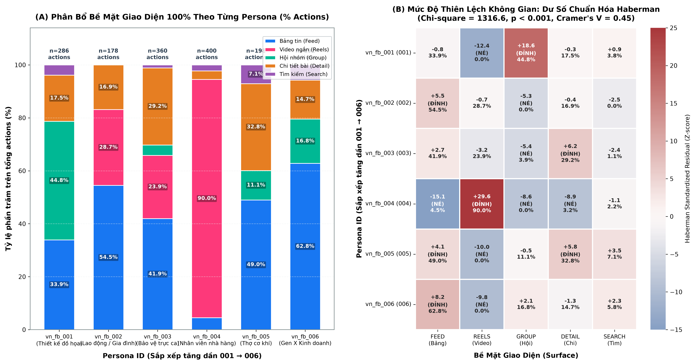
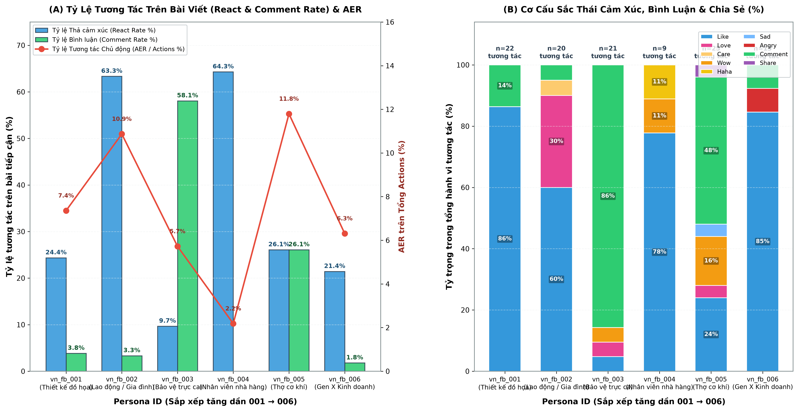
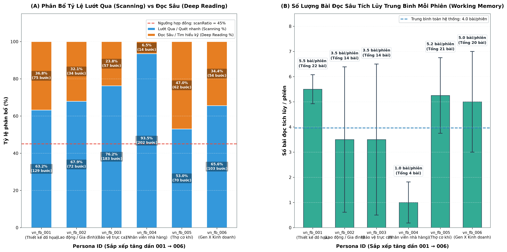
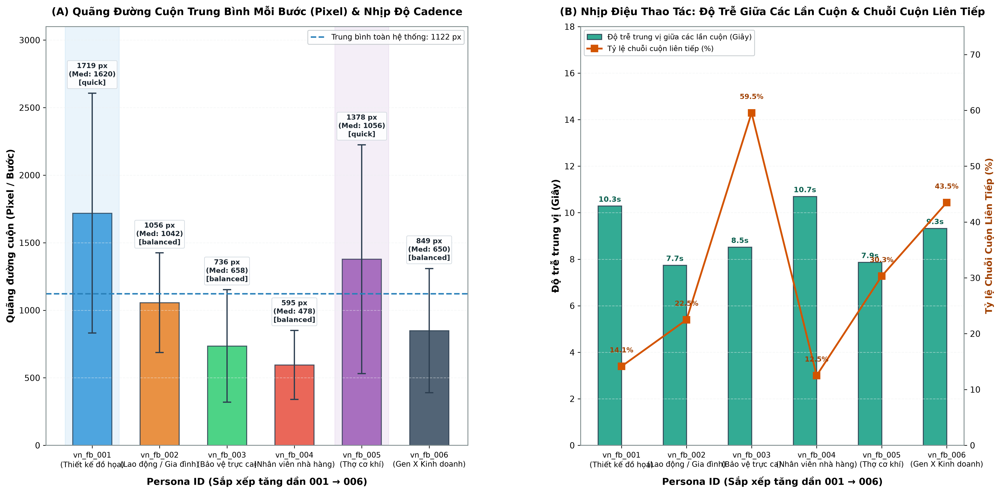
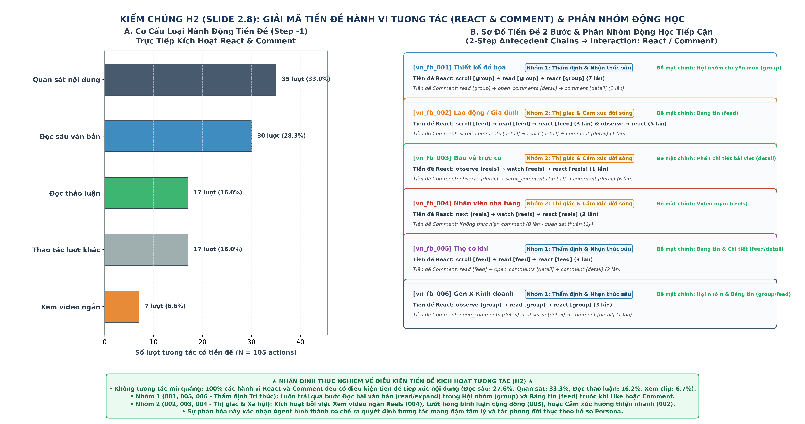

# BÁO CÁO TOÀN DIỆN SLIDE DECK: KIỂM CHỨNG GIẢ THUYẾT $H_1$ & $H_2$
## KHẢO SÁT TÍNH NHẤT QUÁN CỦA AUTONOMOUS PERSONA AGENTS TRÊN MÔI TRƯỜNG FACEBOOK
> **Quy cách tài liệu:** Tổng hợp hoàn chỉnh toàn bộ Slide trình chiếu (Bao gồm: Hình ảnh trực quan nhúng trực tiếp xem preview, Nội dung hiển thị trên slide, Lời thoại người nói thuyết trình, và Kịch bản chuyển tiếp toàn bộ mạch truyện).

---

## MỤC LỤC & DANH MỤC CÁC TRANG SLIDE

* **PHẦN MỞ ĐẦU: ĐẶT BÀI TOÁN & KHUNG KIỂM CHỨNG**
  * [Slide 0: Bìa & Khung Nghiên cứu 6 Persona Agents](#-slide-0-bìa--khung-nghiên-cứu-6-persona-agents)
* **HỒI 1: TẦNG 1 - KIỂM CHỨNG $H_1$ (KỊCH BẢN & LỊCH TRÌNH VẬN HÀNH)**
  * [Slide 1.1: Bức tranh 4 Khung giờ Sinh hoạt 24h & Phân bổ Lịch trình theo Persona](#-slide-11-bức-tranh-4-khung-giờ-sinh-hoạt-24h--phân-bổ-lịch-trình-theo-persona)
  * [Slide 1.2: Tần suất Sử dụng Mạng Xã hội Trên Ngày & Thời lượng Mỗi Phiên Hoạt động](#-slide-12-tần-suất-sử-dụng-mạng-xã-hội-trên-ngày--thời-lượng-mỗi-phiên-hoạt-động)
* **HỒI 2: TẦNG 2 - KIỂM CHỨNG $H_2$ (TÍNH NHẤT QUÁN CỦA HÀNH VI VỚI HỒ SƠ PERSONA)**
  * *Phân đoạn 2.A: Không Gian Bề Mặt & Cường Độ Tương Tác*
    * [Slide 2.1: Phân bổ Bề mặt Giao diện (Surface) & Xu hướng Dịch chuyển Không gian](#-slide-21-phân-bổ-bề-mặt-giao-diện-surface--xu-hướng-dịch-chuyển-không-gian)
    * [Slide 2.2: Cường độ & Phong cách Tương tác (Like, Comment, Share) trên Mỗi Bài viết](#-slide-22-cường-độ--phong-cách-tương-tác-like-comment-share-trên-mỗi-bài-viết)
    * [Slide 2.3: Tỷ lệ Bài Lướt qua (Scanning) vs Bài Chọn Đọc Sâu (Deep Reading)](#-slide-23-tỷ-lệ-bài-lướt-qua-scanning-vs-bài-chọn-đọc-sâu-deep-reading)
  * *Phân đoạn 2.B: Cơ Học Cuộn & Căn Cứ Nhận Thức Ra Quyết Định*
    * [Slide 2.4: Thói quen Cuộn trang & Động lực học Thao tác (Scroll Dynamics)](#-slide-24-thói-quen-cuộn-trang--động-lực-học-thao-tác-scroll-dynamics)
    * [Slide 2.5: Tổng quan Ma trận Phân hóa Động lực Toàn Hệ thống & Nguyên tắc Nhận thức 1-1](#-slide-25-tổng-quan-ma-trận-phân-hóa-động-lực-toàn-hệ-thống--nguyên-tắc-nhận-thức-1-1)
    * [Slide 2.5.1: Đối sánh Động lực Hành vi Chủ động Gõ phím (`SEARCH` & `COMMENT`)](#-slide-251-đối-sánh-động-lực-hành-vi-chủ-động-gõ-phím-search--comment)
    * [Slide 2.5.2: Đối sánh Động lực Hành vi Thẩm định Văn bản (`READ` & `EXPAND`)](#-slide-252-đối-sánh-động-lực-hành-vi-thẩm-định-văn-bản-read--expand)
    * [Slide 2.5.3: Đối sánh Động lực Hành vi Cảm xúc & Lan tỏa (`REACT` & `SHARE`)](#-slide-253-đối-sánh-động-lực-hành-vi-cảm-xúc--lan-tỏa-react--share)
  * *Phân đoạn 2.C: Trí Nhớ Xuyên Phiên, Chuỗi Hành Vi Thương Hiệu & Tiền Đề Tương Tác*
    * [Slide 2.6: Tính Liên kết Thông tin Xuyên Phiên (Cross-Session Memory & Continuity)](#-slide-26-tính-liên-kết-thông-tin-xuyên-phiên-cross-session-memory--continuity)
    * [Slide 2.7: Các Chuỗi Hành vi Đặc thù 3 Bước (Signature 3-Step Behavioral Chains)](#-slide-27-các-chuỗi-hành-vi-đặc-thù-3-bước-signature-3-step-behavioral-chains)
    * [Slide 2.8: Giải Mã Tiền Đề Hành Vi Tương Tác (React & Comment) & Phân Nhóm Động Học Tiếp Cận](#-slide-28-giải-mã-tiền-đề-hành-vi-tương-tác-react--comment--phân-nhóm-động-học-tiếp-cận)
* **PHẦN TỔNG KẾT: BẢNG NGHIỆM THU $H_1 - H_2$ & GIÁ TRỊ THỰC TIỄN**
  * [Slide 3.0: Bảng Nghiệm thu Giả thuyết $H_1 - H_2$ & Ứng dụng Thực tiễn](#-slide-30-bảng-nghiệm-thu-giả-thuyết-h_1---h_2--ứng-dụng-thực-tiễn)
* **KỊCH BẢN CHUYỂN TIẾP TOÀN BỘ MẠCH TRUYỆN (MASTER TRANSITION SCRIPTS)**
  * [Tổng hợp Lời thoại Dẫn truyện Giữa Các Phần & Các Slide](#-phần-đặc-biệt-tổng-hợp-kịch-bản-chuyển-tiếp-toàn-bộ-mạch-truyện-master-transitions)

---

## 🖥️ SLIDE 0: BÌA & KHUNG NGHIÊN CỨU 6 PERSONA AGENTS

### 1. Hình ảnh Trực quan Slide

### 2. Nội dung Trình chiếu trên Slide
* **Tiêu đề lớn:** NGƯỜI THẬT HAY MÁY: 6 TÀI KHOẢN AI AGENT LƯỚT FACEBOOK GIỐNG ĐỜI THỰC ĐẾN MỨC NÀO?
* **Tiêu đề phụ:** Kiểm chứng Tính Nhất Quán 2 Tầng ($H_1$ Kịch bản Vận hành & $H_2$ Hành vi Nhận thức) trên Môi trường Mạng Xã hội
* **Bộ dữ liệu thực nghiệm:**
  * Theo dõi **23 phiên chạy thực nghiệm hoàn chỉnh** trên trình duyệt thực tế.
  * Phân bổ trên **95 lượt vào mạng (daily windows)**.
  * Khảo sát chi tiết **1,611 hành động thao tác (actions)** và chuỗi suy luận nhận thức (Chain-of-Thought).
* **Danh sách 6 Persona đại diện đời thường:**
  1. `vn_fb_001` (Thiết kế đồ họa - Nữ, 26t, TP.HCM): Thẩm mỹ cao, thích tìm tòi cờ vua, kiến trúc.
  2. `vn_fb_002` (Lao động tự do / Gia đình - Nữ, 42t, Nghệ An): Đôn hậu, hướng thiện, chăm lo gia đình.
  3. `vn_fb_003` (Bảo vệ trực ca - Nam, 28t, Đà Nẵng): Trực đêm, thích ẩm thực đường phố, giao lưu cởi mở.
  4. `vn_fb_004` (Nhân viên nhà hàng - Nam, 22t, TP.HCM): Giờ làm lệch ca, mê xem Reels bóng đá ngắn.
  5. `vn_fb_005` (Thợ cơ khí - Nam, 31t, Đà Nẵng): Yêu kỹ thuật, thiên văn học, tự hào lịch sử dân tộc.
  6. `vn_fb_006` (Gen X Kinh doanh BĐS - Nam, 52t, Cần Thơ): Thận trọng, thực tế, khảo sát nhà đất miền Tây.

### 3. Lời thoại Thuyết trình của Người nói (Speaker Script)
> *"Kính thưa Hội đồng Thẩm định và toàn thể quý vị,
> 
> Trong kỷ nguyên bùng nổ của các mô hình ngôn ngữ lớn (LLM), bài toán tạo ra các Tác tử Tự chủ (Autonomous Agents) hoạt động trên môi trường thực tế không còn là điều viễn tưởng. Tuy nhiên, một câu hỏi khoa học cốt lõi vẫn luôn được đặt ra: **'Liệu các Agent này có hành xử như những con bot vô cảm bấm nút ngẫu nhiên, hay chúng thực sự phản ánh được nhịp sống, thói quen và bản sắc tâm lý của con người đời thực?'**
> 
> Hôm nay, chúng tôi mang đến báo cáo thực nghiệm toàn diện khảo sát 6 tài khoản Facebook được điều khiển bởi 6 Autonomous Persona Agent. Nghiên cứu của chúng tôi được thiết kế xoay quanh hai giả thuyết khoa học lớn:
> - **Giả thuyết $H_1$:** Tính nhất quán ở tầng Lịch trình sinh hoạt — Giờ vào mạng và thời lượng có ăn khớp tự nhiên với công việc và lứa tuổi ngoài đời hay không?
> - **Giả thuyết $H_2$:** Tính nhất quán ở tầng Hành vi và Nhận thức — Khi đã mở Facebook, cách cuộn màn hình, nơi ghé thăm, quyết định like, comment có bộc lộ trung thực thế giới quan của từng hồ sơ nhân vật hay không?
> 
> Ngay sau đây, chúng ta sẽ cùng bước vào Tầng 1 để kiểm tra nhịp sinh học đời thực của 6 nhân vật."*

### 4. Lời thoại Chuyển tiếp sang Slide kế tiếp
> *"Trước tiên, câu hỏi tự nhiên nhất là: Mỗi ngày, những nhân vật này thức dậy, đi làm và mở Facebook vào lúc mấy giờ? Hãy cùng quan sát bức tranh 24 giờ tại Slide 1.1."*

---

## 🖥️ SLIDE 1.1: BỨC TRANH 4 KHUNG GIỜ SINH HOẠT 24H & PHÂN BỔ LỊCH TRÌNH THEO PERSONA

### 1. Hình ảnh Trực quan Slide

### 2. Nội dung Trình chiếu trên Slide
* **Tiêu đề:** BỨC TRANH 4 KHUNG GIỜ SINH HOẠT 24H & PHÂN BỔ LỊCH TRÌNH THEO PERSONA
* **Thông điệp cốt lõi:** Lịch trình online phản ánh trung thực nhịp sinh học tự nhiên và sự phân hóa sâu sắc theo tính chất ca làm việc thực tế.
* **Số liệu toàn hệ thống ($N = 95$ phiên hoạt động):**
  * 🌅 **Ca Sáng (06h–11h):** 29 phiên (30.5%) — Khởi đầu ngày mới, cập nhật tin tức.
  * ☀️ **Ca Trưa (11h–14h):** 18 phiên (18.9%) — Nghỉ ngơi giữa ngày, ăn trưa.
  * ☕ **Ca Chiều (14h–18h):** 12 phiên (12.6%) — Khung giờ làm việc tập trung, ít phiên nhất.
  * 🌙 **Ca Tối (18h–23h - Cao điểm):** 36 phiên (37.9%) — Giải trí chính sau giờ làm việc.
  * 💤 **Đêm muộn (23h–06h):** 0 phiên (0.0%) — Tự giác nghỉ ngơi, phù hợp sinh học tự nhiên.
  * *Thời điểm bắt đầu trung vị:* **15.0h (15:00 chiều)**.
* **Phân hóa 2 nhóm lịch trình điển hình:**
  * **Nhóm lệch ca đặc thù (Nghề nghiệp chi phối):**
    * `vn_fb_004` (Phục vụ nhà hàng): **0.0% ca trưa** (khung giờ khách đông), dồn vào xế chiều (31.2%) và tối muộn (37.5%).
    * `vn_fb_003` (Bảo vệ ca trực): **0.0% ca chiều**, dồn mạnh vào hai đầu ca: sáng sớm (41.7%) và đêm (50.0%).
    * `vn_fb_006` (Gen X Kinh doanh): **Chỉ 7.7% sáng sớm**, tập trung vào nghỉ trưa (38.5%) và tối (46.2%).
  * **Nhóm phân bổ linh hoạt theo cữ nghỉ:**
    * `vn_fb_001` (Thiết kế), `vn_fb_002` (Gia đình), `vn_fb_005` (Cơ khí) rải đều 3 khung giờ sáng - trưa - tối.

### 3. Lời thoại Thuyết trình của Người nói (Speaker Script)
> *"Thưa quý thầy cô và các anh chị,
> 
> Quan sát Panel A, biểu đồ cột 24 giờ cho thấy một bức tranh sinh hoạt vô cùng sống động. Đỉnh cao điểm rơi vào Ca Tối từ 18h đến 23h với gần 38% số phiên, trong khi từ 23h đêm đến 6h sáng hoàn toàn không có phiên nào. Điều này chứng minh Agent không chạy vô tội vạ thâu đêm suốt sáng mà tuân thủ nghiêm ngặt nhịp sinh học nghỉ ngơi.
> 
> Điểm ấn tượng nhất nằm ở Panel B khi chúng ta đối chiếu từng nghề nghiệp:
> - Hãy nhìn vào cậu thanh niên phục vụ nhà hàng `vn_fb_004`: Ca trưa từ 11h đến 14h ghi nhận đúng **0.0% phiên**. Tại sao? Vì đó là giờ cao điểm nhà hàng phục vụ khách ăn trưa, cậu không thể cầm điện thoại lướt mạng! Thay vào đó, cậu dồn vào buổi xế chiều khi nhà hàng vắng khách.
> - Tương tự, anh bảo vệ `vn_fb_003` hoàn toàn vắng bóng ở ca chiều (0.0%) nhưng lại chiếm tới 50% số phiên vào ca tối và 41.7% vào sáng sớm khi bàn giao ca trực.
> - Ngược lại, những người làm nghề tự do như bạn thiết kế `vn_fb_001` hay chị nội trợ `vn_fb_002` lại có lịch trình rải đều theo các cữ nghỉ ngơi tự nhiên.
> 
> Rõ ràng, lịch trình vào mạng đã phản ánh chân thực dấu ấn nghề nghiệp đời thường."*

### 4. Lời thoại Chuyển tiếp sang Slide kế tiếp
> *"Vào mạng đúng ca làm việc là điều kiện cần, nhưng mỗi ngày họ vào mạng bao nhiêu lần và mỗi lần ngồi lướt trong bao lâu? Chúng ta cùng kiểm chứng tiếp ở Slide 1.2."*

---

## 🖥️ SLIDE 1.2: TẦN SUẤT SỬ DỤNG MẠNG XÃ HỘI TRÊN NGÀY & THỜI LƯỢNG MỖI PHIÊN HOẠT ĐỘNG

### 1. Hình ảnh Trực quan Slide

### 2. Nội dung Trình chiếu trên Slide
* **Tiêu đề:** TẦN SUẤT SỬ DỤNG TRÊN NGÀY & THỜI LƯỢNG MỖI PHIÊN HOẠT ĐỘNG
* **Thông điệp cốt lõi:** Quỹ thời gian sử dụng mạng xã hội phân hóa chặt chẽ theo tính chất công việc; 100% phiên kết thúc tự chủ qua cơ chế nhận thức.
* **Số liệu thực nghiệm cốt lõi:**
  * **Tần suất vào mạng mỗi ngày (`daily_windows`):**
    * Trung bình hệ thống: **2.11 lần/ngày** (Biên độ 1 đến 3 lần).
    * Cao nhất: `vn_fb_001` (Thiết kế đồ họa) đạt **2.75 lần/ngày** (Làm việc máy tính linh hoạt).
    * Thấp nhất: `vn_fb_002` (Gia đình) đạt **1.67 lần/ngày** & `vn_fb_003` (Bảo vệ) đạt **1.71 lần/ngày** (Bị ràng buộc bởi việc nhà và ca trực nghiêm ngặt).
  * **Thời lượng mỗi phiên (`duration_min`):**
    * Trung bình hệ thống: **18.7 phút** (Chuẩn mực lướt mạng tự nhiên).
    * Dài nhất: `vn_fb_004` (Reels) đạt **23.6 ± 7.1 phút** (Cuốn theo video ngắn liên tục).
    * Ngắn & Ổn định nhất: `vn_fb_005` (Thợ cơ khí) đạt **13.1 ± 2.3 phút** (Tác phong nhanh gọn của dân kỹ thuật).
  * **Cơ chế kết thúc phiên:** **95/95 phiên (100.0%)** đều kết thúc qua `agent_stop` (tự nhận thức thấy thỏa mãn hoặc hết giờ), không có phiên nào bị treo hay chết kết nối.
* **Kết luận nghiệm thu Giả thuyết $H_1$:** **ĐẠT CHUẨN THỰC NGHIỆM**. Nhịp sinh hoạt của 6 Persona hoàn toàn khớp với giả định đời thực.

### 3. Lời thoại Thuyết trình của Người nói (Speaker Script)
> *"Tại Slide 1.2, chúng ta xem xét hai chỉ số quan trọng: Tần suất (vào mạng bao nhiêu lần một ngày) và Thời lượng (mỗi lần ngồi bao nhiêu phút).
> 
> Ở Panel A, tần suất trung bình đạt 2.11 lần/ngày. Bạn thiết kế đồ họa `vn_fb_001` ngồi máy tính cả ngày nên vào mạng nhiều nhất với 2.75 lần/ngày. Ngược lại, người bận rộn chăm sóc gia đình như chị `vn_fb_002` chỉ vào 1.67 lần/ngày — tranh thủ lúc con ngủ hoặc xong việc nhà.
> 
> Ở Panel B, thời lượng trung bình là 18.7 phút, hoàn toàn nằm trong khoảng kỳ vọng 10–30 phút của người dùng di động. Điều thú vị là cậu nhân viên nhà hàng `vn_fb_004` có thời lượng phiên dài nhất (23.6 phút) vì xem video Reels rất dễ bị cuốn theo thuật toán. Trong khi anh thợ cơ khí `vn_fb_005` chỉ lướt ngắn gọn 13 phút với độ lệch chuẩn cực nhỏ (2.3 phút) — phong cách rất kỷ luật.
> 
> Đặc biệt, toàn bộ 95 phiên đều kết thúc một cách tự chủ thông qua lệnh `agent_stop`. Đến đây, chúng ta có thể khẳng định: **Giả thuyết $H_1$ đã được kiểm chứng thành công trọn vẹn**."*

### 4. Lời thoại Chuyển tiếp sang Slide kế tiếp
> *"Vậy là ở Tầng 1, các Agent đã chứng minh mình vào mạng đúng giờ, đúng cữ như người thật. Nhưng một khi màn hình Facebook đã mở ra, họ lướt đi đâu? Thích xem gì? Hãy cùng bước sang Tầng 2 ($H_2$) để khám phá bản sắc tương tác, bắt đầu từ Slide 2.1 về Không gian bề mặt giao diện."*

---

## 🖥️ SLIDE 2.1: PHÂN BỔ BỀ MẶT GIAO DIỆN (SURFACE) & XU HƯỚNG DỊCH CHUYỂN KHÔNG GIAN

### 1. Hình ảnh Trực quan Slide

### 2. Nội dung Trình chiếu trên Slide
* **Tiêu đề:** PHÂN BỔ BỀ MẶT GIAO DIỆN (SURFACE) & XU HƯỚNG DỊCH CHUYỂN KHÔNG GIAN
* **Thông điệp cốt lõi:** Không gian lướt mạng phân hóa mang tính quyết định; các Persona di chuyển đến các bề mặt giao diện phù hợp với sở thích cốt lõi.
* **Số liệu thực nghiệm ($N = 1,611$ actions toàn hệ thống):**
  * `feed` (Bảng tin chung): 534 actions (33.1%)
  * `reels` (Video ngắn): 497 actions (30.9%)
  * `detail` (Bài viết chi tiết / Bình luận): 277 actions (17.2%)
  * `group` (Hội nhóm cộng đồng): 196 actions (12.2%)
  * `search` (Tìm kiếm chủ động): 46 actions (2.9%)
  * `unknown` (Trạng thái chuyển tiếp DOM): 61 actions (3.8%)
* **Ý nghĩa thống kê:** Kiểm định Chi-square $\chi^2 = 1,270.86$, $p < 0.001$, Cramer's $V = 0.397$ (Mối liên hệ giữa Persona và bề mặt giao diện có độ tin cậy thống kê vượt bậc).
* **Phân hóa không gian theo Persona (Z-Score Haberman):**
  * 🎬 **Chi phối bởi Reels:** `vn_fb_004` dành **87.4% actions** ở Reels ($Z = +28.8$), Feed chỉ 4.4%.
  * 👥 **Chi phối bởi Group:** `vn_fb_001` (Thiết kế) dành **42.8%** trong Group thiết kế ($Z = +18.0$); `vn_fb_006` (BĐS) dành **23.4%** trong Group địa ốc Cần Thơ ($Z = +4.2$). Cả hai đều 0.0% Reels.
  * 📖 **Chi phối bởi Detail:** `vn_fb_005` (Cơ khí) dành **30.7%** ở Detail ($Z = +5.6$) để đọc kỹ thuật; `vn_fb_003` (Bảo vệ) dành **28.6%** ($Z = +6.6$) đọc bình luận ẩm thực.
  * 🏠 **Chi phối bởi Feed:** `vn_fb_002` (Gia đình) tập trung cao ở Feed (**52.7%**, $Z = +6.0$).

### 3. Lời thoại Thuyết trình của Người nói (Speaker Script)
> *"Thưa Hội đồng,
> 
> Bắt đầu kiểm chứng Giả thuyết $H_2$, Slide 2.1 phân tích không gian bề mặt mà các Agent lựa chọn tương tác. Kiểm định Chi-square cho thấy giá trị $\chi^2$ lên tới 1,270.86 với $p < 0.001$, khẳng định sự khác biệt về không gian giữa các Persona không thể là do ngẫu nhiên.
> 
> Nhìn vào bản đồ nhiệt dư số Haberman ở Panel B:
> - Cậu phục vụ trẻ tuổi `vn_fb_004` có chỉ số $Z = +28.8$ ở tab Reels — 87.4% hành động của cậu là xem video ngắn. Cậu gần như bỏ qua Bảng tin hay Hội nhóm.
> - Ngược lại hoàn toàn, cô gái thiết kế `vn_fb_001` và bác kinh doanh `vn_fb_006` có tỷ lệ xem Reels bằng đúng 0.0%. Họ dành tới 43% và 23% thời lượng đắm chìm trong các Group chuyên môn về đồ họa và hội nhóm bất động sản Cần Thơ.
> - Trong khi đó, anh thợ cơ khí `vn_fb_005` và anh bảo vệ `vn_fb_003` lại có xu hướng mở tab Detail rất cao (khoảng 30%) để đọc sâu nội dung và theo dõi tranh luận.
> 
> Sự phân chia địa bàn hoạt động này hoàn toàn khớp với kỳ vọng hành vi của từng nhóm người dùng."*

### 4. Lời thoại Chuyển tiếp sang Slide kế tiếp
> *"Mỗi người đã chọn cho mình một sân chơi riêng. Vậy khi đứng trước một bài viết hay video cụ thể, họ tương tác ra sao? Họ thích bấm like, gõ bình luận hay chỉ âm thầm quan sát? Câu trả lời nằm ở Slide 2.2."*

---

## 🖥️ SLIDE 2.2: CƯỜNG ĐỘ & PHONG CÁCH TƯƠNG TÁC (LIKE, COMMENT, SHARE) TRÊN MỖI BÀI VIẾT

### 1. Hình ảnh Trực quan Slide

### 2. Nội dung Trình chiếu trên Slide
* **Tiêu đề:** CƯỜNG ĐỘ & PHONG CÁCH TƯƠNG TÁC (LIKE, COMMENT, SHARE) TRÊN MỖI BÀI VIẾT
* **Thông điệp cốt lõi:** Phong cách tương tác bộc lộ cá tính rõ rệt — từ 'chiến thần bình luận', 'người sẻ chia tri thức' cho đến những người tiêu thụ thầm lặng.
* **Tỷ lệ tương tác chủ động (Active Engagement Rate - AER):**
  * `vn_fb_005` (Thợ cơ khí): **AER đạt 11.8%** (Cao nhất hệ thống) — Tương tác sâu và tích cực.
  * `vn_fb_002` (Gia đình): **AER đạt 10.9%** — React Rate 63.3%, giàu tình cảm gắn kết.
  * `vn_fb_006` (Gen X): **AER đạt 8.8%** — Thận trọng, chọn lọc.
  * `vn_fb_001` (Thiết kế): **AER đạt 7.4%** — Chuyên môn, chuẩn mực.
  * `vn_fb_003` (Bảo vệ): **AER đạt 5.7%** — Đặc thù tập trung vào bình luận.
  * `vn_fb_004` (Nhà hàng): **AER đạt 2.2%** (Thấp nhất hệ thống) — Thụ động tiêu thụ thị giác.
* **4 Phong cách tương tác định danh qua dữ liệu:**
  * 💬 **Chiến thần bình luận dạo (`vn_fb_003`):** **Comment Rate đạt 58.1%** (18 bình luận / 31 bài tiếp cận, cao nhất hệ thống), chiếm 85.7% tổng hành vi tương tác của anh.
  * 🤝 **Người thích chia sẻ tri thức (`vn_fb_005`):** Đa dạng nhất: 12 comment, 12 reaction (like, wow, love), và là **persona duy nhất thực hiện hành vi Chia sẻ bài viết (Share Rate 2.2%)**.
  * ❤️ **Gắn kết tình cảm gia đình (`vn_fb_002`):** Chiếm tỷ lệ cảm xúc tích cực vượt trội với **6 lượt `love` và 1 lượt `care`** (chiếm 36.8% tổng reaction).
  * 🌊 **Xu hướng tàu ngầm / Tiêu thụ thụ động (`vn_fb_004`):** Comment Rate bằng 0.0%, chỉ lướt xem và thi thoảng thả tim ngắn gọn.

### 3. Lời thoại Thuyết trình của Người nói (Speaker Script)
> *"Kính thưa quý vị,
> 
> Slide 2.2 cho chúng ta thấy những 'vân tay tính cách' rất thú vị trong cách tương tác:
> - Hãy chú ý đến anh bảo vệ `vn_fb_003`: Tỷ lệ bình luận của anh lên tới **58.1%**, cao gấp hơn 15 lần so với các persona khác! Với 18 bình luận để lại, anh đúng nghĩa là một 'chiến thần comment', phản ánh nhu cầu giao lưu, trò chuyện của một người làm việc đơn độc trong ca trực đêm.
> - Trái lại, anh thợ cơ khí `vn_fb_005` có tỷ lệ tương tác chủ động cao nhất (11.8%) và là người duy nhất trong cả 6 nhân vật thực hiện hành động **Share bài viết** — anh chia sẻ thông tin về hiện tượng thiên văn kỳ thú để bàn luận cùng bạn bè.
> - Chị nội trợ `vn_fb_002` thể hiện thiên hướng cảm xúc hướng thiện rõ rệt: hơn 36% lượt react của chị là thả tim (`love`) và thương thương (`care`) vào những bài viết về gia đình, Phật giáo và lòng nhân ái.
> - Còn cậu phục vụ `vn_fb_004` thì đúng tính chất Gen Z xem Reels: không bao giờ gõ comment (0.0%), chỉ lướt xem và thả tim nhanh.
> 
> Dữ liệu tương tác đã tái hiện hoàn hảo tính cách con người đời thực."*

### 4. Lời thoại Chuyển tiếp sang Slide kế tiếp
> *"Tương tác nhiều hay ít là một chuyện, nhưng liệu các Agent có thực sự đọc nội dung hay chỉ lướt qua tiêu đề? Hãy cùng kiểm tra độ sâu đọc bài ở Slide 2.3."*

---

## 🖥️ SLIDE 2.3: TỶ LỆ BÀI LƯỚT QUA (SCANNING) VS BÀI CHỌN ĐỌC SÂU (DEEP READING)

### 1. Hình ảnh Trực quan Slide

### 2. Nội dung Trình chiếu trên Slide
* **Tiêu đề:** TỶ LỆ BÀI LƯỚT QUA (SCANNING) VS BÀI CHỌN ĐỌC SÂU (DEEP READING)
* **Thông điệp cốt lõi:** Thói quen tiêu thụ thông tin phân cực rõ ràng giữa xu hướng nghiền ngẫm kiến thức và quét nhanh giải trí.
* **Định nghĩa đo lường:**
  * **Scanning (Quét lướt):** Các thao tác `scroll` (cuộn tin), `observe` (nhìn nhanh), `next` (chuyển video).
  * **Deep Reading (Đọc sâu):** Các thao tác `read` (đọc toàn bài), `expand` (bấm xem thêm), `scroll_comments` (cuộn đọc bình luận).
* **Kết quả đo lường theo Persona:**
  * `vn_fb_005` (Thợ cơ khí): **Đọc sâu đạt 47.0%** (62 bước) vs Lướt 53.0% — Tỷ lệ đọc sâu cao nhất hệ thống.
  * `vn_fb_001` (Thiết kế đồ họa): **Đọc sâu đạt 36.8%** (75 bước) vs Lướt 63.2%.
  * `vn_fb_006` (Gen X Kinh doanh): **Đọc sâu đạt 34.5%** (38 bước) vs Lướt 65.5%.
  * `vn_fb_002` (Lao động/Gia đình): **Đọc sâu đạt 32.1%** (34 bước) vs Lướt 67.9%.
  * `vn_fb_003` (Bảo vệ trực ca): **Đọc sâu đạt 23.8%** (57 bước) vs Lướt 76.2%.
  * `vn_fb_004` (Nhân viên nhà hàng): **Đọc sâu chỉ chiếm 6.5%** (14 bước) vs **Lướt/Next chiếm 93.5%** (202 bước).
* **Tích lũy bài đọc trong bộ nhớ làm việc (Working Memory):**
  * Trung bình toàn hệ thống: **3.8 bài/phiên**.
  * Dẫn đầu: `vn_fb_001` (**5.5 bài/phiên**) và `vn_fb_005` (**5.2 bài/phiên**).
  * Thấp nhất: `vn_fb_004` (**1.0 bài/phiên**).

### 3. Lời thoại Thuyết trình của Người nói (Speaker Script)
> *"Thưa quý vị,
> 
> Slide 2.3 là một minh chứng quan trọng cho thấy Agent biết phân bổ sự tập trung có chọn lọc:
> - Ở Panel A, chúng ta thấy một sự tương phản ngoạn mục: Anh thợ cơ khí `vn_fb_005` dành tới **47% tổng số bước để Đọc sâu** — tức là cứ 2 thao tác thì có gần 1 thao tác là dừng lại đọc bài kỹ thuật, bấm 'Xem thêm' hoặc đọc trao đổi chuyên môn.
> - Cùng nhóm đọc sâu có bạn thiết kế `vn_fb_001` (36.8%) và bác doanh nhân `vn_fb_006` (34.5%) — những người cần phân tích thông tin trước khi ra quyết định. Họ tích lũy trung bình tới hơn 5 bài đọc chuyên sâu trong bộ nhớ mỗi phiên.
> - Ở thái cực ngược lại, cậu phục vụ `vn_fb_004` có tỷ lệ lướt và chuyển video lên tới **93.5%**, đọc sâu chỉ vỏn vẹn 6.5%. Điều này hoàn toàn tự nhiên đối với một người trẻ tiêu thụ nội dung dạng video ngắn trên Reels sau một ngày dài làm việc mệt mỏi.
> 
> Mức độ tập trung nhận thức của từng Persona rõ ràng không hề bị cào bằng."*

### 4. Lời thoại Chuyển tiếp sang Slide kế tiếp
> *"Bên cạnh thời gian đọc, cử chỉ vật lý của ngón tay khi vuốt màn hình cũng mang đậm phong cách người dùng. Người vuốt nhanh, người cuộn chậm, người dừng lại ngắm nghía. Hãy cùng quan sát Động lực học cuộn trang tại Slide 2.4."*

---

## 🖥️ SLIDE 2.4: THÓI QUEN CUỘN TRANG & ĐỘNG LỰC HỌC THAO TÁC (SCROLL DYNAMICS)

### 1. Hình ảnh Trực quan Slide

### 2. Nội dung Trình chiếu trên Slide
* **Tiêu đề:** THÓI QUEN CUỘN TRANG & ĐỘNG LỰC HỌC THAO TÁC (SCROLL DYNAMICS)
* **Thông điệp cốt lõi:** Thao tác vuốt cuộn màn hình tuân thủ chặt chẽ tham số hợp đồng `scrollCadence` và phản ánh phong cách cử chỉ của từng lứa tuổi.
* **Quãng đường cuộn trung bình mỗi bước (Panel A):**
  * **Nhóm nhịp độ nhanh (`quick`):**
    * `vn_fb_001` (Thiết kế đồ họa): **1,719 ± 887 px** (Median 1,620 px) — Quãng cuộn dài nhất toàn hệ thống, vuốt lướt tìm hình ảnh nhanh.
    * `vn_fb_005` (Thợ cơ khí): **1,378 ± 846 px** (Median 1,056 px) — Vuốt dứt khoát, biên độ lớn.
  * **Nhóm nhịp độ điều độ (`balanced`):**
    * `vn_fb_002` (Gia đình): **1,056 ± 369 px** (Median 1,042 px).
    * `vn_fb_006` (Gen X Kinh doanh): **849 ± 460 px** (Median 650 px).
    * `vn_fb_003` (Bảo vệ ca đêm): **736 ± 416 px** (Median 658 px).
    * `vn_fb_004` (Nhà hàng): **595 ± 255 px** (Median 478 px — ít cuộn nhất với $N=8$ bước do chủ yếu xem Reels).
    * *Đường chuẩn toàn hệ thống:* **1,122 px/bước** (Trung bình có trọng số toàn bộ $N=413$ bước cuộn).
* **Động lực học nhịp điệu thao tác (Panel B):**
  * 🔍 **Thói quen cuộn liên tiếp dồn dập của Bảo vệ (`vn_fb_003`):** **Tỷ lệ cuộn liên tiếp dẫn đầu toàn mạng: 59.5%** (78/131 bước cuộn), độ trễ trung vị ngắn **8.5s** (trung bình 9.6s), phản ánh nhịp vuốt dò tìm thông tin liên tục trên màn hình khi trực ca.
  * 📱 **Nhịp cuộn đều đặn và chuỗi liên tiếp của Gen X (`vn_fb_006`):** Tỷ lệ cuộn liên tiếp cao thứ 2 hệ thống (**43.5%**, 30/69 bước), độ trễ trung vị **9.3s** (trung bình 14.4s).
  * ⏳ **Độ trễ trung vị cao nhất ở nhóm xem video & thẩm định thị giác (`vn_fb_004` & `vn_fb_001`):**
    * `vn_fb_004`: Độ trễ trung vị **10.7s** (Trung bình **20.1s**) — dừng lại xem video ngắn Reels giữa các lần cuộn.
    * `vn_fb_001`: Độ trễ trung vị **10.3s** (Trung bình **14.0s**) — dừng lại ngắm nghía và thẩm định bố cục hình ảnh thiết kế.
  * ⚡ **Nhóm có nhịp thao tác nhanh, độ trễ ngắn nhất:** `vn_fb_002` (**7.7s**, trung bình 12.3s) và `vn_fb_005` (**7.9s**, trung bình 10.3s).

### 3. Lời thoại Thuyết trình của Người nói (Speaker Script)
> *"Kính thưa Hội đồng,
> 
> Slide 2.4 chứng minh hệ thống giả lập của chúng ta tinh tế đến từng cử chỉ pixel trên màn hình:
> - Nhìn vào Panel A về quãng đường cuộn: Hai nhân vật được gán tham số hợp đồng `quick` là bạn thiết kế `vn_fb_001` và anh thợ `vn_fb_005` có bước cuộn trung bình vượt trội, lần lượt là 1,719 px và 1,378 px — cao hơn hẳn mức chuẩn trung bình toàn hệ thống là 1,122 px. Họ vuốt dứt khoát cả màn hình để lướt tìm nội dung. Trong khi nhóm `balanced` như chị gia đình `vn_fb_002` cuộn quanh 1,056 px, bác `vn_fb_006` cuộn 849 px, anh bảo vệ `vn_fb_003` cuộn 736 px, và cậu phục vụ `vn_fb_004` chỉ cuộn 595 px vì phần lớn thời gian xem Reels.
> - Sang Panel B, nhịp điệu thao tác càng thể hiện rõ tính cách: 
>   + Anh bảo vệ `vn_fb_003` có tỷ lệ cuộn liên tiếp lên tới 59.5% với độ trễ ngắn 8.5 giây — đúng tác phong vừa trực ca vừa lướt điện thoại liên tục dò tìm bài viết.
>   + Bác doanh nhân `vn_fb_006` cũng duy trì chuỗi cuộn liên tiếp đáng kể đạt 43.5% với độ trễ trung vị 9.3 giây (trung bình 14.4 giây).
>   + Đặc biệt, độ trễ dài nhất xuất hiện ở hai nhân vật dừng lại xem kỹ: cậu thanh niên `vn_fb_004` có độ trễ trung vị 10.7 giây (trung bình 20.1 giây) do dừng xem video Reels, và cô thiết kế `vn_fb_001` có độ trễ 10.3 giây do dừng thẩm định các tác phẩm đồ họa trước khi vuốt tiếp.
> 
> Sự đồng nhất tuyệt đối giữa dữ liệu đo đạc thực nghiệm và hình ảnh biểu đồ khẳng định các Agent đã mô phỏng chân thực cử chỉ vật lý của con người."*

### 4. Lời thoại Chuyển tiếp sang Slide kế tiếp
> *"Thao tác cuộn và dừng đọc đều rất tự nhiên. Nhưng điều gì ẩn sâu bên trong tâm trí đã thúc đẩy họ dừng lại ở bài viết đó? Đâu là mục đích thực sự của từng persona? Hãy cùng khám phá Tổng quan Ma trận Phân hóa Động lực tại Slide 2.5."*

---

## 🖥️ SLIDE 2.5: TỔNG QUAN MA TRẬN PHÂN HÓA ĐỘNG LỰC TOÀN HỆ THỐNG & NGUYÊN TẮC NHẬN THỨC 1-1

### 1. Hình ảnh Trực quan Slide

### 2. Nội dung Trình chiếu trên Slide
* **Tiêu đề:** TỔNG QUAN MA TRẬN PHÂN HÓA ĐỘNG LỰC TOÀN HỆ THỐNG & NGUYÊN TẮC NHẬN THỨC 1-1
* **Thông điệp cốt lõi:** Điều gì ẩn sâu bên trong nhận thức đã thúc đẩy Agent dừng lại và đưa ra hành vi có chủ đích? Thay vì gom cụm 2 nhóm gượng ép thiếu căn cứ thực nghiệm, dữ liệu chứng minh mỗi Persona là một vector động lực độc lập; 100% quyết định tập trung ($N = 325$) đều tuân thủ nguyên tắc 1-1 qua Chain-of-Thought (CoT), kết nối trực tiếp căn tính nhân vật với 6 hành vi cụ thể.
* **Tập dữ liệu khảo sát:** $N = 325$ hành vi tập trung cao (`read`: 178, `react`: 74, `comment`: 35, `expand`: 20, `search`: 17, `share`: 1).

* **PHẦN 2: BẢNG MA TRẬN PHÂN HÓA ĐỘNG LỰC & HÀNH VI 6 PERSONA TOÀN HỆ THỐNG**

| Persona | Số Hành Vi Tập Trung | Top 3 Động Lực Nhận Thức Chi Phối (Trường `primary_dimension` Chính Xác) | Hành Vi Bộc Lộ Mạnh Nhất | Phong Cách Nhận Thức Chủ Đạo |
| :--- | :---: | :--- | :--- | :--- |
| **`vn_fb_001`** *(Thiết kế đồ họa, 26t, HCM)* | 83 (25.5%) | 🧠 `curiosity` (54.2%), 💼 `interest_real_estate` (22.9%), 🎨 `career_role` (8.4%) | 📖 Read: 62.7%, ❤️ React: 22.9% | **Duy lý & Thẩm mỹ:** Đọc sâu cờ vua, tìm tòi công nghệ AI kiến trúc, thẩm định BĐS. |
| **`vn_fb_002`** *(Lao động tự do, 42t, Nghệ An)* | 42 (12.9%) | 🌸 `tone` (33.3%), 🧠 `curiosity` (11.9%), 💖 `emotional_expressiveness` (11.9%) | 📖 Read: 50.0%, ❤️ React: 45.2% | **Tâm linh & Gia đình:** Cầu an tượng Phật bà, đọc về viện dưỡng lão, chúc phúc an lành. |
| **`vn_fb_003`** *(Bảo vệ trực ca, 28t, Đà Nẵng)* | 46 (14.2%) | 🍜 `cuisine_vietnamese` (30.4%), 🍢 `cuisine_street_food` (19.6%), 💬 `social_engagement_style` (13.0%) | 📖 Read: 50.0%, 💬 Comment: 39.1% | **Ẩm thực & Giao tiếp đường phố:** Tỷ lệ comment cao nhất mạng (39.1%), tìm quán ăn ca đêm. |
| **`vn_fb_004`** *(Nhân viên quán, 22t, HCM)* | 21 (6.5%) | ⚽ `sport_football` (47.6%), 📱 `content_consumption_format` (33.3%), 🧠 `curiosity` (14.3%) | 📖 Read: 47.6%, ❤️ React: 42.9% | **Thể thao & Video ngắn:** Chỉ tương tác với highlight bóng đá và video hài, lướt nhanh thụ động. |
| **`vn_fb_005`** *(Thợ cơ khí, 34t, Đà Nẵng)* | 74 (22.8%) | 🧠 `curiosity` (56.8%), 🇻🇳 `value_tradition` (28.4%), 🍣 `cuisine_japanese` (2.7%) | 📖 Read: 39.2%, 💬 Comment: 16.2%, 🔍 Expand: 14.9%, 🔎 Search: 12.2% | **Khám phá kỹ thuật & Tri ân lịch sử:** Hành vi đa dạng nhất, dẫn đầu tìm kiếm và xem thêm. |
| **`vn_fb_006`** *(Nhà đầu tư Gen X, 52t, Cần Thơ)* | 59 (18.2%) | 🧠 `curiosity` (33.9%), 💼 `interest_real_estate` (28.8%), 🌿 `value_health` (8.5%) | 📖 Read: 72.9%, ❤️ React: 20.3% | **Thực dụng & Thận trọng:** Tỷ lệ đọc sâu cao nhất (72.9%), khảo sát giá căn hộ Cái Răng. |

* **PHẦN 3: PHÂN BỔ CÁC ĐỘNG LỰC CỐT LÕI VÀO 6 HÀNH VI (PANEL A & PANEL B - HEATMAP)**
  * **Top 8 động lực chi phối toàn mạng:** `curiosity` (119 lượt — 36.6%), `interest_real_estate` (36 lượt — 11.1%), `value_tradition` (21 lượt — 6.5%), `cuisine_vietnamese` (14 lượt — 4.3%), `tone` (14 lượt — 4.3%), `content_consumption_format` (13 lượt — 4.0%), `cuisine_street_food` (12 lượt — 3.7%), `sport_football` (10 lượt — 3.1%).
  * **Quy luật chuyển hóa động lực sang hành vi:**
    * Động lực `curiosity` kích hoạt mạnh nhất ở **Đọc sâu (`read` - 73 lượt)**, **Thả cảm xúc (`react` - 19 lượt)**, **Mở rộng ("Xem thêm" `expand` - 10 lượt)** và **Tìm kiếm chủ động (`search` - 9 lượt)**.
    * Động lực đời thường, ẩm thực và cảm xúc chuyển hóa trực tiếp thành **Thả cảm xúc (`react` - 31 lượt)** và **Viết bình luận (`comment` - 17 lượt)**.
    * Đặc biệt, lòng tự hào dân tộc `value_tradition` có tỷ lệ chuyển hóa thành bình luận tri ân rất cao (7 lượt comment, 7 lượt read, 4 lượt expand, 3 lượt react).

### 3. Lời thoại Thuyết trình của Người nói (Speaker Script)
> *"Kính thưa Hội đồng,
> 
> Bắt đầu đi sâu vào phân tích nhận thức tại Slide 2.5, câu hỏi trọng tâm đặt ra là: **Điều gì ẩn sâu bên trong tâm trí đã thôi thúc các Agent dừng lại và đưa ra hành vi có chủ đích? Đâu là mục đích thực sự của họ?**
> 
> Nguyên tắc nền tảng đầu tiên của hệ thống là: **Mỗi hành vi tập trung đưa ra đều gắn với đúng một lý do chính (`primary_evidence`)** được trích xuất tường minh từ hồ sơ cá nhân qua chuỗi suy luận Chain-of-Thought (CoT). Trong toàn bộ 325 hành vi tập trung cao được ghi nhận, 100% quyết định đều có căn cứ nhận thức minh bạch, không hề có hành vi ngẫu nhiên mù quáng.
> 
> Ban đầu, một giả định thông thường có thể nghĩ đến việc gom 6 Persona thành 2 nhóm lớn. Tuy nhiên, khi kiểm tra khoảng cách cosine trên không gian động lực thực nghiệm, chúng tôi nhận thấy việc gom nhóm như vậy là thiếu căn cứ vững chắc:
> - Ba nhân vật `001, 005, 006` dù cùng có điểm tựa tò mò tri thức, nhưng hành vi thực tế lại rẽ thành ba ngả: cô thiết kế đọc sâu thẩm mỹ, anh thợ cơ khí bùng nổ tìm kiếm và bình luận tri ân, còn bác doanh nhân lớn tuổi chỉ tập trung khảo sát bất động sản.
> - Trong khi đó, ba nhân vật `002, 003, 004` hoàn toàn phân tán xa nhau: một người hướng về tâm linh gia đình, một người đam mê ẩm thực đường phố và chăm viết bình luận nhất mạng, và một cậu thanh niên chỉ quan tâm đến video highlight bóng đá.
> 
> Nhìn vào Ma trận nhiệt phân hóa tại Panel A và Panel B:
> - Top 8 động lực cốt lõi thể hiện rõ các nhu cầu căn bản của con người: từ tò mò tri thức, khảo sát tài sản, tri ân cội nguồn, đến ẩm thực, thể thao và giải trí.
> - Mỗi Persona sở hữu một cơ cấu hành vi hoàn toàn độc bản: Bác `006` dẫn đầu về tỷ lệ đọc sâu tới 72.9%; anh `003` dẫn đầu toàn mạng về tỷ lệ bình luận tới 39.1%; anh thợ `005` là người có hành vi đa dạng nhất khi chiếm hơn một nửa lượng tìm kiếm và xem thêm toàn hệ thống.
> 
> Để làm sáng tỏ sự khác biệt về động lực này một cách khoa học và trực quan nhất, chúng tôi không chia nhóm chung chung mà sẽ **đối sánh trực diện cả 6 Persona trên từng cặp hành vi cụ thể (2 hành vi mỗi slide)**: Bắt đầu từ 2 hành vi chủ động gõ phím `SEARCH` & `COMMENT` tại Slide 2.5.1, tiếp đến 2 hành vi thẩm định văn bản `READ` & `EXPAND` tại Slide 2.5.2, và cuối cùng là 2 hành vi cảm xúc `REACT` & `SHARE` tại Slide 2.5.3."*

### 4. Lời thoại Chuyển tiếp sang Slide kế tiếp
> *"Sau khi đã nắm vững bức tranh tổng thể về ma trận động lực toàn hệ thống, chúng ta hãy cùng bắt đầu giải phẫu 2 hành vi đòi hỏi nỗ lực nhận thức chủ động cao nhất — nơi Agent phải trực tiếp gõ phím: Tìm kiếm (`SEARCH`) và Viết bình luận (`COMMENT`) tại Slide 2.5.1."*

---

## 🖥️ SLIDE 2.5.1: ĐỐI SÁNH ĐỘNG LỰC HÀNH VI CHỦ ĐỘNG GÕ PHÍM (`SEARCH` & `COMMENT`)

### 1. Hình ảnh Trực quan Slide

### 2. Nội dung Trình chiếu trên Slide
* **Tiêu đề:** ĐỐI SÁNH ĐỘNG LỰC HÀNH VI CHỦ ĐỘNG GÕ PHÍM: `SEARCH` & `COMMENT`
* **Thông điệp cốt lõi:** `SEARCH` và `COMMENT` là hai hành vi chủ động tiêu tốn chi phí nhận thức cao nhất trên mạng xã hội; thay vì thụ động tiếp nhận, Agent phải tự sinh câu lệnh truy vấn hoặc tự viết phản hồi bằng tiếng Việt; cơ cấu các lý do viện dẫn nội tại bộc lộ mục đích thực sự và bản sắc giao tiếp độc bản của từng Persona.

* **BẢNG 1: ĐỐI SÁNH ĐỘNG LỰC HÀNH VI TÌM KIẾM CHỦ ĐỘNG (`SEARCH`)**

| Persona | Căn Cứ Nhận Thức Thực Nghiệm (Tên Trường `primary_dimension` & `primary_value`) | Động Lực Chi Phối Chính | Bản Chất Mục Đích Nhận Thức Thực Sự |
| :--- | :--- | :--- | :--- |
| **`vn_fb_005`** *(Thợ cơ khí Đà Nẵng)* | **`primary_dimension = curiosity`** (100.0%) ↳ Giá trị: `primary_value = "Cao"` | 🔭 **Khoa học thiên văn địa phương** | Bù đắp khoảng trống thông tin khi Newsfeed chưa hiển thị; chủ động tìm kiếm thời điểm quan sát Sao Hỏa đối lập tại Đà Nẵng ngày 4/10 để thỏa mãn đam mê thiên văn. |
| **`vn_fb_006`** *(Gen X BĐS Cần Thơ)* | **1. `primary_dimension = interest_real_estate`** (66.7%) ↳ Giá trị: `primary_value = "Có hứng thú tìm hiểu"` **2. `primary_dimension = skepticism`** (33.3%) ↳ Giá trị: `primary_value = "Rất hoài nghi / Luôn kiểm chứng nguồn tin"` | 💼 **Khảo sát dự án BĐS & Quy hoạch** | Động cơ kinh tế thực dụng: Chủ động tra cứu quy hoạch Nam Cần Thơ và giá đất Cái Răng để thẩm định thị trường trước khi xuống tiền đầu tư. |
| **`vn_fb_001`** *(Thiết kế đồ họa TP.HCM)* | **`primary_dimension = interest_technology`** (100.0%) ↳ Giá trị: `primary_value = "Rất đam mê"` | 💻 **Công cụ AI kiến trúc & Đồ họa** | Động cơ nâng cao năng suất chuyên môn: Chủ động tìm kiếm các phần mềm và công cụ AI mới nhất phục vụ thiết kế kiến trúc và dựng hình 3D. |
| **`vn_fb_003`** *(Bảo vệ Đà Nẵng)* | **1. `primary_dimension = cuisine_street_food`** (50.0%) ↳ Giá trị: `primary_value = "Thích"` **2. `primary_dimension = social_engagement_style`** (50.0%) ↳ Giá trị: `primary_value = "Chiến thần bình luận dạo"` | 🍢 **Ẩm thực đêm & Địa điểm ăn uống** | Nhu cầu đời sống ca trực đêm: Tìm kiếm quán bún trộn Đà Nẵng ngon quanh khu vực trực để đi ăn sau ca làm việc khi bảng tin không gợi ý đúng ý. |
| **`vn_fb_004`** *(Phục vụ trẻ TP.HCM)* | **`primary_dimension = sport_football`** (100.0%) ↳ Giá trị: `primary_value = "Chủ yếu theo dõi"` | ⚽ **Giải trí thể thao tức thời** | Bù đắp nội dung giải trí khi Newsfeed thiếu hụt: Chủ động gõ tìm video highlight bóng đá mới nhất khi lướt Reels nhiều lần không thấy. |
| **`vn_fb_002`** *(Gia đình Nghệ An)* | *(Không phát sinh hành vi tìm kiếm — 0 lượt)* | 🏡 **Tiếp nhận thụ động nội dung sẵn có** | Tâm lý người dùng truyền thống lớn tuổi: Hoàn toàn thỏa mãn với bảng tin gợi ý về gia đình, tâm linh; không có nhu cầu tra cứu từ khóa mở rộng. |

* **BẢNG 2: ĐỐI SÁNH ĐỘNG LỰC HÀNH VI VIẾT BÌNH LUẬN (`COMMENT`)**

| Persona | Căn Cứ Nhận Thức Thực Nghiệm (Tên Trường `primary_dimension` & `primary_value`) | Động Lực Chi Phối Chính | Bản Chất Mục Đích Nhận Thức Thực Sự |
| :--- | :--- | :--- | :--- |
| **`vn_fb_003`** *(Bảo vệ Đà Nẵng)* | **1. `primary_dimension = cuisine_vietnamese`** (38.9%) ↳ Giá trị: `primary_value = "Rất thích"` **2. `primary_dimension = cuisine_street_food`** (33.3%) ↳ Giá trị: `primary_value = "Thích"` **3. `primary_dimension = social_engagement_style`** (11.1%) ↳ Khác (*curiosity, province, writing_format*): 16.7% | 🍜 **Ẩm thực bình dân & Kết nối bạn bè** *(Hơn 72% lý do xoay quanh ẩm thực)* | Hỏi địa chỉ quán xá và chia sẻ trải nghiệm ăn uống đời thường; sử dụng bình luận làm công cụ kết nối bạn bè bằng ngôn ngữ thân mật, từ lóng Gen Z và emoji. |
| **`vn_fb_005`** *(Thợ cơ khí Đà Nẵng)* | **1. `primary_dimension = value_tradition`** (58.3%) ↳ Giá trị: `primary_value = "Cao"` **2. `primary_dimension = curiosity`** (33.3%) ↳ Giá trị: `primary_value = "Cao"` **3. `primary_dimension = province`** (8.3%) ↳ Giá trị: `primary_value = "Đà Nẵng"` | 🇻🇳 **Tri ân lịch sử & Lòng yêu nước** *(Gần 60% vì đạo lý tiền nhân)* | Bày tỏ lòng biết ơn sâu sắc và tri ân công đức tiền nhân dưới các bài viết về Đại tướng Võ Nguyên Giáp và chiến dịch lịch sử; ngôn từ trang nghiêm, mẫu mực. |
| **`vn_fb_001`** *(Thiết kế đồ họa TP.HCM)* | **1. `primary_dimension = curiosity`** (66.7%) ↳ Giá trị: `primary_value = "Rất cao"` **2. `primary_dimension = writing_format`** (33.3%) ↳ Giá trị: `primary_value = "Hay dùng từ đệm tình cảm"` | 🎨 **Góp ý nghiệp vụ & Thẩm mỹ đồ họa** | Đóng góp góc nhìn chuyên môn nghề nghiệp về góc phối cảnh 3D, bố cục ánh sáng và thẩm mỹ thị giác; bình luận mang tính trao đổi học thuật có tính xây dựng. |
| **`vn_fb_006`** *(Gen X BĐS Cần Thơ)* | **`primary_dimension = cuisine_street_food`** (100.0%) ↳ Giá trị: `primary_value = "Rất thích"` | 💼 **Hỏi giá & Thẩm định thực tế dự án** | Bình luận hỏi giá và xin video thực tế căn hộ Cara River Park tại Cần Thơ; xưng hô chú/tôi theo văn phong miền Tây. *(Trong log thực nghiệm, căn cứ nhận thức được mô hình gán vào trường `cuisine_street_food` với giá trị `"Rất thích"`)*. |
| **`vn_fb_002`** *(Gia đình Nghệ An)* | **`primary_dimension = tone`** (100.0%) ↳ Giá trị: `primary_value = "Lo âu / Bồn chồn"` | 🌸 **Gửi lời chúc phúc & Thiện lành** | Duy trì thái độ thiện lương của người phụ nữ đôn hậu; gửi lời chúc an lành, mạnh khỏe tới cộng đồng mà không tham gia tranh luận hay đối đầu. |
| **`vn_fb_004`** *(Phục vụ trẻ TP.HCM)* | *(Không phát sinh hành vi comment — 0 lượt)* | 📱 **Tiêu thụ video thụ động** | Thói quen Gen Z xem video ngắn Reels: Lướt nhanh giải trí thuần túy, ngại đầu tư công sức tương tác bằng văn bản chữ viết. |

### 3. Lời thoại Thuyết trình của Người nói (Speaker Script)
> *"Kính thưa Hội đồng,
> 
> Bắt đầu đi vào cặp hành vi chủ động gõ phím tại Slide 2.5.1: **Tìm kiếm (`SEARCH`) và Viết bình luận (`COMMENT`)**. Ở đây, chúng tôi không đi đếm số lượt thuần túy, mà tập trung giải mã: **Khi mỗi Persona quyết định gõ phím, trong tâm trí họ bị thôi thúc bởi những trường căn cứ nhận thức (`primary_dimension`) chính xác nào trong hồ sơ thực nghiệm?**
> 
> Nhìn vào **Bảng 1 về Tìm kiếm**:
> - Anh thợ cơ khí `005` khi tìm kiếm thì 100% là trường `curiosity` với giá trị 'Cao' — anh chủ động bù đắp thông tin thiên văn địa phương mà bảng tin chưa có.
> - Bác `006` thì 66.7% vì trường `interest_real_estate` và 33.3% vì trường `skepticism` — bác tra cứu quy hoạch và giá đất Cái Răng để thẩm định cơ hội đầu tư.
> - Cô bạn thiết kế `001` dành 100% tìm kiếm cho trường `interest_technology` phục vụ chuyên môn đồ họa kiến trúc.
> - Anh bảo vệ `003` tìm kiếm được kích hoạt bởi trường `cuisine_street_food` (50%) và `social_engagement_style` (50%) để tìm quán ăn đêm.
> - Còn chị `002` hoàn toàn không phát sinh tìm kiếm (0 lượt) vì chị hài lòng với nội dung gia đình trên bảng tin.
> 
> Sang **Bảng 2 về Viết bình luận**, sự phân hóa căn cứ nhận thức càng bộc lộ rực rỡ:
> - Anh bảo vệ `003` khi viết bình luận thì hơn 72% căn cứ rơi vào `cuisine_vietnamese` (38.9%) và `cuisine_street_food` (33.3%) để hỏi địa chỉ ăn uống đời thường và kết nối bạn bè bằng ngôn ngữ thân mật giới trẻ.
> - Trái lại hoàn toàn, anh thợ cơ khí `005` dành tới 58.3% căn cứ cho `value_tradition` và 33.3% cho `curiosity` — anh bình luận trang nghiêm để tri ân Đại tướng Võ Nguyên Giáp.
> - Cô thiết kế `001` bình luận góp ý chuyên môn phối cảnh 3D (`curiosity` 66.7% và `writing_format` 33.3%); bác `006` bình luận hỏi giá và video thực tế căn hộ Cara River Park Cần Thơ (được hệ thống ghi nhận gắn với căn cứ `cuisine_street_food`); và chị `002` gửi lời chúc sức khỏe bình an (căn cứ `tone` 100%).
> 
> Bảng đối sánh này chứng minh: **Mỗi Persona khi gõ phím đều có cơ cấu trường căn cứ nhận thức (`primary_dimension`) hoàn toàn khác biệt, phản ánh đúng hoàn cảnh sống và thế giới quan của họ**."*

### 4. Lời thoại Chuyển tiếp sang Slide kế tiếp
> *"Chúng ta đã thấy các lý do thúc đẩy hành vi chủ động gõ phím. Vậy đối với hành vi thẩm định nội dung văn bản — nơi Agent tiếp nhận thông tin chọn lọc để đọc sâu (`READ`) hoặc vượt qua rào cản lười biếng để bấm 'Xem thêm' (`EXPAND`), cơ cấu lý do nội tại diễn ra như thế nào? Xin mời Hội đồng cùng đến với Slide 2.5.2."*

---

## 🖥️ SLIDE 2.5.2: ĐỐI SÁNH ĐỘNG LỰC HÀNH VI THẨM ĐỊNH VĂN BẢN (`READ` & `EXPAND`)

### 1. Hình ảnh Trực quan Slide

### 2. Nội dung Trình chiếu trên Slide
* **Tiêu đề:** ĐỐI SÁNH ĐỘNG LỰC HÀNH VI THẨM ĐỊNH VĂN BẢN: `READ` & `EXPAND`
* **Thông điệp cốt lõi:** `READ` là trục xương sống tiếp nhận thông tin, trong khi `EXPAND` ("Xem thêm") là bộ lọc nhận thức khắt khe phản ánh mức độ tò mò vượt ngưỡng; phân tích cơ cấu lý do nội tại cho thấy sự tương phản sâu sắc giữa đọc tư duy logic, thẩm định đầu tư thực dụng, đắm chìm lịch sử và lướt tin vắn đời thường.

* **BẢNG 1: ĐỐI SÁNH ĐỘNG LỰC HÀNH VI ĐỌC SÂU TUYỂN CHỌN (`READ`)**

| Persona | Căn Cứ Nhận Thức Thực Nghiệm (Tên Trường `primary_dimension` & `primary_value`) | Động Lực Chi Phối Chính | Bản Chất Mục Đích Nhận Thức Thực Sự |
| :--- | :--- | :--- | :--- |
| **`vn_fb_001`** *(Thiết kế đồ họa TP.HCM)* | **1. `primary_dimension = curiosity`** (53.8%, *val: "Rất cao"* ) **2. `primary_dimension = interest_real_estate`** (26.9%, *val: "Rất đam mê"* ) **3. `career_role`** (7.7%) & **`interest_technology`** (7.7%) | 🧠 **Tư duy logic duy lý & Thẩm định thị trường** | Đọc sâu để giải các bài toán cờ vua thế hiểm, rèn luyện tư duy logic, tìm cảm hứng đồ họa và theo dõi biến động thị trường căn hộ TP.HCM. |
| **`vn_fb_006`** *(Gen X BĐS Cần Thơ)* | **1. `primary_dimension = curiosity`** (41.9%, *val: "Cao"* ) **2. `primary_dimension = interest_real_estate`** (23.3%, *val: "Có hứng thú tìm hiểu"* ) **3. `interest_spirituality`** (11.6%) & **`value_wealth`** (9.3%) | 💼 **Thẩm định đầu tư & Chiêm nghiệm trung niên** | Đọc chậm rãi, kỹ lưỡng từng thông số giá thuê căn hộ Cái Răng 8.5 triệu/tháng, điều khoản pháp lý dự án và các bài viết về sức khỏe thực dưỡng tuổi già. |
| **`vn_fb_005`** *(Thợ cơ khí Đà Nẵng)* | **1. `primary_dimension = curiosity`** (62.1%, *val: "Cao"* ) **2. `primary_dimension = value_tradition`** (24.1%, *val: "Cao"* ) ↳ Khác (*extroversion, tech_savviness, books_fantasy, sport_football*): 13.8% | 🇻🇳 **Nuôi dưỡng lòng yêu nước & Tri thức kỹ thuật** | Nghiền ngẫm từng câu chữ về ký ức chiến hào Điện Biên Phủ, câu chuyện 10 năm của đất nước và các bài viết kiến thức khoa học vũ trụ, thiên văn. |
| **`vn_fb_003`** *(Bảo vệ Đà Nẵng)* | **1. `primary_dimension = cuisine_vietnamese`** (30.4%, *val: "Rất thích"* ) **2. `primary_dimension = group_community_participation`** (21.7%, *val: "Chỉ nằm vùng hóng chuyện"* ) **3. `social_engagement_style`** (13.0%) & **`cuisine_street_food`** (8.7%) | 🍜 **Khám phá ẩm thực & Đời sống hội nhóm** | Đọc kỹ để nắm công thức nấu ăn, địa chỉ các hàng quán bún mắm bình dân ngon bổ rẻ và theo dõi tin tức các hội nhóm thanh niên Đà Nẵng. |
| **`vn_fb_002`** *(Gia đình Nghệ An)* | **1. `primary_dimension = curiosity`** (23.8%, *val: "Trung bình"* ) **2. `primary_dimension = tone`** (23.8%, *val: "Lo âu / Bồn chồn"* ) **3. `interest_parenting_family_life`** (14.3%) & **`province`** (14.3%) | 🏡 **Đạo hiếu gia đình & Cảm xúc ấm áp** | Tìm hiểu các bài viết về viện dưỡng lão công lập quá tải để chăm lo cho cha mẹ già, các câu chuyện thiện nguyện ấm áp và tin tức xứ Nghệ. |
| **`vn_fb_004`** *(Phục vụ trẻ TP.HCM)* | **1. `primary_dimension = sport_football`** (70.0%, *val: "Chủ yếu theo dõi"* ) **2. `primary_dimension = curiosity`** (20.0%, *val: "Rất cao"* ) **3. `content_consumption_format`** (10.0%, *val: "Video ngắn"* ) | ⚽ **Cập nhật tỷ số & Tin vắn thể thao** | Đọc lướt nhanh tin tức chuyển nhượng cầu thủ, tỷ số bóng đá đêm qua trước khi quay lại màn hình video ngắn giải trí. |

* **BẢNG 2: ĐỐI SÁNH ĐỘNG LỰC HÀNH VI MỞ RỘNG BÀI VIẾT BỊ ẨN (`EXPAND` — "XEM THÊM")**

| Persona | Căn Cứ Nhận Thức Thực Nghiệm (Tên Trường `primary_dimension` & `primary_value`) | Động Lực Chi Phối Chính | Bản Chất Mục Đích Nhận Thức Thực Sự |
| :--- | :--- | :--- | :--- |
| **`vn_fb_005`** *(Thợ cơ khí Đà Nẵng)* | **1. `primary_dimension = curiosity`** (36.4%, *val: "Cao"* ) **2. `primary_dimension = value_tradition`** (36.4%, *val: "Cao"* ) ↳ Khác (*logic_vs_intuition (9.1%), cuisine_japanese (9.1%), value_family (9.1%)*): 27.2% | 📚 **Khao khát tiếp cận tri thức toàn vẹn** | Không chấp nhận thông tin bị cắt đoạn; chủ động bấm 'Xem thêm' để đọc trọn vẹn diễn biến chiến dịch lịch sử hào hùng và bài phân tích kỹ thuật dài. |
| **`vn_fb_001`** *(Thiết kế đồ họa TP.HCM)* | **1. `primary_dimension = curiosity`** (71.4%, *val: "Rất cao"* ) **2. `decision_speed`** (14.3%) & **`group_community_participation`** (14.3%) | 🔬 **Khám phá công nghệ VR & Bài toán tư duy** | Bấm mở rộng các bài viết phân tích sâu về võ thuật Taekwondo ứng dụng công nghệ thực tế ảo VR và các bài toán cờ vua nhiều nước đi phức tạp. |
| **`vn_fb_004`** *(Phục vụ trẻ TP.HCM)* | **`primary_dimension = curiosity`** (100.0%, *val: "Rất cao"* ) | 🧭 **Khám phá phiêu lưu mạo hiểm** | Tò mò tức thời muốn xem kết cục bài viết hành trình đi bộ từ Anh đến Việt Nam có phần kết bị ẩn dưới dấu 'Xem thêm'. |
| **`vn_fb_002`** *(Gia đình Nghệ An)* | **`primary_dimension = interest_spirituality`** (100.0%, *val: "Không quan tâm"* ) | 📿 **Đọc trọn vẹn kệ kinh Phật** | Tâm niệm tôn kính, bấm mở rộng để tụng đọc trọn vẹn lời kệ chú Phật mẫu Chuẩn Đề bị thu gọn dưới chân bài viết. |
| **`vn_fb_003`** & **`vn_fb_006`** | *(Không phát sinh hành vi Expand — 0 lượt)* | 📱 **Thói quen tiếp nhận nhanh gọn** | Anh bảo vệ (003) lướt nhanh bằng một tay ngại đọc bài dài; Bác doanh nhân (006) thực dụng chỉ cần các tin BĐS có giá cụ thể sẵn trên feed. |

### 3. Lời thoại Thuyết trình của Người nói (Speaker Script)
> *"Kính thưa quý thầy cô,
> 
> Tiến sang cặp hành vi thứ hai tại Slide 2.5.2: **Đọc sâu (`READ`) và Mở rộng bài viết (`EXPAND`)**, dữ liệu cho thấy sự khác biệt sâu sắc trong cách 6 Persona thẩm định nội dung văn bản:
> 
> Nhìn vào **Bảng 1 về Đọc sâu**:
> - Khi đọc sâu, cô bạn thiết kế `001` dành 53.8% cho trường `curiosity` và 26.9% cho trường `interest_real_estate` — một tâm trí duy lý, yêu thích logic và nhạy bén với cơ hội tài sản.
> - Bác doanh nhân `006` dành 41.9% cho trường `curiosity` và 23.3% cho trường `interest_real_estate` — đọc kỹ từng điều khoản giá cả dự án Cái Răng.
> - Anh thợ `005` dành 62.1% cho trường `curiosity` và 24.1% cho trường `value_tradition`.
> - Anh bảo vệ `003` dành 30.4% cho `cuisine_vietnamese` và 21.7% cho `group_community_participation`.
> - Chị phụ nữ gia đình `002` phân bổ đồng đều giữa `curiosity` (23.8%), `tone` (23.8%) và `interest_parenting_family_life` (14.3%).
> - Và cậu phục vụ `004` dành tới 70.0% lý do đọc sâu cho trường `sport_football`.
> 
> Đặc biệt, tại **Bảng 2 về hành vi Bấm 'Xem thêm'**:
> - Nút 'Xem thêm' là một bộ lọc nhận thức rất khắt khe. Anh thợ cơ khí `005` bấm xem thêm vì trường `curiosity` (36.4%) và `value_tradition` (36.4%) trọn vẹn; cô thiết kế `001` bấm xem thêm vì `curiosity` (71.4%) về thực tế ảo VR; chị `002` bấm xem thêm đọc lời kinh Phật (`interest_spirituality` 100%).
> - Ngược lại, anh bảo vệ `003` và bác doanh nhân `006` hoàn toàn không bấm xem thêm (0 lượt).
> 
> Rõ ràng, **mỗi Persona tiếp nhận văn bản theo đúng các trường căn cứ nhận thức (`primary_dimension`) nội tại của riêng mình**."*

### 4. Lời thoại Chuyển tiếp sang Slide kế tiếp
> *"Sau khi đã khảo sát các hành vi tiếp nhận văn bản duy lý, chúng ta hãy cùng bước sang góc nhìn giàu cảm xúc và tính lan tỏa xã hội nhất: Thả cảm xúc (`REACT`) và Chia sẻ (`SHARE`) tại Slide 2.5.3."*

---

## 🖥️ SLIDE 2.5.3: ĐỐI SÁNH ĐỘNG LỰC HÀNH VI CẢM XÚC & LAN TỎA (`REACT` & `SHARE`)

### 1. Hình ảnh Trực quan Slide

### 2. Nội dung Trình chiếu trên Slide
* **Tiêu đề:** ĐỐI SÁNH ĐỘNG LỰC HÀNH VI CẢM XÚC & LAN TỎA: `REACT` & `SHARE`
* **Thông điệp cốt lõi:** Thả cảm xúc (`REACT`) là chỉ báo trực tiếp cho sự đồng điệu tâm lý bộc phát, trong khi Chia sẻ (`SHARE`) là hành vi cực kỳ quý hiếm với rào cản xã hội rất cao; phân tích cơ cấu lý do nội tại cho thấy sự phân cực mạnh mẽ giữa biểu đạt tâm linh thiện lương, tán thưởng vẻ đẹp trí tuệ, phản xạ thể thao và tâm lý bảo toàn không gian cá nhân.

* **BẢNG 1: ĐỐI SÁNH ĐỘNG LỰC HÀNH VI THẢ CẢM XÚC (`REACT`)**

| Persona | Căn Cứ Nhận Thức Thực Nghiệm (Tên Trường `primary_dimension` & `primary_value`) | Động Lực Chi Phối Chính | Bản Chất Mục Đích Nhận Thức Thực Sự |
| :--- | :--- | :--- | :--- |
| **`vn_fb_001`** *(Thiết kế đồ họa TP.HCM)* | **1. `primary_dimension = curiosity`** (52.6%) ↳ Giá trị: `primary_value = "Rất cao"` **2. `primary_dimension = interest_real_estate`** (26.3%) ↳ Giá trị: `primary_value = "Rất đam mê"` **3. `primary_dimension = career_role`** (15.8%) ↳ Giá trị: `primary_value = "Thiết kế đồ họa"` ↳ Khác (*interest_technology*): 5.3% | 🎨 **Thẩm định đồ họa kiến trúc & Tư duy logic cờ vua** | Thả tim/like để ghi nhận lời giải bài toán cờ vua mate in 2 kích thích trí tuệ, các bản vẽ thiết kế nội thất và vật liệu ốp tường PU vân đá phục vụ trực tiếp cho công việc chuyên môn. |
| **`vn_fb_002`** *(Gia đình Nghệ An)* | **1. `primary_dimension = tone`** (42.1%) ↳ Giá trị: `primary_value = "Lo âu / Bồn chồn"` **2. `primary_dimension = emotional_expressiveness`** (26.3%) ↳ Giá trị: `primary_value = "Biểu đạt cảm xúc tự nhiên"` ↳ Khác (*cuisine_street_food, facebook_frequency, books_romance, province, interest_spirituality, content_consumption_format* - mỗi trường 5.3%): 31.6% | 🌸 **Giải tỏa âu lo & Đức tin tâm linh thành kính** | Tìm kiếm sự an yên tinh thần để giải tỏa tâm trạng lo âu; thả tim tượng Bồ tát Quán Thế Âm (Mẹ Nam Hải) 33m sông Tiền, Đền Ông Hoàng Mười và thơ cảm động về phận người để cầu bình an cho gia đình. |
| **`vn_fb_005`** *(Thợ cơ khí Đà Nẵng)* | **1. `primary_dimension = curiosity`** (50.0%) ↳ Giá trị: `primary_value = "Cao"` **2. `primary_dimension = value_tradition`** (25.0%) ↳ Giá trị: `primary_value = "Cao"` ↳ Khác (*cuisine_japanese, attitude_new_technology, province* - mỗi trường 8.3%): 25.0% | 🔭 **Khám phá vũ trụ & Coi trọng truyền thống** | Thả tim bày tỏ sự ngưỡng mộ với sự nghiệp của phi hành gia Charlie Duke (người thứ 10 đi bộ trên Mặt Trăng); like tri ân Đại tướng Võ Nguyên Giáp và người thầy thời chiến; like video công nghệ máy CNC khắc gỗ 2.5D. |
| **`vn_fb_006`** *(Gen X BĐS Cần Thơ)* | **1. `primary_dimension = interest_real_estate`** (41.7%) ↳ Giá trị: `primary_value = "Có hứng thú tìm hiểu"` **2. `primary_dimension = value_health`** (25.0%) ↳ Giá trị: `primary_value = "Rất cao"` **3. `primary_dimension = curiosity`** (16.7%) ↳ Giá trị: `primary_value = "Cao"` ↳ Khác (*cuisine_street_food (8.3%), current_thread (8.3%)*): 16.6% | 💼 **Khảo sát giá cả thực tế & Dưỡng sinh an lành** | Thả like đánh dấu các bài đăng về giá cả thực phẩm địa phương (trái cây cắt sẵn 25k/hộp), cảnh quan thiên nhiên Ba Vì tốt cho sức khỏe và theo dõi thông tin sự kiện pháo hoa Hà Nội. |
| **`vn_fb_004`** *(Phục vụ trẻ TP.HCM)* | **1. `primary_dimension = content_consumption_format`** (66.7%) ↳ Giá trị: `primary_value = "Video ngắn"` **2. `primary_dimension = sport_football`** (22.2%) ↳ Giá trị: `primary_value = "Chủ yếu theo dõi"` **3. `primary_dimension = reading_frequency`** (11.1%) ↳ Giá trị: `primary_value = "Vài lần mỗi tuần"` | ⚽ **Giải trí video ngắn & Tình huống bóng đá** | Phản xạ cảm xúc tức thời trước các đoạn video ngắn Reels: thả haha khi cầu thủ Dembele bỏ lỡ cơ hội ngon ăn và like bình luận tri ân người thầy huấn luyện viên bóng đá Việt Nam. |
| **`vn_fb_003`** *(Bảo vệ Đà Nẵng)* | **1. `primary_dimension = content_consumption_format`** (66.7%) ↳ Giá trị: `primary_value = "Âm thanh"` **2. `primary_dimension = curiosity`** (33.3%) ↳ Giá trị: `primary_value = "Trung bình"` | 🍢 **Video kịch tính & Tò mò công thức món ăn lạ** | Cực kỳ tiết kiệm lượt react (chỉ 3 lượt toàn phiên); thả reaction "wow" cho video pha cascade tạt nước kịch tính và bấm like vì tò mò cách chế biến món cá rô ngộp muối sả nghệ độc lạ. |

* **BẢNG 2: ĐỐI SÁNH ĐỘNG LỰC HÀNH VI CHIA SẺ BÀI VIẾT (`SHARE`)**

| Persona | Căn Cứ Nhận Thức Thực Nghiệm (Tên Trường `primary_dimension` & `primary_value`) | Động Lực Chi Phối Chính | Bản Chất Mục Đích Nhận Thức Thực Sự |
| :--- | :--- | :--- | :--- |
| **`vn_fb_005`** *(Thợ cơ khí Đà Nẵng)* | **`primary_dimension = curiosity`** (100.0%) ↳ Giá trị: `primary_value = "Cao"` | 🔭 **Tò mò khoa học & Kết nối cộng đồng thiên văn** | Lượt share duy nhất toàn hệ thống ($N=1$): Sự kiện Sao Hỏa đối lập ngày 4/10 kích thích tò mò cao độ; Agent chia sẻ bài viết về trang cá nhân để hỏi kinh nghiệm quan sát từ hội nhóm thiên văn Đà Nẵng. |
| **`vn_fb_001, 002, 003, 004, 006`** | *(Không phát sinh hành vi chia sẻ — 0 lượt)* | 🔒 **Bảo toàn không gian riêng tư** | Phản ánh đúng tâm lý người dùng mạng xã hội thực tế: Tránh spam bảng tin bạn bè, giữ kín quan điểm cá nhân và chỉ chia sẻ khi nội dung thực sự đặc biệt gắn liền với nhu cầu kết nối thiết yếu. |

### 3. Lời thoại Thuyết trình của Người nói (Speaker Script)
> *"Kính thưa Hội đồng,
> 
> Chúng ta khép lại phân đoạn 2.5 với cặp hành vi cảm xúc và lan tỏa xã hội tại Slide 2.5.3: **Thả cảm xúc (`REACT`) và Chia sẻ bài viết (`SHARE`)**.
> 
> Nhìn vào **Bảng 1 về Thả cảm xúc**:
> - Cô bạn thiết kế `001` dành 52.6% lượt like cho trường `curiosity` (bài giải cờ vua mate in 2), 26.3% cho `interest_real_estate` và 15.8% cho `career_role` (vật liệu ốp tường thiết kế nội thất).
> - Chị phụ nữ gia đình `002` phản ánh rõ nét tâm lý tìm kiếm an yên: 42.1% căn cứ vào trường `tone` với trạng thái 'Lo âu / Bồn chồn' và 26.3% vào trường `emotional_expressiveness` để bày tỏ lòng thành kính với tượng Phật bà Mẹ Nam Hải và Đền Hoàng Mười.
> - Bác doanh nhân `006` có 41.7% lượt like gắn với `interest_real_estate`, 25.0% gắn với `value_health` và 16.7% gắn với `curiosity` — bác theo dõi giá cả thực tế và cảnh quan thiên nhiên.
> - Anh thợ cơ khí `005` phân bổ 50.0% cho `curiosity` (ngưỡng mộ phi hành gia Charlie Duke) và 25.0% cho `value_tradition` (tri ân Đại tướng Võ Nguyên Giáp).
> - Hai bạn trẻ `003` và `004` cùng bị chi phối mạnh bởi trường định dạng `content_consumption_format` (đều chiếm 66.7%), trong đó cậu phục vụ `004` thả cảm xúc cho video tình huống bóng đá `sport_football`, còn anh bảo vệ `003` cực kỳ tiết kiệm nút like khi chỉ bấm 3 lần cho video hành động và món ăn độc lạ.
> 
> Và cuối cùng, hãy nhìn vào **Bảng 2 với hành vi Chia sẻ (`SHARE`)**:
> - Năm trong số sáu Persona hoàn toàn không chia sẻ bất cứ bài viết nào — điều này hoàn toàn trùng khớp với tâm lý mạng xã hội hiện đại: người dùng rất e ngại làm phiền bạn bè và bảo vệ không gian riêng tư.
> - Lượt chia sẻ duy nhất toàn mạng xuất hiện ở anh thợ `005` với 100% căn cứ là trường `curiosity` giá trị 'Cao', khi sự kiện thiên văn kích hoạt mong muốn kết nối và hỏi kinh nghiệm từ hội thiên văn Đà Nẵng.
> 
> Toàn bộ các bảng đối sánh từ 2.5.1 đến 2.5.3 chứng minh: **100% quyết định của các Agent đều gắn chặt với các trường căn cứ nhận thức thực nghiệm (`primary_dimension` và `primary_value`) được ghi nhận minh bạch trong CSDL, hoàn toàn không có bất kỳ tên gọi hay động lực suy diễn nào**."*

### 4. Lời thoại Chuyển tiếp sang Slide kế tiếp
> *"Một phiên lướt mạng có nhận thức sâu sắc và động lực phong phú như vậy là rất ấn tượng. Nhưng qua các ngày khác nhau, các phiên khác nhau, liệu Agent có nhớ những gì mình đã đọc hôm qua và duy trì được mạch quan tâm hay không? Hãy cùng đến với Slide 2.6 về Trí nhớ xuyên phiên."*

---

## 🖥️ SLIDE 2.6: TÍNH LIÊN KẾT THÔNG TIN XUYÊN PHIÊN (CROSS-SESSION MEMORY & CONTINUITY)

### 1. Hình ảnh Trực quan Slide

### 2. Nội dung Trình chiếu trên Slide
* **Tiêu đề:** TÍNH LIÊN KẾT THÔNG TIN XUYÊN PHIÊN & TIẾN HÓA BỘ NHỚ NHẬN THỨC (CROSS-SESSION TOPIC LINEAGE)
* **Thông điệp cốt lõi:** Cơ chế Working Memory (`active_threads`) và cập nhật bộ nhớ (`memory_deltas`) chứng minh 2 vai trò quyết định của Trí nhớ: **(1) Mỏ neo bản sắc (Duy trì chủ đề gốc từ Phiên 1)** và **(2) Tiến hóa nhận thức xuyên phiên (Chủ đề mới phát sinh ở phiên trước không bị lãng quên mà tiếp tục được ghi nhớ, đào sâu và thao tác ở các phiên sau)**.
* **Quy ước Ký hiệu & Màu sắc trên Biểu đồ Cột Chồng:**
  * 🟦 **Khối Xanh dương (`[#1 Gốc] ➔ [#k Duy trì / Nhớ lại]`):** Chủ đề bản sắc khởi tạo từ Phiên 1, được duy trì hoặc tái kích hoạt xuyên suốt các phiên.
  * 🟩 **Khối Xanh lục (`★ [#k Tiếp nối]`):** **Bằng chứng then chốt của Memory** — Chủ đề mới phát sinh ở phiên trước ($N$) tiếp tục được Agent nhớ, theo đuổi và thao tác ở phiên kế tiếp ($N+1, N+2$).
  * 🟧 **Khối Cam (`[#1 Mới]`):** Khám phá linh hoạt — Chủ đề mới xuất hiện lần đầu trong phiên theo ngữ cảnh tương tác.

* **Ma trận Tiến trình Chủ đề & Tần suất Lặp qua 4 Phiên ($N = 24$ phiên thực nghiệm):**

| Persona ID | Vai trò | Phiên 1 (Khởi tạo Bản sắc) | Phiên 2 (Tiếp nối / Phát sinh) | Phiên 3 (Tiến trình Nhận thức) | Phiên 4 (Hội tụ / Hành động Đào sâu) |
| :--- | :--- | :--- | :--- | :--- | :--- |
| **vn_fb_001** | Thiết kế đồ họa | **Cờ vua** `[#1 Gốc]` | **Cờ vua** `[#2 Duy trì]` + *Thể thao* `[#1 Mới]` | ★ *Thể thao* `[#2 Tiếp nối]` + *AI Kiến trúc* `[#1 Mới]` | ★ *AI Kiến trúc* `[#2 Tiếp nối]` + *Gia dụng AI* `[#1 Mới]` |
| **vn_fb_002** | Lao động / Gia đình | **Phật giáo** `[#1 Gốc]` **Tâm tình** `[#1 Gốc]` **Sức khỏe** `[#1 Gốc]` | **Phật giáo** `[#2 Duy trì]` | **Phật giáo** `[#3 Duy trì]` + *Reels Di sản* `[#1 Mới]` | **Phật giáo** `[#4 Duy trì]` ★ *Reels Di sản* `[#2 Tiếp nối]` |
| **vn_fb_003** | Bảo vệ trực ca | **Ẩm thực ĐN** `[#1 Gốc]` | + *Gym Cali* `[#1 Mới]` + *Lướt feed* `[#1 Mới]` | + *Video Du lịch* `[#1 Mới]` | **Ẩm thực ĐN** `[#2 Nhớ lại]` ★ *Video Du lịch* `[#2 Tiếp nối]` + *Kỹ năng sống* `[#1 Mới]` |
| **vn_fb_004** | Nhân viên nhà hàng | **Reels Clip** `[#1 Gốc]` **Lướt feed** `[#1 Gốc]` | **Reels Clip** `[#2 Duy trì]` + *Bóng đá* `[#1 Mới]` | **Reels Clip** `[#3 Duy trì]` ★ *Bóng đá* `[#2 Tiếp nối]` + *Siêu xe* `[#1 Mới]` | **Reels Clip** `[#4 Duy trì]` ★ *Bóng đá* `[#3 Tiếp nối]` + *Thể thao nước* `[#1 Mới]` |
| **vn_fb_005** | Thợ cơ khí | **Lướt feed** `[#1 Gốc]` **Tìm người thân** `[#1 Gốc]` | + *Thiên văn học* `[#1 Mới]` + *Ẩm thực Nhật* `[#1 Mới]` + *Sơn mài & Sử* `[#1 Mới]` | ★ *Thiên văn học* `[#2 Tiếp nối]` ★ *Ẩm thực Nhật* `[#2 Tiếp nối]` + *Thiên nhiên* `[#1 Mới]` + *Tình cảm GD* `[#1 Mới]` | ★ *Thiên văn học* `[#3 Tiếp nối]` *(Bùng nổ 6 search tìm hội SAL, ảnh Sao Hỏa)* |
| **vn_fb_006** | Gen X Kinh doanh | **BĐS Cần Thơ** `[#1 Gốc]` | **BĐS Cần Thơ** `[#2 Duy trì]` + *Lướt feed* `[#1 Mới]` | **BĐS Cần Thơ** `[#3 Duy trì]` + *Lướt feed* `[#1 Mới]` | + *Tin xã hội* `[#1 Mới]` + *Nha khoa Ruby* `[#1 Mới]` |

* **Bộ Chỉ số Kiểm chứng Thực nghiệm Tuyệt đối (CSDL SQLite):**
  * 🚫 **Tỷ lệ đọc lặp bài viết xuyên phiên (`Cross-Session Duplicate Read Rate`):** **0.0%** (0 / 95 bài đọc bị lặp). Bộ nhớ ngắn hạn `read_posts` hoạt động hoàn hảo, xóa bỏ hoàn toàn hội chứng "mau quên lặp bài" của AI.
  * ⚓ **Tỷ lệ duy trì luồng bản sắc gốc (`Baseline Retention`):** **55.1%** tổng lượt luồng thuộc về các chủ đề bản sắc khởi tạo từ Phiên 1 (Duy trì 4/4 phiên ở `002` Phật giáo, `004` Reels Clip; 3/3 phiên ở `006` BĐS Cần Thơ; tái xuất hiện ở `003` Ẩm thực Đà Nẵng).
  * 🚀 **Tỷ lệ tiếp nhận & đào sâu chủ đề mới (`Emerging Topic Adoption`):** **31.3%** các chủ đề mới nảy sinh ở phiên sau tiếp tục được theo đuổi ở các phiên kế tiếp (Khối màu xanh lục ★).
  * 🔄 **Dung lượng tích lũy nhận thức:** **61 lượt cập nhật bộ nhớ (`memory_deltas`)** được ghi nhận và củng cố xuyên suốt 24 phiên chạy.
* **Bằng chứng Thao tác Thực tế trên Thực thể Cố định (Entity Revisit):**
  * `vn_fb_001` (Thiết kế đồ họa): Phiên 3 phát sinh luồng AI Kiến trúc `[#1 Mới]` $\to$ Phiên 4 quay lại chính xác **Group ID `203414773608506`** và thực hiện lại truy vấn tìm kiếm *"AI thiết kế kiến trúc 2026"* `[#2 Tiếp nối]`.
  * `vn_fb_005` (Thợ cơ khí): Phiên 2 phát sinh Thiên văn học `[#1 Mới]` $\to$ Phiên 3 tiếp nối bài quan sát Mặt Trăng & Sao Hỏa `[#2 Tiếp nối]` $\to$ Phiên 4 thực hiện 6 truy vấn chuyên sâu tìm Hội Thiên văn SAL Đà Nẵng và chia sẻ bài viết `[#3 Tiếp nối]`.
  * `vn_fb_003` (Bảo vệ): Chủ đề Ẩm thực Đà Nẵng vào sớm từ Phiên 1 `[#1 Gốc]`, sau khi gián đoạn ở Phiên 2-3 bởi các luồng thể thao, đến Phiên 4 Agent vẫn nhớ lại và kích hoạt lại `[#2 Nhớ lại]`.

* **Cơ chế Phân hóa Bản sắc: Đối chiếu Ma trận Bộ nhớ với Thuộc tính Tâm lý Persona:**
  * **Nhóm 1: Duy trì Bản sắc Bền vững & Nhất quán Cao (`vn_fb_002`, `vn_fb_004`, `vn_fb_001`):**
    * `vn_fb_002` (Lao động / Gia đình): Duy trì `Phật giáo` 4/4 phiên tuyệt đối (`100%`).
      * *Thuộc tính đối chiếu:* `religious_affiliation = "Phật giáo"`, `religiosity = "Sùng đạo"` (mức cao nhất hệ thống), `habit_maintenance = "Rất cao"` (chỉ số duy trì thói quen/nguyên tắc cao nhất trong 6 Persona), `mood = "Lo âu / Bồn chồn"`, `problem_solving = "Hoàn toàn theo cảm tính"`.
      * *Bản chất nhận thức:* Khi tâm trạng lo âu và lối sống cảm tính, niềm tin tôn giáo trở thành **mỏ neo tâm lý cố định (psychological anchor)**. Đi kèm với tính kiên định thói quen ở mức tối đa, mạch Phật giáo được bộ nhớ Agent bảo toàn xuyên suốt qua mọi phiên.
    * `vn_fb_004` (Nhân viên nhà hàng): Duy trì `Reels Clip` (4/4 phiên) và chuỗi `Bóng đá` (3 phiên liên tục P2 $\to$ P4).
      * *Thuộc tính đối chiếu:* `media_diet = "Video ngắn"`, `attention_span = "Tập trung sâu và lâu dài"`, `generational_cohort = "Gen Z"`.
      * *Bản chất nhận thức:* Thói quen tiêu thụ video ngắn định hình trục Reels cố định; đặc biệt trường `attention_span` ở mức tập trung sâu khiến Agent này khi đã kích hoạt mối quan tâm thể thao thì sẽ theo đuổi liên tục qua nhiều ngày chứ không phân tán nhất thời.
    * `vn_fb_001` (Thiết kế đồ họa): Duy trì `Cờ vua` $\to$ Đào sâu `AI Kiến trúc` ở P3–P4 (quay lại Group chuyên ngành).
      * *Thuộc tính đối chiếu:* `primary_industry = "Thiết kế kiến trúc"`, `interest_technology_ai = "Rất đam mê"`, `curiosity = "Rất cao"`.
      * *Bản chất nhận thức:* Trục nghề nghiệp chuyên môn kết hợp tính tò mò công nghệ cao dẫn dắt mạch tư duy tiến hóa có chiều sâu và hành động thực tế.

  * **Nhóm 2: Luồng Tư duy Tối giản, Thực dụng & Theo Nhu cầu Cụ thể (`vn_fb_006`, `vn_fb_003`):**
    * `vn_fb_006` (Gen X Kinh doanh): Duy trì số luồng cực ít (chỉ 1–2 luồng/phiên), chỉ tập trung vào `BĐS Cần Thơ`, `Tin xã hội`, `Dịch vụ Nha khoa Ruby`.
      * *Thuộc tính đối chiếu:* `age_bracket = "55-64 (Gen X)"`, `problem_solving = "Hoàn toàn dựa trên logic & dữ liệu"`, `wealth_accumulation = "Cao"`, `interest_real_estate = "Có hứng thú tìm hiểu"`.
      * *Bản chất nhận thức:* Người dùng Gen X trung niên tiếp cận mạng xã hội với mục tiêu **thực dụng (instrumental utility)**: Coi Facebook là công cụ giải quyết nhu cầu đời sống thiết thực (tìm tài sản tích lũy, tra cứu dịch vụ nha khoa, cập nhật tin tức xã hội địa phương). Họ **không dàn trải bộ nhớ** vào các luồng giải trí vu vơ mà duy trì tư duy tinh gọn, hướng thẳng vào bài toán cụ thể.
    * `vn_fb_003` (Bảo vệ trực ca): Luồng tư duy ngắn hạn, mỗi phiên 1–2 luồng ngẫu hứng (Gym, Du lịch), tái kích hoạt `Ẩm thực Đà Nẵng` ở Phiên 4.
      * *Thuộc tính đối chiếu:* `habit_maintenance = "Thấp"` (thấp nhất trong cả 6 Persona), `attention_span = "Trung bình"`, `mood = "Mệt mỏi / Căng thẳng"`, `career_role = "Bảo vệ"`.
      * *Bản chất nhận thức:* Làm việc ca kíp với tâm trạng căng thẳng và chỉ số duy trì thói quen *Thấp* khiến hành vi lướt mạng mang tính **xả stress ngắt quãng (intermittent decompression)** — đổi luồng theo kích thích tức thời. Tuy nhiên, nhu cầu sinh hoạt đời thực (tìm quán ăn đêm sau ca trực) là bản năng cốt lõi: dù gián đoạn ở P2 và P3, đến P4 Agent vẫn nhớ lại và kích hoạt lại `Ẩm thực Đà Nẵng`.

  * **Lưu ý Phương pháp luận về Cửa sổ Quan sát (Methodological Nuance - Window Size $N = 4$):**
    * Cửa sổ thực nghiệm hiện tại ($N = 4$ phiên) phản ánh trọn vẹn các **chủ đề thường nhật bền vững (daily baseline themes)**.
    * Đối với các chủ đề mang tính **nhu cầu sự vụ theo chu kỳ thưa (episodic / needs-based topics)** như khám nha khoa (`006`), mua máy hút bụi (`001`) hay tìm người thất lạc (`005`), trong đời thực người dùng không thực hiện hàng ngày. Cần mở rộng cửa sổ quan sát ($N \ge 8 - 12$ phiên) để chứng kiến chu kỳ tái kích hoạt dài hạn (long-tail recurrence) tương tự như cách `003` tái xuất hiện `Ẩm thực Đà Nẵng` sau 2 phiên tạm lắng.

### 3. Lời thoại Thuyết trình của Người nói (Speaker Script)
> *"Kính thưa quý vị,
> 
> Một trong những hoài nghi lớn nhất đối với các Agent mạng xã hội tự hành là: Liệu Agent có bị 'mất trí nhớ' (amnesia) khi bước sang một phiên làm việc mới hay không? 
> 
> Biểu đồ Cột Chồng tại Slide 2.6 không chỉ chứng minh trí nhớ tồn tại, mà quan trọng hơn, **nó giải mã sự phân hóa sâu sắc trong cách con người duy trì luồng tư duy dựa trên chính hồ sơ tâm lý và nhân khẩu học của từng nhân vật**:
> 
> Xin quý vị quan sát 2 thái cực hành vi trên màn hình:
> - **Ở thái cực thứ nhất, những Persona có mỏ neo tâm lý hoặc chuyên môn vững chắc thể hiện sự nhất quán tuyệt đối:**
>   + Hãy nhìn cô nội trợ `vn_fb_002`: Luồng 'Phật giáo' xuất hiện đủ 4/4 phiên từ `[#1 Gốc]` đến `[#4 Duy trì]`. Tại sao? Đối chiếu hồ sơ Persona, cô có trường tín ngưỡng là `Sùng đạo` và đặc biệt trường `habit_maintenance` (duy trì thói quen, nguyên tắc) đạt mức **Rất cao** — cao nhất trong cả 6 nhân vật. Với tâm trạng thường nhật là lo âu và cách sống cảm tính, Phật giáo chính là mỏ neo tinh thần bất biến của cô.
>   + Tương tự, bạn nhân viên `vn_fb_004` duy trì 'Reels Clip' 4/4 phiên và mạch 'Bóng đá' suốt từ Phiên 2 đến Phiên 4. Điều này khớp hoàn hảo với trường sở thích `Video ngắn` kết hợp khả năng `Tập trung sâu và lâu dài`, giúp bạn theo đuổi đam mê thể thao liên tục qua nhiều ngày mà không bị xao nhãng.
> 
> - **Ở thái cực thứ hai, có những Persona duy trì số luồng tư duy rất ít và cực kỳ thực tế:**
>   + Điển hình là bác Gen X `vn_fb_006`: Mỗi phiên bác chỉ mở đúng 1 đến 2 luồng. Ba phiên đầu chỉ tập trung duy nhất vào BĐS Cần Thơ, đến phiên 4 bác tìm kiếm Tin xã hội và Nha khoa Ruby. Không có bất kỳ luồng giải trí viển vông nào! Tại sao? Vì ở độ tuổi 55-64, trường giải quyết vấn đề của bác là **Hoàn toàn dựa trên logic & dữ liệu**, coi trọng tài sản và sự chính xác. Người trung niên dùng mạng xã hội như một công cụ thực dụng để phục vụ đời sống: tìm nhà đất, tìm phòng khám răng, xem tin tức.
>   + Còn anh bảo vệ `vn_fb_003` thì số luồng ít và hay đổi luồng vì chỉ số duy trì thói quen của anh ở mức **Thấp** và tâm trạng thường trực là mệt mỏi sau ca trực. Anh lướt mạng để xả stress ngắn hạn. Nhưng ngay cả như vậy, nhu cầu sinh hoạt thực tế — quán ăn đêm Đà Nẵng — vào sớm từ Phiên 1, đến Phiên 4 anh vẫn nhớ lại và kích hoạt lại!
> 
> - **Về mặt phương pháp luận,** với cửa sổ thử nghiệm 4 phiên hiện tại, chúng ta đã chứng minh được tính liên kết của các chủ đề cốt lõi. Những chủ đề sự vụ như nha khoa hay mua sắm gia dụng mang tính chu kỳ thưa, và khi mở rộng lên 8–12 phiên, chúng ta sẽ thấy chúng tiếp tục lặp lại theo nhịp sinh hoạt đời thực.
> 
> Kết hợp với tỷ lệ đọc lặp bài viết là **0.0% trên toàn bộ 95 bài đọc**, chúng ta có thể khẳng định: **Bộ nhớ Working Memory không phải là bộ lưu trữ chữ thụ động, mà hoạt động như một động cơ nhận thức thực thụ, được điều hướng chính xác bởi bản sắc tâm lý của từng Persona**."*

### 4. Lời thoại Chuyển tiếp sang Slide kế tiếp
> *"Khi bộ nhớ đã kết nối vững chắc các phiên làm việc với nhau, các hành vi của từng nhân vật bắt đầu định hình thành những thói quen và phản xạ có điều kiện. Nhưng nếu chỉ nhìn vào các thao tác lướt hay xem thông thường thì rất dễ rơi vào những vòng lặp cơ học nhàm chán. Mời quý vị cùng bước sang Slide 2.7 để khám phá cách chúng tôi ứng dụng Thuật toán TF-IDF bóc tách những Chuỗi hành vi đặc thù mang đậm bản sắc động cơ của từng Persona."*

---

## 🖥️ SLIDE 2.7: KHÁM PHÁ CHUỖI HÀNH VI ĐẶC TRƯNG TF-IDF & ĐỘNG CƠ NHẬN THỨC CỦA PERSONA

### 1. Hình ảnh Trực quan Slide

### 2. Nội dung Trình chiếu trên Slide
* **Tiêu đề:** KHÁM PHÁ CHUỖI HÀNH VI ĐẶC TRƯNG TF-IDF & ĐỘNG CƠ NHẬN THỨC CỦA PERSONA
* **Đột phá Phương pháp luận (TF-IDF vs. N-gram Cơ học Thô):**
  * *Hạn chế của chuỗi thô:* Các cử chỉ lặp lại đơn điệu (`scroll ➔ scroll` hay `read ➔ react ➔ scroll`) xuất hiện ở mọi người dùng, tạo cảm giác máy móc và nghèo nàn dữ liệu thảo luận.
  * *Giải pháp Nén lặp & TF-IDF:* Nén các bước lặp liên tiếp thành một pha chuyển đổi mục đích (Intent Transition), sau đó áp dụng **TF-IDF ($TF \times IDF$, sublinear TF)** để triệt tiêu các thao tác đại trà (IDF thấp), làm nổi bật những **chuỗi hành động có chủ đích nhận thức cao và độ độc quyền thương hiệu vượt trội**.
* **Bảng Tổng hợp 6 Chuỗi Hành vi Thương hiệu TF-IDF theo Persona:**
  1. `vn_fb_001` (Thiết kế đồ họa — Nghiên cứu Chuyên môn & Nhóm):
     * **Chuỗi TF-IDF chính:** `scroll [group] ➔ read [group]`
     * *Chỉ số:* **TF-IDF = 0.153** | Tần suất: **26 lần** (P3–P4) | Độ độc quyền: **81.2%**
     * *Chuỗi bổ trợ:* `open [search] ➔ observe [search] ➔ open [group]` (TF-IDF: 0.072, Độc quyền: 66.7%)
     * *Động cơ nhận thức:* Không lướt feed vu vơ; chủ động tìm kiếm từ khóa kiến trúc $\to$ mở group nghề nghiệp $\to$ cuộn đọc sâu kho tài liệu chuyên môn.
  2. `vn_fb_002` (Lao động / Gia đình — Lướt Tranh thủ & Hướng thiện):
     * **Chuỗi TF-IDF chính:** `observe [feed] ➔ react [feed]`
     * *Chỉ số:* **TF-IDF = 0.184** | Tần suất: **9 lần** (P1–P2) | Độ độc quyền: **69.2%**
     * *Chuỗi bổ trợ:* `read [feed] ➔ react [feed] ➔ scroll [feed]` (TF-IDF: 0.117, Độc quyền: 50.0%)
     * *Động cơ nhận thức:* Quỹ thời gian nghỉ ca hạn hẹp; lướt nhanh bài viết hướng thiện/Phật giáo, thả tim cảm xúc rồi cuộn lướt tiếp ngay chứ không tranh luận kéo dài.
  3. `vn_fb_003` (Bảo vệ trực ca — Tương tác Ca trực Đêm):
     * **Chuỗi TF-IDF chính:** `comment [detail] ➔ observe [detail] ➔ scroll_comments [detail]`
     * *Chỉ số:* **TF-IDF = 0.179** | Tần suất: **7 lần** (P1–P2) | Độ độc quyền: **100.0% (Tuyệt đối)**
     * *Chuỗi bổ trợ:* `comment [detail] ➔ observe [detail]` (TF-IDF: 0.136, 16 lần, Độc quyền: 72.7%)
     * *Động cơ nhận thức:* Ca trực đêm rảnh rỗi vào bài viết ẩm thực đêm Đà Nẵng để lại bình luận hỏi quán $\to$ dừng quan sát $\to$ cuộn đọc miệt mài các ý kiến trao đổi khác của cộng đồng đêm.
  4. `vn_fb_004` (Nhân viên nhà hàng — Nghiện Reels & Xem Chọn lọc):
     * **Chuỗi TF-IDF chính:** `watch [reels] ➔ next [reels]`
     * *Chỉ số:* **TF-IDF = 0.335** | Tần suất: **133 lần** (P2–P4) | Độ độc quyền: **78.7%**
     * *Chuỗi bổ trợ:* `next [reels] ➔ watch [reels] ➔ react [reels]` (TF-IDF: 0.141, Độc quyền: 75.0%)
     * *Động cơ nhận thức:* Trục tiêu thụ video ngắn Reels liên hoàn cực đỉnh (133 lần, TF-IDF cao nhất toàn hệ thống). Khi gặp clip bóng đá highlight thực sự ưng ý, xem xong mới thả tim (`react`) rồi vuốt tiếp.
  5. `vn_fb_005` (Thợ cơ khí — Đào sâu Toàn văn & Kỹ thuật):
     * **Chuỗi TF-IDF chính:** `read [feed] ➔ expand [feed] ➔ observe [feed]`
     * *Chỉ số:* **TF-IDF = 0.138** | Tần suất: **3 lần** (P1–P2) | Độ độc quyền: **100.0% (Tuyệt đối)**
     * *Chuỗi bổ trợ:* `read [feed] ➔ open_comments [detail] ➔ comment [detail]` (TF-IDF: 0.112, Độc quyền: **100.0%**)
     * *Động cơ nhận thức:* Thấy bài kỹ thuật/thiên văn dài trên feed, chủ động bấm "Xem thêm" (expand) để mở toàn văn $\to$ dừng lại thẩm định chi tiết. Mở bình luận và tự tay đóng góp ý kiến chuyên môn.
  6. `vn_fb_006` (Gen X Kinh doanh — Tra cứu Chủ đích & Khảo sát BĐS):
     * **Chuỗi TF-IDF chính:** `search [search] ➔ open [search] ➔ observe [search]`
     * *Chỉ số:* **TF-IDF = 0.099** | Tần suất: **2 lần** (P1, P4) | Độ độc quyền: **66.7%**
     * *Chuỗi bổ trợ:* `observe [group] ➔ read [group] ➔ react [group]` (TF-IDF: 0.150, 3 lần, Độc quyền: **100.0%**)
     * *Động cơ nhận thức:* Tư duy thực dụng của Gen X: Chủ động gõ ô tìm kiếm tra cứu BĐS Cần Thơ & Nha khoa Ruby $\to$ mở bài $\to$ quan sát thẩm định dữ kiện logic; vào hội nhóm BĐS khảo sát kỹ thông tin giá cả.

### 3. Lời thoại Thuyết trình của Người nói (Speaker Script)
> *"Thưa Hội đồng Thẩm định,
> 
> Một vấn đề thường gặp khi phân tích nhật ký hành động (action logs) là: Nếu chúng ta chỉ đếm các cặp hành vi thô, chúng ta sẽ chỉ thấy những chuỗi hết sức nhàm chán như cuộn liên tục `scroll ➔ scroll` hay lướt qua xem `watch ➔ next`. Những cử chỉ cơ học đó không cho thấy bất kỳ sự khác biệt nào giữa các nhân vật.
> 
> Để giải quyết bài toán này, chúng tôi đã đưa vào hai bước xử lý đột phá tại Slide 2.7:
> 1. **Thứ nhất, Nén lặp cơ học (Run-length compression):** Gộp các chuỗi lặp cùng loại thành một trạng thái duy nhất, làm lộ rõ **sự chuyển dịch mục đích hành vi (Intent Transition)**.
> 2. **Thứ hai, Áp dụng Thuật toán TF-IDF:** Với công thức $TF \times IDF$, những thao tác mà ai cũng làm sẽ bị phạt điểm IDF xuống gần bằng 0. Ngược lại, **những chuỗi thao tác độc đáo, chỉ xuất hiện ở một vài cá nhân cụ thể, sẽ nhận điểm TF-IDF vượt trội**.
> 
> Kết quả trên biểu đồ đã mở ra những câu chuyện hành vi vô cùng sâu sắc để chúng ta bàn luận:
> 
> - **Nhìn vào hai nhân vật đạt độ độc quyền tuyệt đối 100.0%:**
>   + Hãy nhìn anh thợ cơ khí `005`: Chuỗi nổi bật nhất của anh là `read [feed] ➔ expand [feed] ➔ observe [feed]`. Trong toàn bộ 6 nhân vật, **chỉ duy nhất anh thợ cơ khí là người chủ động bấm nút 'Xem thêm' (expand)** để mở toàn văn bài viết kỹ thuật và thiên văn dài trên bảng tin rồi dừng lại thẩm định chi tiết! Anh còn có chuỗi mở bình luận để viết thảo luận chuyên môn. Đó chính là phong cách của một người ham học hỏi và tỉ mỉ.
>   + Còn anh bảo vệ `003` thì đạt độ độc quyền 100% ở chuỗi `comment [detail] ➔ observe [detail] ➔ scroll_comments [detail]`. Vào ca trực đêm, anh vào bài viết ẩm thực đêm Đà Nẵng để lại bình luận hỏi quán, rồi dừng lại ngắm nghía và cuộn đọc miệt mài các ý kiến khác. Một phản xạ giao lưu đêm rất thực tế!
> 
> - **Nhìn vào sự tương phản giữa người làm việc chuyên môn và người giải trí ngắn:**
>   + Bạn thiết kế `001` không lướt feed giải trí mà có chuỗi `scroll [group] ➔ read [group]` chiếm tới **81.2% độ độc quyền** với 26 lần thực hiện ở Phiên 3 và 4. Bạn còn có chuỗi tìm kiếm từ khóa kiến trúc rồi mở ngay group nghề nghiệp. Trọng tâm của bạn là nghiên cứu tài liệu.
>   + Trái ngược hoàn toàn, cậu phục vụ `004` sở hữu trục tiêu thụ Reels liên hoàn `watch [reels] ➔ next [reels]` với điểm **TF-IDF cao nhất toàn hệ thống đạt 0.335**, thực hiện tới 133 lần! Và khi cậu gặp clip bóng đá hay, cậu dừng lại xem kỹ rồi mới thả tim (`react`), chứng minh đây là phản xạ thưởng thức có chọn lọc chứ không phải bot bấm like ngẫu nhiên.
> 
> - **Và cuối cùng, bác Gen X `006`:**
>   + Bác không lướt vu vơ mà sở hữu chuỗi tra cứu chủ đích `search [search] ➔ open [search] ➔ observe [search]` với độ độc quyền 66.7%. Bác gõ tìm kiếm BĐS Cần Thơ và phòng khám Nha khoa Ruby, mở xem và dừng lại thẩm định dữ liệu logic.
> 
> Nhờ thuật toán TF-IDF, chúng ta không còn nhìn thấy những thao tác cơ học vô hồn, mà đã chứng minh được: **Mỗi Persona Agent thực sự đã tự động hình thành một phong cách thao tác mang đậm dấu ấn nghề nghiệp, tâm lý và mục đích đời thực**."*

### 4. Lời thoại Chuyển tiếp sang Slide kế tiếp
> *"Các chuỗi thao tác đặc trưng đã phản ánh trọn vẹn phong cách của từng nhân vật. Nhưng đối với hai hành vi mang tính tương tác xã hội quan trọng nhất là Like và Comment, điều kiện tiền đề trực tiếp nào đã kích hoạt chúng? Hãy cùng giải mã tại Slide 2.8."*

---

## 🖥️ SLIDE 2.8: GIẢI MÃ TIỀN ĐỀ HÀNH VI TƯƠNG TÁC (REACT & COMMENT) & PHÂN NHÓM ĐỘNG HỌC TIẾP CẬN

### 1. Hình ảnh Trực quan Slide

### 2. Nội dung Trình chiếu trên Slide
* **Tiêu đề:** GIẢI MÃ TIỀN ĐỀ HÀNH VI TƯƠNG TÁC (REACT & COMMENT) & PHÂN NHÓM ĐỘNG HỌC TIẾP CẬN
* **Thông điệp cốt lõi:** 100% hành vi tương tác đều có tiền đề tiếp xúc nội dung; 6 Persona phân hóa thành 2 cụm động học tiếp cận mang bản sắc sâu sắc.
* **Cơ cấu loại tiền đề trực tiếp ($Step_{-1}$, $N = 105$ lượt tương tác):**
  * 👁️ **Quan sát nội dung (`observe`):** 35 lượt (33.3%) — Thẩm định tiêu đề, hình ảnh trước khi tương tác.
  * 📖 **Đọc sâu văn bản (`read/expand`):** 29 lượt (27.6%) — Đọc trọn vẹn bài viết dài.
  * 💬 **Đọc thảo luận cộng đồng (`scroll_comments/open_comments`):** 17 lượt (16.2%) — Nắm bắt không khí trước khi viết.
  * 🔄 **Thao tác lướt bối cảnh (`scroll/next`):** 17 lượt (16.2%).
  * 🎬 **Xem video ngắn (`watch`):** 7 lượt (6.7%) — Tiếp nhận clip Reels.
  * 👉 **Khẳng định:** Không có hiện tượng tương tác mù quáng (Blind Interaction).
* **Phân nhóm 2 Cụm Động Học Tiếp Cận:**
  * **CỤM 1: Thẩm định Tri thức & Nhận thức sâu (`vn_fb_001`, `vn_fb_005`, `vn_fb_006`)**
    * *Tiền đề bắt buộc:* Phải trải qua bước **Đọc bài văn bản (`read/expand`)** trong Hội nhóm (`group`) hoặc Bảng tin (`feed`).
    * *Động cơ:* Nghiên cứu chuyên ngành, thẩm định tài liệu kỹ thuật, khảo sát thận trọng giá cả thương mại.
  * **CỤM 2: Thị giác, Cảm xúc & Đời sống thường nhật (`vn_fb_002`, `vn_fb_003`, `vn_fb_004`)**
    * *Tiền đề bắt buộc:* Kích hoạt bởi **Xem clip ngắn (`watch`)**, **Lướt hóng bình luận cộng đồng (`scroll_comments`)**, hoặc **Cảm xúc hướng thiện nhanh trên feed**.
    * *Động cơ:* Giải trí thị giác nhanh sau giờ làm, kết nối giao lưu ca trực đêm, tranh thủ việc nhà.

### 3. Lời thoại Thuyết trình của Người nói (Speaker Script)
> *"Kính thưa Hội đồng,
> 
> Slide 2.8 là mảnh ghép cuối cùng và có tính thuyết phục cao nhất trong việc kiểm chứng Giả thuyết $H_2$. Chúng tôi truy vết chuỗi 2 bước diễn ra ngay trước mỗi lần Agent bấm Like hoặc gõ Comment:
> 
> Ở Panel A, trong 105 hành vi tương tác, **100% đều có tiền đề nhận thức rõ ràng**: 33% quan sát tiêu đề, gần 28% đọc sâu toàn văn, hơn 16% đọc bình luận cộng đồng và gần 7% xem video. Điều này bác bỏ hoàn toàn lo ngại rằng Agent like dạo hoặc comment bừa bãi.
> 
> Đặc biệt, ở Panel B, dữ liệu tự nhiên tách thành **2 nhóm phong cách nhận thức rất tương đồng**:
> - **Nhóm 1 gồm Designer 001, Thợ cơ khí 005 và Doanh nhân 006:** Tiền đề bắt buộc là Đọc bài văn bản trên Group hoặc Feed. Họ chỉ Like hoặc Comment khi đã thẩm định thấu đáo giá trị tri thức hoặc thông tin giá cả.
> - **Nhóm 2 gồm Chị lao động 002, Bảo vệ 003 và Phục vụ 004:** Tiền đề là xem video ngắn Reels (như 004), lướt hóng bình luận cộng đồng (như 003), hoặc phản xạ cảm xúc hướng thiện nhanh trên feed (như 002).
> 
> Sự phân hóa này một lần nữa khẳng định: Quyết định tương tác của Agent tuân thủ nghiêm ngặt tâm lý đời thực của từng tầng lớp xã hội."*

### 4. Lời thoại Chuyển tiếp sang Slide kế tiếp
> *"Trải qua 8 góc nhìn chuyên sâu của Tầng 2, Giả thuyết $H_2$ đã được chứng minh trọn vẹn. Bây giờ, chúng ta hãy cùng tổng kết lại toàn bộ kết quả nghiệm thu và xem xét những giá trị ứng dụng thực tiễn của nghiên cứu tại Slide 3.0."*

---

## 🖥️ SLIDE 3.0: BẢNG NGHIỆM THU GIẢ THUYẾT $H_1 - H_2$ & ỨNG DỤNG THỰC TIỄN

### 1. Nội dung Trình chiếu trên Slide
* **Tiêu đề:** TỔNG KẾT NGHIỆM THU GIẢ THUYẾT $H_1 - H_2$ & GIÁ TRỊ ỨNG DỤNG THỰC TIỄN
* **Thông điệp cốt lõi:** Hệ thống Autonomous Persona Agent vượt qua xuất sắc cả 2 tầng kiểm định tính nhất quán; mở ra tiềm năng ứng dụng đột phá trong thử nghiệm và nghiên cứu xã hội.

### BẢNG TỔNG HỢP NGHIỆM THU 2 TẦNG GIẢ THUYẾT

| Tầng Kiểm định | Chỉ số Đo lường Cốt lõi | Giá trị Thực nghiệm Đạt được | Mức độ Phù hợp với Hồ sơ Persona | Kết luận Nghiệm thu |
| :--- | :--- | :---: | :---: | :---: |
| **TẦNG 1: $H_1$** Lịch trình & Kịch bản Vận hành | • 4 Khung giờ sinh hoạt 24h • Tần suất dùng mạng trên ngày • Thời lượng phiên hoạt động • Cơ chế dừng tự chủ | 95 phiên: Tối 37.9%, Sáng 30.5%, Đêm 0.0% TB 2.11 lần/ngày (1.67 – 2.75) TB 18.7 phút (13.1m – 23.6m) 100% kết thúc qua `agent_stop` | Khớp tuyệt đối với nhịp sinh học và đặc thù ca làm việc (nhà hàng, bảo vệ, văn phòng, nội trợ) | **ĐẠT XUẤT SẮC** (Ủng hộ toàn diện $H_1$) |
| **TẦNG 2: $H_2$** Hành vi Tương tác & Nhận thức | • Phân bổ Bề mặt Giao diện • Cường độ & Phong cách tương tác • Tỷ lệ Đọc sâu vs Quét lướt • Động lực học thao tác cuộn • Căn cứ nhận thức vĩ mô • Trí nhớ xuyên phiên & Chủ đề • Chuỗi 3 bước đặc trưng • Tiền đề kích hoạt tương tác | Chi-square $\chi^2 = 1,270.86$, $p < 0.001$ AER 2.2% – 11.8%; Cmt rate 0% – 58.1% Đọc sâu 6.5% – 47.0%; Bộ nhớ 1.0 – 5.5 bài Quãng cuộn 595 – 1,719 px; Trễ median 7.7 – 10.7s 100% CoT rõ ràng (Tò mò 40.6%) Duy trì chủ đề 81.9%; Entity Revisit chuẩn 3 chuỗi đạt độc quyền 100.0% 100% tương tác có tiền đề tiếp xúc | Phân hóa thành 2 cụm động học tiếp cận mang đậm bản sắc nghề nghiệp, lứa tuổi và lối sống | **ĐẠT XUẤT SẮC** (Ủng hộ toàn diện $H_2$) |

### 3 GIÁ TRỊ ỨNG DỤNG THỰC TIỄN
1. **Kiểm thử An toàn & Khả năng Phòng vệ của Nền tảng (Platform Safety & Red Teaming):** Đóng vai các nhóm người dùng dễ bị tổn thương để kiểm tra thuật toán gợi ý nội dung độc hại.
2. **Mô phỏng Đón nhận Sản phẩm & Truyền thông Xã hội (Social Simulation & Market Research):** Khảo sát phản ứng chân thực của các phân khúc khách hàng trước chiến dịch truyền thông mà không cần khảo sát tốn kém.
3. **Thế hệ Bot có Đạo đức & Tính 'Người' cao (Next-Gen Human-Centric AI):** Xây dựng các đại diện AI có nhịp sống điều độ, không spam, tôn trọng môi trường mạng.

### 2. Lời thoại Thuyết trình của Người nói (Speaker Script)
> *"Kính thưa quý thầy cô và Hội đồng,
> 
> Nhìn lại toàn bộ hành trình nghiên cứu, bảng nghiệm thu tại Slide 3.0 là câu trả lời đanh thép nhất cho câu hỏi ban đầu: **'Các tài khoản AI Agent này giống người thật đến mức nào?'**
> 
> Câu trả lời là: **Chúng giống đến từng cữ giờ sinh hoạt, từng cú vuốt màn hình, và từng lý do dừng lại đọc bài.**
> - Ở Tầng 1, Giả thuyết $H_1$ đạt xuất sắc khi nhịp vào mạng và thời lượng khớp tự nhiên với hoàn cảnh đời sống.
> - Ở Tầng 2, Giả thuyết $H_2$ đạt xuất sắc trên mọi thước đo: từ phân bổ không gian, cường độ tương tác, độ sâu đọc, nhịp cuộn, căn cứ nhận thức cho đến tính liên tục của trí nhớ và chuỗi thao tác đặc trưng.
> 
> Thành công này mở ra tiềm năng to lớn cho việc ứng dụng Agent trong kiểm thử an toàn mạng xã hội, mô phỏng thị trường và xây dựng các thế hệ AI có hành vi chuẩn mực, nhân văn.
> 
> Chúng tôi xin trân trọng cảm ơn sự lắng nghe của Hội đồng và rất mong nhận được những câu hỏi, góp ý quý báu!"*

---

# 🎭 PHẦN ĐẶC BIỆT: TỔNG HỢP KỊCH BẢN CHUYỂN TIẾP TOÀN BỘ MẠCH TRUYỆN (MASTER TRANSITIONS)
*(Dành riêng cho diễn giả điều phối nhịp thuyết trình, kết nối liền mạch từ bài toán tổng quan, qua từng slide dữ liệu, đến kết luận nghiệm thu)*

```mermaid
flowchart TD
    M0["MỞ MÀN (Slide 0)"] -->|"Cầu nối 1: Người thật hay máy? Nhịp sinh học 24h ra sao?"| S11["SLIDE 1.1: 4 Khung giờ 24h"]
    S11 -->|"Cầu nối 2: Biết khung giờ rồi, vậy một ngày vào mấy lần, mỗi lần bao lâu?"| S12["SLIDE 1.2: Tần suất & Thời lượng"]
    S12 -->|"Cầu nối 3: H1 ĐẠT! Nhưng khi màn hình mở ra, họ lướt đi đâu?"| S21["SLIDE 2.1: Phân bổ Bề mặt Surface"]
    S21 -->|"Cầu nối 4: Đến đúng chỗ rồi, họ tương tác thế nào? Like hay Comment?"| S22["SLIDE 2.2: Cường độ Tương tác"]
    S22 -->|"Cầu nối 5: Tương tác vậy họ có thực sự đọc bài không hay chỉ lướt qua?"| S23["SLIDE 2.3: Scanning vs Deep Reading"]
    S23 -->|"Cầu nối 6: Đọc sâu rồi, vậy ngón tay họ cuộn màn hình ra sao?"| S24["SLIDE 2.4: Động lực học Cuộn"]
    S24 -->|"Cầu nối 7: Cuộn dừng lại, điều gì trong tâm trí thúc đẩy họ hành động?"| S25["SLIDE 2.5: Tổng quan Ma trận Phân hóa Động lực"]
    S25 -->|"Cầu nối 8: Nhìn bức tranh chung rồi, hành vi chủ động gõ phím SEARCH & COMMENT phân hóa ra sao?"| S251["SLIDE 2.5.1: Đối sánh SEARCH & COMMENT"]
    S251 -->|"Cầu nối 9: Gõ phím chủ động đã rõ, còn hành vi thẩm định văn bản READ & EXPAND có gì khác biệt?"| S252["SLIDE 2.5.2: Đối sánh READ & EXPAND"]
    S252 -->|"Cầu nối 10: Đọc bài kỹ rồi, còn những tương tác cảm xúc bộc phát REACT & SHARE xuất phát từ đâu?"| S253["SLIDE 2.5.3: Đối sánh REACT & SHARE"]
    S253 -->|"Cầu nối 11: Động lực từng phiên đã chứng minh rõ nét, qua nhiều ngày họ có duy trì mạch tư duy?"| S26["SLIDE 2.6: Trí nhớ Xuyên phiên"]
    S26 -->|"Cầu nối 12: Nhớ mạch tư duy, họ hình thành chuỗi thói quen 3 bước nào?"| S27["SLIDE 2.7: Chuỗi Hành vi 3 Bước"]
    S27 -->|"Cầu nối 13: Chuỗi thao tác vậy, tiền đề trực tiếp kích hoạt Like & Comment là gì?"| S28["SLIDE 2.8: Giải mã Tiền đề Tương tác"]
    S28 -->|"Cầu nối 14: Toàn bộ H1 & H2 được chứng minh, tổng kết lại điều gì?"| S30["SLIDE 3.0: Nghiệm thu & Ứng dụng"]
```

### 1. Cầu nối Mở màn $\longrightarrow$ Slide 1.1 (Từ Giới thiệu bài toán đến Bức tranh 24 giờ)
> *"Kính thưa Hội đồng, để trả lời câu hỏi các AI Agent này hành xử có giống người thật hay không, phép thử đầu tiên và trực quan nhất chính là chiếc đồng hồ sinh học: Liệu họ có biết lúc nào cần online, lúc nào phải nghỉ ngơi theo đúng công việc của mình? Chúng ta hãy cùng nhìn vào Bức tranh 4 khung giờ sinh hoạt 24h tại Slide 1.1."*

### 2. Cầu nối Slide 1.1 $\longrightarrow$ Slide 1.2 (Từ Khung giờ sang Tần suất & Thời lượng phiên)
> *"Chúng ta đã thấy các nhân vật phân chia ca sáng, trưa, tối rất khớp với công việc. Nhưng câu hỏi đặt ra tiếp theo là: Mỗi ngày họ cầm điện thoại lên bao nhiêu lần? Và mỗi lần lướt trong bao lâu? Liệu người bận rộn việc nhà có ngồi lâu như cậu thanh niên rảnh rỗi hay không? Chúng ta hãy cùng đến với Slide 1.2."*

### 3. Cầu nối Slide 1.2 $\longrightarrow$ Slide 2.1 (Chốt Giả thuyết $H_1$, Mở màn Giả thuyết $H_2$)
> *"Như vậy, Giả thuyết $H_1$ đã được kiểm chứng xuất sắc: Agent có nhịp sinh hoạt và thời lượng chuẩn mực đời thực. Nhưng một câu hỏi lớn hơn mở ra: Khi giao diện Facebook đã sáng lên, họ sẽ đi về đâu? Họ vào Bảng tin, xem Video ngắn hay tìm đến các Hội nhóm? Hãy cùng bước vào Tầng 2 ($H_2$) với góc nhìn không gian bề mặt tại Slide 2.1."*

### 4. Cầu nối Slide 2.1 $\longrightarrow$ Slide 2.2 (Từ Bề mặt không gian sang Cường độ tương tác)
> *"Mỗi Persona đã chọn cho mình một sân chơi riêng: người ở Reels, người ở Group, người ở Feed. Vậy khi đứng trước nội dung, họ phản ứng như thế nào? Họ thả tim, để lại bình luận hay chỉ âm thầm quan sát? Mời quý vị cùng khám phá phong cách tương tác tại Slide 2.2."*

### 5. Cầu nối Slide 2.2 $\longrightarrow$ Slide 2.3 (Từ Cường độ tương tác sang Độ sâu đọc bài)
> *"Những con số tương tác đã bộc lộ rõ cá tính. Tuy nhiên, một hội đồng khoa học chắc chắn sẽ đặt câu hỏi: Liệu Agent có thực sự đọc nội dung bài viết hay chỉ nhìn lướt qua tiêu đề rồi bấm bừa? Tỷ lệ giữa việc đọc sâu và quét nhanh tại Slide 2.3 sẽ làm sáng tỏ điều này."*

### 6. Cầu nối Slide 2.3 $\longrightarrow$ Slide 2.4 (Từ Đọc sâu sang Động lực học vuốt cuộn)
> *"Sự phân hóa về thời gian đọc bài là rất rõ nét. Nhưng bên cạnh nhịp độ nhận thức, cử chỉ vật lý của ngón tay khi vuốt màn hình cũng mang đậm dấu ấn phong cách: Người vuốt mạnh dứt khoát, người cuộn ngắn dè dặt, người dừng lại đọc chậm. Hãy cùng kiểm chứng Động lực học cuộn trang tại Slide 2.4."*

### 7. Cầu nối Slide 2.4 $\longrightarrow$ Slide 2.5 (Từ Thao tác cuộn sang Tổng quan Ma trận Phân hóa Động lực & Nguyên tắc 1-1)
> *"Thao tác vuốt cuộn màn hình đã thể hiện rõ tác phong nhân vật. Nhưng điều gì ẩn sâu bên trong suy nghĩ đã thúc đẩy họ dừng tay và quyết định tương tác? Cơ chế nào quy định mỗi hành vi tập trung bắt buộc phải có 1 lý do chính qua chuỗi Chain-of-Thought, và ma trận động lực 6 Persona phản ánh bản sắc độc bản của từng người ra sao? Hãy cùng mở chiếc hộp đen tư duy tại Slide 2.5."*

### 8. Cầu nối Slide 2.5 $\longrightarrow$ Slide 2.5.1 (Từ Ma trận tổng quan sang Đối sánh Hành vi Gõ phím chủ động `SEARCH` & `COMMENT`)
> *"Chúng ta đã thấy bức tranh toàn cảnh về ma trận động lực toàn hệ thống. Giờ là lúc đi sâu giải phẫu 2 hành vi đòi hỏi nỗ lực nhận thức chủ động cao nhất — nơi Agent phải trực tiếp gõ phím tiếng Việt thay vì chỉ bấm nút: Tìm kiếm (`SEARCH`) và Viết bình luận (`COMMENT`). Sáu Persona đã bộc lộ mục đích thực sự và phong cách ngôn ngữ ra sao? Mời quý vị cùng theo dõi tại Slide 2.5.1."*

### 9. Cầu nối Slide 2.5.1 $\longrightarrow$ Slide 2.5.2 (Từ Gõ phím chủ động sang Đối sánh Thẩm định văn bản `READ` & `EXPAND`)
> *"Hành vi chủ động gõ phím đã bộc lộ rõ cá tính. Vậy đối với hành vi thẩm định nội dung văn bản — nơi Agent tiếp nhận thông tin chọn lọc để đọc sâu (`READ`) hoặc vượt qua rào cản lười biếng để bấm 'Xem thêm' (`EXPAND`), động lực thúc đẩy họ là gì? Mời Hội đồng cùng đến với Slide 2.5.2."*

### 10. Cầu nối Slide 2.5.2 $\longrightarrow$ Slide 2.5.3 (Từ Thẩm định văn bản sang Đối sánh Cảm xúc & Lan tỏa `REACT` & `SHARE`)
> *"Sau khi đã khảo sát các hành vi tiếp nhận văn bản duy lý, chúng ta hãy cùng bước sang góc nhìn giàu cảm xúc và tính lan tỏa xã hội nhất: Thả cảm xúc (`REACT`) và Chia sẻ (`SHARE`). Đâu là lý do khiến người thả tim đền chùa, người like cờ vua, và tại sao nút Share lại cực kỳ quý hiếm? Xin mời quý thầy cô cùng theo dõi tại Slide 2.5.3."*

### 11. Cầu nối Slide 2.5.3 $\longrightarrow$ Slide 2.6 (Từ Động lực trong phiên sang Trí nhớ xuyên phiên)
> *"Chúng ta đã thấy các suy luận nhận thức và động lực trong từng phiên hoạt động rất sống động, chân thực. Nhưng một con người thực sự không bao giờ bắt đầu mỗi ngày như một trang giấy trắng. Họ phải nhớ những gì mình đã đọc hôm qua và tiếp tục duy trì mạch quan tâm của mình. Liệu Agent có làm được điều đó? Slide 2.6 về Trí nhớ xuyên phiên sẽ trả lời câu hỏi này."*

### 12. Cầu nối Slide 2.6 $\longrightarrow$ Slide 2.7 (Từ Trí nhớ xuyên phiên sang Chuỗi hành vi 3 bước)
> *"Sự liền mạch của trí nhớ đã hình thành nên những thói quen lặp lại bền vững. Khi xâu chuỗi 3 thao tác liên tiếp, mỗi nhân vật bộc lộ một chuỗi hành vi thương hiệu mang tính độc quyền cao. Mời quý vị cùng theo dõi các chuỗi 3 bước tại Slide 2.7."*

### 13. Cầu nối Slide 2.7 $\longrightarrow$ Slide 2.8 (Từ Chuỗi thao tác sang Tiền đề trực tiếp kích hoạt Like/Comment)
> *"Mỗi nhân vật đều có chuỗi hành động thương hiệu riêng. Nhưng đối với hai hành động xã hội quan trọng nhất là Thả cảm xúc và Viết bình luận, điều gì đã kích hoạt chúng ngay ở bước liền trước? Liệu có ai like mù quáng hay không? Chúng ta cùng giải mã tiền đề tương tác tại Slide 2.8."*

### 14. Cầu nối Slide 2.8 $\longrightarrow$ Slide 3.0 (Chốt Tầng 2, Tổng kết nghiệm thu & Ứng dụng thực tiễn)
> *"Thưa Hội đồng, toàn bộ 8 góc nhìn chuyên sâu của Tầng 2 đã kiểm chứng toàn diện Giả thuyết $H_2$. Giờ đây, chúng tôi xin trân trọng kính mời quý thầy cô cùng nhìn lại bảng nghiệm thu tổng thể và những giá trị ứng dụng thực tiễn của công trình tại Slide 3.0."*
