# BÁO CÁO TOÀN DIỆN SLIDE DECK: KIỂM CHỨNG GIẢ THUYẾT $H_1$ & $H_2$
## KHẢO SÁT TÍNH NHẤT QUÁN CỦA AUTONOMOUS PERSONA AGENTS TRÊN MÔI TRƯỜNG FACEBOOK
> **Quy cách tài liệu:** Tổng hợp hoàn chỉnh toàn bộ Slide trình chiếu (Bao gồm: Hình ảnh trực quan nhúng trực tiếp xem preview, Nội dung hiển thị trên slide, Lời thoại người nói thuyết trình, và Kịch bản chuyển tiếp toàn bộ mạch truyện).

---

## MỤC LỤC & DANH MỤC CÁC TRANG SLIDE

* **PHẦN MỞ ĐẦU: ĐẶT BÀI TOÁN & KHUNG KIỂM CHỨNG**
  * [Slide 0: Bìa & Khung Nghiên cứu 6 Persona Agents](#-slide-0-bìa--khung-nghiên-cứu-6-persona-agents)
* **HỒI 1: TẦNG 1 - KIỂM CHỨNG $H_1$ (KỊCH BẢN & LỊCH TRÌNH VẬN HÀNH)**
  * [Slide 1.1: Bức tranh 4 Khung giờ Sinh hoạt 24h & Phân bổ Lịch trình theo Persona](#-slide-11-bức-tranh-4-khung-giờ-sinh-hoạt-24h--phân-bổ-lịch-trình-theo-persona)
  * [Slide 1.2: Tần suất Sử dụng Mạng Xã hội Trên Ngày & Thời lượng Mỗi Phiên Hoạt động](#-slide-12-tần-suất-sử-dụng-mạng-xã-hội-trên-ngày--thời-lượng-mỗi-phiên-hoạt-động)
* **HỒI 2: TẦNG 2 - KIỂM CHỨNG $H_2$ (TÍNH NHẤT QUÁN CỦA HÀNH VI VỚI HỒ SƠ PERSONA)**
  * *Phân đoạn 2.A: Không Gian Bề Mặt & Cường Độ Tương Tác*
    * [Slide 2.1: Phân bổ Bề mặt Giao diện (Surface) & Xu hướng Dịch chuyển Không gian](#-slide-21-phân-bổ-bề-mặt-giao-diện-surface--xu-hướng-dịch-chuyển-không-gian)
    * [Slide 2.2: Cường độ & Phong cách Tương tác (Like, Comment, Share) trên Mỗi Bài viết](#-slide-22-cường-độ--phong-cách-tương-tác-like-comment-share-trên-mỗi-bài-viết)
    * [Slide 2.3: Tỷ lệ Bài Lướt qua (Scanning) vs Bài Chọn Đọc Sâu (Deep Reading)](#-slide-23-tỷ-lệ-bài-lướt-qua-scanning-vs-bài-chọn-đọc-sâu-deep-reading)
  * *Phân đoạn 2.B: Cơ Học Cuộn & Căn Cứ Nhận Thức Ra Quyết Định*
    * [Slide 2.4: Thói quen Cuộn trang & Động lực học Thao tác (Scroll Dynamics)](#-slide-24-thói-quen-cuộn-trang--động-lực-học-thao-tác-scroll-dynamics)
    * [Slide 2.5: Thống kê Căn cứ Nhận thức Vĩ mô (Macro Decision Evidence) & Ma trận Liên kết Hành vi](#-slide-25-thống-kê-căn-cứ-nhận-thức-vĩ-mô-macro-decision-evidence--ma-trận-liên-kết-hành-vi)
    * [Slide 2.5-Chi Tiết: Đối sánh Ma trận Nhận thức 6 Persona theo 2 Nhóm Bản sắc](#-slide-25-chi-tiết-đối-sánh-ma-trận-nhận-thức-6-persona-theo-2-nhóm-bản-sắc)
  * *Phân đoạn 2.C: Trí Nhớ Xuyên Phiên, Chuỗi Hành Vi Thương Hiệu & Tiền Đề Tương Tác*
    * [Slide 2.6: Tính Liên kết Thông tin Xuyên Phiên (Cross-Session Memory & Continuity)](#-slide-26-tính-liên-kết-thông-tin-xuyên-phiên-cross-session-memory--continuity)
    * [Slide 2.7: Các Chuỗi Hành vi Đặc thù 3 Bước (Signature 3-Step Behavioral Chains)](#-slide-27-các-chuỗi-hành-vi-đặc-thù-3-bước-signature-3-step-behavioral-chains)
    * [Slide 2.8: Giải Mã Tiền Đề Hành Vi Tương Tác (React & Comment) & Phân Nhóm Động Học Tiếp Cận](#-slide-28-giải-mã-tiền-đề-hành-vi-tương-tác-react--comment--phân-nhóm-động-học-tiếp-cận)
* **PHẦN TỔNG KẾT: BẢNG NGHIỆM THU $H_1 - H_2$ & GIÁ TRỊ THỰC TIỄN**
  * [Slide 3.0: Bảng Nghiệm thu Giả thuyết $H_1 - H_2$ & Ứng dụng Thực tiễn](#-slide-30-bảng-nghiệm-thu-giả-thuyết-h_1---h_2--ứng-dụng-thực-tiễn)
* **KỊCH BẢN CHUYỂN TIẾP TOÀN BỘ MẠCH TRUYỆN (MASTER TRANSITION SCRIPTS)**
  * [Tổng hợp Lời thoại Dẫn truyện Giữa Các Phần & Các Slide](#-phần-đặc-biệt-tổng-hợp-kịch-bản-chuyển-tiếp-toàn-bộ-mạch-truyện-master-transitions)

---

## 🖥️ SLIDE 0: BÌA & KHUNG NGHIÊN CỨU 6 PERSONA AGENTS

### 1. Hình ảnh Trực quan Slide

### 2. Nội dung Trình chiếu trên Slide
* **Tiêu đề lớn:** NGƯỜI THẬT HAY MÁY: 6 TÀI KHOẢN AI AGENT LƯỚT FACEBOOK GIỐNG ĐỜI THỰC ĐẾN MỨC NÀO?
* **Tiêu đề phụ:** Kiểm chứng Tính Nhất Quán 2 Tầng ($H_1$ Kịch bản Vận hành & $H_2$ Hành vi Nhận thức) trên Môi trường Mạng Xã hội
* **Bộ dữ liệu thực nghiệm:**
  * Theo dõi **23 phiên chạy thực nghiệm hoàn chỉnh** trên trình duyệt thực tế.
  * Phân bổ trên **95 lượt vào mạng (daily windows)**.
  * Khảo sát chi tiết **1,611 hành động thao tác (actions)** và chuỗi suy luận nhận thức (Chain-of-Thought).
* **Danh sách 6 Persona đại diện đời thường:**
  1. `vn_fb_001` (Thiết kế đồ họa - Nữ, 26t, TP.HCM): Thẩm mỹ cao, thích tìm tòi cờ vua, kiến trúc.
  2. `vn_fb_002` (Lao động tự do / Gia đình - Nữ, 42t, Nghệ An): Đôn hậu, hướng thiện, chăm lo gia đình.
  3. `vn_fb_003` (Bảo vệ trực ca - Nam, 28t, Đà Nẵng): Trực đêm, thích ẩm thực đường phố, giao lưu cởi mở.
  4. `vn_fb_004` (Nhân viên nhà hàng - Nam, 22t, TP.HCM): Giờ làm lệch ca, mê xem Reels bóng đá ngắn.
  5. `vn_fb_005` (Thợ cơ khí - Nam, 31t, Đà Nẵng): Yêu kỹ thuật, thiên văn học, tự hào lịch sử dân tộc.
  6. `vn_fb_006` (Gen X Kinh doanh BĐS - Nam, 52t, Cần Thơ): Thận trọng, thực tế, khảo sát nhà đất miền Tây.

### 3. Lời thoại Thuyết trình của Người nói (Speaker Script)
> *"Kính thưa Hội đồng Thẩm định và toàn thể quý vị,
> 
> Trong kỷ nguyên bùng nổ của các mô hình ngôn ngữ lớn (LLM), bài toán tạo ra các Tác tử Tự chủ (Autonomous Agents) hoạt động trên môi trường thực tế không còn là điều viễn tưởng. Tuy nhiên, một câu hỏi khoa học cốt lõi vẫn luôn được đặt ra: **'Liệu các Agent này có hành xử như những con bot vô cảm bấm nút ngẫu nhiên, hay chúng thực sự phản ánh được nhịp sống, thói quen và bản sắc tâm lý của con người đời thực?'**
> 
> Hôm nay, chúng tôi mang đến báo cáo thực nghiệm toàn diện khảo sát 6 tài khoản Facebook được điều khiển bởi 6 Autonomous Persona Agent. Nghiên cứu của chúng tôi được thiết kế xoay quanh hai giả thuyết khoa học lớn:
> - **Giả thuyết $H_1$:** Tính nhất quán ở tầng Lịch trình sinh hoạt — Giờ vào mạng và thời lượng có ăn khớp tự nhiên với công việc và lứa tuổi ngoài đời hay không?
> - **Giả thuyết $H_2$:** Tính nhất quán ở tầng Hành vi và Nhận thức — Khi đã mở Facebook, cách cuộn màn hình, nơi ghé thăm, quyết định like, comment có bộc lộ trung thực thế giới quan của từng hồ sơ nhân vật hay không?
> 
> Ngay sau đây, chúng ta sẽ cùng bước vào Tầng 1 để kiểm tra nhịp sinh học đời thực của 6 nhân vật."*

### 4. Lời thoại Chuyển tiếp sang Slide kế tiếp
> *"Trước tiên, câu hỏi tự nhiên nhất là: Mỗi ngày, những nhân vật này thức dậy, đi làm và mở Facebook vào lúc mấy giờ? Hãy cùng quan sát bức tranh 24 giờ tại Slide 1.1."*

---

## 🖥️ SLIDE 1.1: BỨC TRANH 4 KHUNG GIỜ SINH HOẠT 24H & PHÂN BỔ LỊCH TRÌNH THEO PERSONA

### 1. Hình ảnh Trực quan Slide

### 2. Nội dung Trình chiếu trên Slide
* **Tiêu đề:** BỨC TRANH 4 KHUNG GIỜ SINH HOẠT 24H & PHÂN BỔ LỊCH TRÌNH THEO PERSONA
* **Thông điệp cốt lõi:** Lịch trình online phản ánh trung thực nhịp sinh học tự nhiên và sự phân hóa sâu sắc theo tính chất ca làm việc thực tế.
* **Số liệu toàn hệ thống ($N = 95$ phiên hoạt động):**
  * 🌅 **Ca Sáng (06h–11h):** 29 phiên (30.5%) — Khởi đầu ngày mới, cập nhật tin tức.
  * ☀️ **Ca Trưa (11h–14h):** 18 phiên (18.9%) — Nghỉ ngơi giữa ngày, ăn trưa.
  * ☕ **Ca Chiều (14h–18h):** 12 phiên (12.6%) — Khung giờ làm việc tập trung, ít phiên nhất.
  * 🌙 **Ca Tối (18h–23h - Cao điểm):** 36 phiên (37.9%) — Giải trí chính sau giờ làm việc.
  * 💤 **Đêm muộn (23h–06h):** 0 phiên (0.0%) — Tự giác nghỉ ngơi, phù hợp sinh học tự nhiên.
  * *Thời điểm bắt đầu trung vị:* **15.0h (15:00 chiều)**.
* **Phân hóa 2 nhóm lịch trình điển hình:**
  * **Nhóm lệch ca đặc thù (Nghề nghiệp chi phối):**
    * `vn_fb_004` (Phục vụ nhà hàng): **0.0% ca trưa** (khung giờ khách đông), dồn vào xế chiều (31.2%) và tối muộn (37.5%).
    * `vn_fb_003` (Bảo vệ ca trực): **0.0% ca chiều**, dồn mạnh vào hai đầu ca: sáng sớm (41.7%) và đêm (50.0%).
    * `vn_fb_006` (Gen X Kinh doanh): **Chỉ 7.7% sáng sớm**, tập trung vào nghỉ trưa (38.5%) và tối (46.2%).
  * **Nhóm phân bổ linh hoạt theo cữ nghỉ:**
    * `vn_fb_001` (Thiết kế), `vn_fb_002` (Gia đình), `vn_fb_005` (Cơ khí) rải đều 3 khung giờ sáng - trưa - tối.

### 3. Lời thoại Thuyết trình của Người nói (Speaker Script)
> *"Thưa quý thầy cô và các anh chị,
> 
> Quan sát Panel A, biểu đồ cột 24 giờ cho thấy một bức tranh sinh hoạt vô cùng sống động. Đỉnh cao điểm rơi vào Ca Tối từ 18h đến 23h với gần 38% số phiên, trong khi từ 23h đêm đến 6h sáng hoàn toàn không có phiên nào. Điều này chứng minh Agent không chạy vô tội vạ thâu đêm suốt sáng mà tuân thủ nghiêm ngặt nhịp sinh học nghỉ ngơi.
> 
> Điểm ấn tượng nhất nằm ở Panel B khi chúng ta đối chiếu từng nghề nghiệp:
> - Hãy nhìn vào cậu thanh niên phục vụ nhà hàng `vn_fb_004`: Ca trưa từ 11h đến 14h ghi nhận đúng **0.0% phiên**. Tại sao? Vì đó là giờ cao điểm nhà hàng phục vụ khách ăn trưa, cậu không thể cầm điện thoại lướt mạng! Thay vào đó, cậu dồn vào buổi xế chiều khi nhà hàng vắng khách.
> - Tương tự, anh bảo vệ `vn_fb_003` hoàn toàn vắng bóng ở ca chiều (0.0%) nhưng lại chiếm tới 50% số phiên vào ca tối và 41.7% vào sáng sớm khi bàn giao ca trực.
> - Ngược lại, những người làm nghề tự do như bạn thiết kế `vn_fb_001` hay chị nội trợ `vn_fb_002` lại có lịch trình rải đều theo các cữ nghỉ ngơi tự nhiên.
> 
> Rõ ràng, lịch trình vào mạng đã phản ánh chân thực dấu ấn nghề nghiệp đời thường."*

### 4. Lời thoại Chuyển tiếp sang Slide kế tiếp
> *"Vào mạng đúng ca làm việc là điều kiện cần, nhưng mỗi ngày họ vào mạng bao nhiêu lần và mỗi lần ngồi lướt trong bao lâu? Chúng ta cùng kiểm chứng tiếp ở Slide 1.2."*

---

## 🖥️ SLIDE 1.2: TẦN SUẤT SỬ DỤNG MẠNG XÃ HỘI TRÊN NGÀY & THỜI LƯỢNG MỖI PHIÊN HOẠT ĐỘNG

### 1. Hình ảnh Trực quan Slide

### 2. Nội dung Trình chiếu trên Slide
* **Tiêu đề:** TẦN SUẤT SỬ DỤNG TRÊN NGÀY & THỜI LƯỢNG MỖI PHIÊN HOẠT ĐỘNG
* **Thông điệp cốt lõi:** Quỹ thời gian sử dụng mạng xã hội phân hóa chặt chẽ theo tính chất công việc; 100% phiên kết thúc tự chủ qua cơ chế nhận thức.
* **Số liệu thực nghiệm cốt lõi:**
  * **Tần suất vào mạng mỗi ngày (`daily_windows`):**
    * Trung bình hệ thống: **2.11 lần/ngày** (Biên độ 1 đến 3 lần).
    * Cao nhất: `vn_fb_001` (Thiết kế đồ họa) đạt **2.75 lần/ngày** (Làm việc máy tính linh hoạt).
    * Thấp nhất: `vn_fb_002` (Gia đình) đạt **1.67 lần/ngày** & `vn_fb_003` (Bảo vệ) đạt **1.71 lần/ngày** (Bị ràng buộc bởi việc nhà và ca trực nghiêm ngặt).
  * **Thời lượng mỗi phiên (`duration_min`):**
    * Trung bình hệ thống: **18.7 phút** (Chuẩn mực lướt mạng tự nhiên).
    * Dài nhất: `vn_fb_004` (Reels) đạt **23.6 ± 7.1 phút** (Cuốn theo video ngắn liên tục).
    * Ngắn & Ổn định nhất: `vn_fb_005` (Thợ cơ khí) đạt **13.1 ± 2.3 phút** (Tác phong nhanh gọn của dân kỹ thuật).
  * **Cơ chế kết thúc phiên:** **95/95 phiên (100.0%)** đều kết thúc qua `agent_stop` (tự nhận thức thấy thỏa mãn hoặc hết giờ), không có phiên nào bị treo hay chết kết nối.
* **Kết luận nghiệm thu Giả thuyết $H_1$:** **ĐẠT CHUẨN THỰC NGHIỆM**. Nhịp sinh hoạt của 6 Persona hoàn toàn khớp với giả định đời thực.

### 3. Lời thoại Thuyết trình của Người nói (Speaker Script)
> *"Tại Slide 1.2, chúng ta xem xét hai chỉ số quan trọng: Tần suất (vào mạng bao nhiêu lần một ngày) và Thời lượng (mỗi lần ngồi bao nhiêu phút).
> 
> Ở Panel A, tần suất trung bình đạt 2.11 lần/ngày. Bạn thiết kế đồ họa `vn_fb_001` ngồi máy tính cả ngày nên vào mạng nhiều nhất với 2.75 lần/ngày. Ngược lại, người bận rộn chăm sóc gia đình như chị `vn_fb_002` chỉ vào 1.67 lần/ngày — tranh thủ lúc con ngủ hoặc xong việc nhà.
> 
> Ở Panel B, thời lượng trung bình là 18.7 phút, hoàn toàn nằm trong khoảng kỳ vọng 10–30 phút của người dùng di động. Điều thú vị là cậu nhân viên nhà hàng `vn_fb_004` có thời lượng phiên dài nhất (23.6 phút) vì xem video Reels rất dễ bị cuốn theo thuật toán. Trong khi anh thợ cơ khí `vn_fb_005` chỉ lướt ngắn gọn 13 phút với độ lệch chuẩn cực nhỏ (2.3 phút) — phong cách rất kỷ luật.
> 
> Đặc biệt, toàn bộ 95 phiên đều kết thúc một cách tự chủ thông qua lệnh `agent_stop`. Đến đây, chúng ta có thể khẳng định: **Giả thuyết $H_1$ đã được kiểm chứng thành công trọn vẹn**."*

### 4. Lời thoại Chuyển tiếp sang Slide kế tiếp
> *"Vậy là ở Tầng 1, các Agent đã chứng minh mình vào mạng đúng giờ, đúng cữ như người thật. Nhưng một khi màn hình Facebook đã mở ra, họ lướt đi đâu? Thích xem gì? Hãy cùng bước sang Tầng 2 ($H_2$) để khám phá bản sắc tương tác, bắt đầu từ Slide 2.1 về Không gian bề mặt giao diện."*

---

## 🖥️ SLIDE 2.1: PHÂN BỔ BỀ MẶT GIAO DIỆN (SURFACE) & XU HƯỚNG DỊCH CHUYỂN KHÔNG GIAN

### 1. Hình ảnh Trực quan Slide

### 2. Nội dung Trình chiếu trên Slide
* **Tiêu đề:** PHÂN BỔ BỀ MẶT GIAO DIỆN (SURFACE) & XU HƯỚNG DỊCH CHUYỂN KHÔNG GIAN
* **Thông điệp cốt lõi:** Không gian lướt mạng phân hóa mang tính quyết định; các Persona di chuyển đến các bề mặt giao diện phù hợp với sở thích cốt lõi.
* **Số liệu thực nghiệm ($N = 1,611$ actions toàn hệ thống):**
  * `feed` (Bảng tin chung): 534 actions (33.1%)
  * `reels` (Video ngắn): 497 actions (30.9%)
  * `detail` (Bài viết chi tiết / Bình luận): 277 actions (17.2%)
  * `group` (Hội nhóm cộng đồng): 196 actions (12.2%)
  * `search` (Tìm kiếm chủ động): 46 actions (2.9%)
  * `unknown` (Trạng thái chuyển tiếp DOM): 61 actions (3.8%)
* **Ý nghĩa thống kê:** Kiểm định Chi-square $\chi^2 = 1,270.86$, $p < 0.001$, Cramer's $V = 0.397$ (Mối liên hệ giữa Persona và bề mặt giao diện có độ tin cậy thống kê vượt bậc).
* **Phân hóa không gian theo Persona (Z-Score Haberman):**
  * 🎬 **Chi phối bởi Reels:** `vn_fb_004` dành **87.4% actions** ở Reels ($Z = +28.8$), Feed chỉ 4.4%.
  * 👥 **Chi phối bởi Group:** `vn_fb_001` (Thiết kế) dành **42.8%** trong Group thiết kế ($Z = +18.0$); `vn_fb_006` (BĐS) dành **23.4%** trong Group địa ốc Cần Thơ ($Z = +4.2$). Cả hai đều 0.0% Reels.
  * 📖 **Chi phối bởi Detail:** `vn_fb_005` (Cơ khí) dành **30.7%** ở Detail ($Z = +5.6$) để đọc kỹ thuật; `vn_fb_003` (Bảo vệ) dành **28.6%** ($Z = +6.6$) đọc bình luận ẩm thực.
  * 🏠 **Chi phối bởi Feed:** `vn_fb_002` (Gia đình) tập trung cao ở Feed (**52.7%**, $Z = +6.0$).

### 3. Lời thoại Thuyết trình của Người nói (Speaker Script)
> *"Thưa Hội đồng,
> 
> Bắt đầu kiểm chứng Giả thuyết $H_2$, Slide 2.1 phân tích không gian bề mặt mà các Agent lựa chọn tương tác. Kiểm định Chi-square cho thấy giá trị $\chi^2$ lên tới 1,270.86 với $p < 0.001$, khẳng định sự khác biệt về không gian giữa các Persona không thể là do ngẫu nhiên.
> 
> Nhìn vào bản đồ nhiệt dư số Haberman ở Panel B:
> - Cậu phục vụ trẻ tuổi `vn_fb_004` có chỉ số $Z = +28.8$ ở tab Reels — 87.4% hành động của cậu là xem video ngắn. Cậu gần như bỏ qua Bảng tin hay Hội nhóm.
> - Ngược lại hoàn toàn, cô gái thiết kế `vn_fb_001` và bác kinh doanh `vn_fb_006` có tỷ lệ xem Reels bằng đúng 0.0%. Họ dành tới 43% và 23% thời lượng đắm chìm trong các Group chuyên môn về đồ họa và hội nhóm bất động sản Cần Thơ.
> - Trong khi đó, anh thợ cơ khí `vn_fb_005` và anh bảo vệ `vn_fb_003` lại có xu hướng mở tab Detail rất cao (khoảng 30%) để đọc sâu nội dung và theo dõi tranh luận.
> 
> Sự phân chia địa bàn hoạt động này hoàn toàn khớp với kỳ vọng hành vi của từng nhóm người dùng."*

### 4. Lời thoại Chuyển tiếp sang Slide kế tiếp
> *"Mỗi người đã chọn cho mình một sân chơi riêng. Vậy khi đứng trước một bài viết hay video cụ thể, họ tương tác ra sao? Họ thích bấm like, gõ bình luận hay chỉ âm thầm quan sát? Câu trả lời nằm ở Slide 2.2."*

---

## 🖥️ SLIDE 2.2: CƯỜNG ĐỘ & PHONG CÁCH TƯƠNG TÁC (LIKE, COMMENT, SHARE) TRÊN MỖI BÀI VIẾT

### 1. Hình ảnh Trực quan Slide

### 2. Nội dung Trình chiếu trên Slide
* **Tiêu đề:** CƯỜNG ĐỘ & PHONG CÁCH TƯƠNG TÁC (LIKE, COMMENT, SHARE) TRÊN MỖI BÀI VIẾT
* **Thông điệp cốt lõi:** Phong cách tương tác bộc lộ cá tính rõ rệt — từ 'chiến thần bình luận', 'người sẻ chia tri thức' cho đến những người tiêu thụ thầm lặng.
* **Tỷ lệ tương tác chủ động (Active Engagement Rate - AER):**
  * `vn_fb_005` (Thợ cơ khí): **AER đạt 11.8%** (Cao nhất hệ thống) — Tương tác sâu và tích cực.
  * `vn_fb_002` (Gia đình): **AER đạt 10.9%** — React Rate 63.3%, giàu tình cảm gắn kết.
  * `vn_fb_006` (Gen X): **AER đạt 8.8%** — Thận trọng, chọn lọc.
  * `vn_fb_001` (Thiết kế): **AER đạt 7.4%** — Chuyên môn, chuẩn mực.
  * `vn_fb_003` (Bảo vệ): **AER đạt 5.7%** — Đặc thù tập trung vào bình luận.
  * `vn_fb_004` (Nhà hàng): **AER đạt 2.2%** (Thấp nhất hệ thống) — Thụ động tiêu thụ thị giác.
* **4 Phong cách tương tác định danh qua dữ liệu:**
  * 💬 **Chiến thần bình luận dạo (`vn_fb_003`):** **Comment Rate đạt 58.1%** (18 bình luận / 31 bài tiếp cận, cao nhất hệ thống), chiếm 85.7% tổng hành vi tương tác của anh.
  * 🤝 **Người thích chia sẻ tri thức (`vn_fb_005`):** Đa dạng nhất: 12 comment, 12 reaction (like, wow, love), và là **persona duy nhất thực hiện hành vi Chia sẻ bài viết (Share Rate 2.2%)**.
  * ❤️ **Gắn kết tình cảm gia đình (`vn_fb_002`):** Chiếm tỷ lệ cảm xúc tích cực vượt trội với **6 lượt `love` và 1 lượt `care`** (chiếm 36.8% tổng reaction).
  * 🌊 **Xu hướng tàu ngầm / Tiêu thụ thụ động (`vn_fb_004`):** Comment Rate bằng 0.0%, chỉ lướt xem và thi thoảng thả tim ngắn gọn.

### 3. Lời thoại Thuyết trình của Người nói (Speaker Script)
> *"Kính thưa quý vị,
> 
> Slide 2.2 cho chúng ta thấy những 'vân tay tính cách' rất thú vị trong cách tương tác:
> - Hãy chú ý đến anh bảo vệ `vn_fb_003`: Tỷ lệ bình luận của anh lên tới **58.1%**, cao gấp hơn 15 lần so với các persona khác! Với 18 bình luận để lại, anh đúng nghĩa là một 'chiến thần comment', phản ánh nhu cầu giao lưu, trò chuyện của một người làm việc đơn độc trong ca trực đêm.
> - Trái lại, anh thợ cơ khí `vn_fb_005` có tỷ lệ tương tác chủ động cao nhất (11.8%) và là người duy nhất trong cả 6 nhân vật thực hiện hành động **Share bài viết** — anh chia sẻ thông tin về hiện tượng thiên văn kỳ thú để bàn luận cùng bạn bè.
> - Chị nội trợ `vn_fb_002` thể hiện thiên hướng cảm xúc hướng thiện rõ rệt: hơn 36% lượt react của chị là thả tim (`love`) và thương thương (`care`) vào những bài viết về gia đình, Phật giáo và lòng nhân ái.
> - Còn cậu phục vụ `vn_fb_004` thì đúng tính chất Gen Z xem Reels: không bao giờ gõ comment (0.0%), chỉ lướt xem và thả tim nhanh.
> 
> Dữ liệu tương tác đã tái hiện hoàn hảo tính cách con người đời thực."*

### 4. Lời thoại Chuyển tiếp sang Slide kế tiếp
> *"Tương tác nhiều hay ít là một chuyện, nhưng liệu các Agent có thực sự đọc nội dung hay chỉ lướt qua tiêu đề? Hãy cùng kiểm tra độ sâu đọc bài ở Slide 2.3."*

---

## 🖥️ SLIDE 2.3: TỶ LỆ BÀI LƯỚT QUA (SCANNING) VS BÀI CHỌN ĐỌC SÂU (DEEP READING)

### 1. Hình ảnh Trực quan Slide

### 2. Nội dung Trình chiếu trên Slide
* **Tiêu đề:** TỶ LỆ BÀI LƯỚT QUA (SCANNING) VS BÀI CHỌN ĐỌC SÂU (DEEP READING)
* **Thông điệp cốt lõi:** Thói quen tiêu thụ thông tin phân cực rõ ràng giữa xu hướng nghiền ngẫm kiến thức và quét nhanh giải trí.
* **Định nghĩa đo lường:**
  * **Scanning (Quét lướt):** Các thao tác `scroll` (cuộn tin), `observe` (nhìn nhanh), `next` (chuyển video).
  * **Deep Reading (Đọc sâu):** Các thao tác `read` (đọc toàn bài), `expand` (bấm xem thêm), `scroll_comments` (cuộn đọc bình luận).
* **Kết quả đo lường theo Persona:**
  * `vn_fb_005` (Thợ cơ khí): **Đọc sâu đạt 47.0%** (62 bước) vs Lướt 53.0% — Tỷ lệ đọc sâu cao nhất hệ thống.
  * `vn_fb_001` (Thiết kế đồ họa): **Đọc sâu đạt 36.8%** (75 bước) vs Lướt 63.2%.
  * `vn_fb_006` (Gen X Kinh doanh): **Đọc sâu đạt 34.5%** (38 bước) vs Lướt 65.5%.
  * `vn_fb_002` (Lao động/Gia đình): **Đọc sâu đạt 32.1%** (34 bước) vs Lướt 67.9%.
  * `vn_fb_003` (Bảo vệ trực ca): **Đọc sâu đạt 23.8%** (57 bước) vs Lướt 76.2%.
  * `vn_fb_004` (Nhân viên nhà hàng): **Đọc sâu chỉ chiếm 6.5%** (14 bước) vs **Lướt/Next chiếm 93.5%** (202 bước).
* **Tích lũy bài đọc trong bộ nhớ làm việc (Working Memory):**
  * Trung bình toàn hệ thống: **3.8 bài/phiên**.
  * Dẫn đầu: `vn_fb_001` (**5.5 bài/phiên**) và `vn_fb_005` (**5.2 bài/phiên**).
  * Thấp nhất: `vn_fb_004` (**1.0 bài/phiên**).

### 3. Lời thoại Thuyết trình của Người nói (Speaker Script)
> *"Thưa quý vị,
> 
> Slide 2.3 là một minh chứng quan trọng cho thấy Agent biết phân bổ sự tập trung có chọn lọc:
> - Ở Panel A, chúng ta thấy một sự tương phản ngoạn mục: Anh thợ cơ khí `vn_fb_005` dành tới **47% tổng số bước để Đọc sâu** — tức là cứ 2 thao tác thì có gần 1 thao tác là dừng lại đọc bài kỹ thuật, bấm 'Xem thêm' hoặc đọc trao đổi chuyên môn.
> - Cùng nhóm đọc sâu có bạn thiết kế `vn_fb_001` (36.8%) và bác doanh nhân `vn_fb_006` (34.5%) — những người cần phân tích thông tin trước khi ra quyết định. Họ tích lũy trung bình tới hơn 5 bài đọc chuyên sâu trong bộ nhớ mỗi phiên.
> - Ở thái cực ngược lại, cậu phục vụ `vn_fb_004` có tỷ lệ lướt và chuyển video lên tới **93.5%**, đọc sâu chỉ vỏn vẹn 6.5%. Điều này hoàn toàn tự nhiên đối với một người trẻ tiêu thụ nội dung dạng video ngắn trên Reels sau một ngày dài làm việc mệt mỏi.
> 
> Mức độ tập trung nhận thức của từng Persona rõ ràng không hề bị cào bằng."*

### 4. Lời thoại Chuyển tiếp sang Slide kế tiếp
> *"Bên cạnh thời gian đọc, cử chỉ vật lý của ngón tay khi vuốt màn hình cũng mang đậm phong cách người dùng. Người vuốt nhanh, người cuộn chậm, người dừng lại ngắm nghía. Hãy cùng quan sát Động lực học cuộn trang tại Slide 2.4."*

---

## 🖥️ SLIDE 2.4: THÓI QUEN CUỘN TRANG & ĐỘNG LỰC HỌC THAO TÁC (SCROLL DYNAMICS)

### 1. Hình ảnh Trực quan Slide

### 2. Nội dung Trình chiếu trên Slide
* **Tiêu đề:** THÓI QUEN CUỘN TRANG & ĐỘNG LỰC HỌC THAO TÁC (SCROLL DYNAMICS)
* **Thông điệp cốt lõi:** Thao tác vuốt cuộn màn hình tuân thủ chặt chẽ tham số hợp đồng `scrollCadence` và phản ánh phong cách cử chỉ của từng lứa tuổi.
* **Quãng đường cuộn trung bình mỗi bước (Panel A):**
  * **Nhóm nhịp độ nhanh (`quick`):**
    * `vn_fb_001` (Thiết kế đồ họa): **1,719 ± 887 px** (Median 1,620 px) — Quãng cuộn dài nhất, vuốt lướt tìm hình ảnh nhanh.
    * `vn_fb_005` (Thợ cơ khí): **1,378 ± 846 px** (Median 1,056 px) — Vuốt dứt khoát, biên độ lớn.
  * **Nhóm nhịp độ điều độ (`balanced`):**
    * `vn_fb_002` (Gia đình): **1,056 ± 369 px** (Median 1,042 px).
    * `vn_fb_003` (Bảo vệ): **736 ± 416 px** (Median 658 px).
    * `vn_fb_006` (Gen X): **704 ± 319 px** (Median 650 px).
    * `vn_fb_004` (Nhà hàng): **595 ± 255 px** (Ít cuộn do dùng Reels).
    * *Đường chuẩn toàn hệ thống:* **1,080 px/bước**.
* **Động lực học nhịp điệu thao tác (Panel B):**
  * 🔍 **Thói quen cuộn liên tiếp của Bảo vệ (`vn_fb_003`):** **Tỷ lệ cuộn liên tiếp đạt 59.5%** (78/131 bước), độ trễ trung vị chỉ **8.5s**, phản ánh nhịp vuốt dò tìm thông tin liên tục trên màn hình.
  * ⏳ **Tác phong đọc thận trọng của Gen X (`vn_fb_006`):** **Độ trễ trung vị cao nhất hệ thống: 12.1s (Trung bình 20.4s)**, phản ánh tốc độ đọc chậm rãi, kỹ lưỡng của người lớn tuổi.

### 3. Lời thoại Thuyết trình của Người nói (Speaker Script)
> *"Kính thưa Hội đồng,
> 
> Slide 2.4 chứng minh hệ thống giả lập của chúng ta tinh tế đến từng cử chỉ pixel trên màn hình:
> - Panel A thể hiện quãng đường cuộn: Hai nhân vật được gán nhịp độ `quick` là bạn thiết kế `vn_fb_001` và anh thợ `vn_fb_005` có bước cuộn trung bình vượt trội, từ 1,300 đến hơn 1,700 pixel — tức là vuốt dứt khoát cả màn hình. Trong khi nhóm `balanced` như bác `vn_fb_006` và anh `vn_fb_003` chỉ cuộn ngắn khoảng 700 pixel.
> - Sang Panel B, nhịp điệu thao tác càng thể hiện rõ tính cách: Anh bảo vệ `vn_fb_003` có tỷ lệ cuộn liên tiếp lên tới 59.5% với độ trễ ngắn 8.5 giây — đúng tác phong vừa trực vừa lướt nhanh điện thoại.
> - Ngược lại, bác doanh nhân Gen X `vn_fb_006` có độ trễ giữa các lần cuộn lên tới hơn 20 giây (trung vị 12.1 giây) — bác dừng lại đọc kỹ từng dòng chữ rồi mới từ từ vuốt tiếp.
> 
> Sự sống động này khẳng định các Agent đã mô phỏng chân thực cử chỉ vật lý của con người."*

### 4. Lời thoại Chuyển tiếp sang Slide kế tiếp
> *"Thao tác cuộn và dừng đọc đều rất tự nhiên. Nhưng điều gì ẩn sâu bên trong tâm trí đã thúc đẩy họ dừng lại ở bài viết đó? Hãy cùng khám phá Căn cứ nhận thức vĩ mô tại Slide 2.5."*

---

## 🖥️ SLIDE 2.5: THỐNG KÊ CĂN CỨ NHẬN THỨC VĨ MÔ (MACRO DECISION EVIDENCE) & MA TRẬN LIÊN KẾT HÀNH VI

### 1. Hình ảnh Trực quan Slide

### 2. Nội dung Trình chiếu trên Slide
* **Tiêu đề:** THỐNG KÊ CĂN CỨ NHẬN THỨC VĨ MÔ & MA TRẬN LIÊN KẾT HÀNH VI
* **Thông điệp cốt lõi:** 100% hành vi tập trung cao đều được kích hoạt bởi các chuỗi suy luận có cấu trúc; động cơ nhận thức gắn kết chặt chẽ với hành động cụ thể.
* **Mẫu khảo sát:** $N = 313$ hành vi có chủ đích (`read`: 167, `react`: 73, `comment`: 35, `expand`: 19, `search`: 16, `share`: 1).
* **Phân bổ 4 Trụ cột Căn cứ Nhận thức Vĩ mô (Panel A):**
  * 🧠 **Tò mò & Khám phá tri thức (`curiosity`):** **127 lượt (40.6%)** — Chiếm tỷ trọng lớn nhất, là động lực cốt lõi cho việc đọc sâu và tìm kiếm.
  * 💬 **Đời sống, Cảm xúc & Giải trí:** **96 lượt (30.7%)** — Động lực chủ đạo kích hoạt tương tác xã hội.
  * 💼 **Thực dụng & Chuyên môn đầu tư:** **60 lượt (19.2%)** — Động lực khảo sát giá nhà đất, công nghệ và nghề nghiệp.
  * 🇻🇳 **Truyền thống & Tâm linh:** **29 lượt (9.3%)** — Kích hoạt các hành vi tri ân lịch sử và tín ngưỡng gia đình.
* **Ma trận liên kết Trụ cột $\to$ Hành vi (Panel B - Heatmap):**
  * Trụ cột *Tò mò & Tri thức* kích hoạt tới **73 lượt Đọc sâu** và **11 lượt Tìm kiếm chủ động**.
  * Trụ cột *Đời sống & Giải trí* kích hoạt **30 lượt React** và **17 lượt Comment**.
  * Trụ cột *Thực dụng & Đầu tư* kích hoạt **35 lượt Đọc sâu** và **14 lượt React** có chọn lọc.

### 3. Lời thoại Thuyết trình của Người nói (Speaker Script)
> *"Thưa quý thầy cô,
> 
> Slide 2.5 đưa chúng ta vào 'hộp đen' tư duy của Agent thông qua việc phân tích chuỗi suy luận Chain-of-Thought trong 313 hành vi đòi hỏi độ tập trung cao.
> 
> Kết quả ở Panel A chỉ ra 4 trụ cột nhận thức rõ rệt:
> 1. Trụ cột lớn nhất là **Tò mò & Khám phá tri thức** chiếm 40.6% — chứng minh Agent luôn duy trì tính chủ động tìm kiếm điều mới mẻ.
> 2. Kế đến là **Đời sống & Giải trí** chiếm 30.7%.
> 3. Tiếp theo là **Thực dụng & Chuyên môn** chiếm 19.2%.
> 4. Cuối cùng là **Truyền thống & Tâm linh** chiếm 9.3%.
> 
> Nhìn vào ma trận nhiệt ở Panel B, chúng ta thấy mối liên kết logic hoàn hảo: Động lực tò mò tri thức kích hoạt chủ yếu hành vi Đọc sâu (73 lượt) và Tìm kiếm (11 lượt); trong khi động lực đời sống và cảm xúc lại kích hoạt phần lớn hành vi Like (30 lượt) và Comment (17 lượt).
> 
> Điều này khẳng định Agent không tương tác ngẫu nhiên mà hành động luôn bắt nguồn từ động cơ nhận thức nội tại."*

### 4. Lời thoại Chuyển tiếp sang Slide kế tiếp
> *"4 trụ cột vĩ mô này đã biểu hiện thành những suy nghĩ chi tiết như thế nào trong từng tình huống thực tế của 6 Persona? Chúng ta hãy cùng xem bảng trích dẫn trực tiếp từ log tại Slide 2.5-Chi tiết."*

---

## 🖥️ SLIDE 2.5-CHI TIẾT: ĐỐI SÁNH MA TRẬN NHẬN THỨC 6 PERSONA THEO 2 NHÓM BẢN SẮC

### 1. Nội dung Trình chiếu trên Slide (Bảng Ma trận Đối sánh)
* **Tiêu đề:** MA TRẬN NHẬN THỨC CHI TIẾT & BẰNG CHỨNG SUY LUẬN TỪ NHẬT KÝ THAO TÁC
* **Thông điệp cốt lõi:** Bằng chứng văn bản trích xuất trực tiếp từ log chứng minh tính chân thực của chuỗi suy nghĩ Chain-of-Thought theo hồ sơ nhân vật.

#### Nhóm 1: Tri thức Chuyên sâu, Khám phá & Tư duy Thực dụng (`001`, `005`, `006`)
* **`vn_fb_001` (Thiết kế đồ họa):** 54.2% Tò mò cởi mở, 22.9% Quan tâm BĐS, 8.4% Thiết kế đồ họa.
  * *Trích dẫn log:* `search`: *"Tìm hiểu các công cụ AI mới cho thiết kế kiến trúc, lĩnh vực mình đang làm việc..."* | `read`: *"Bài viết về cờ vua với tiêu đề gợi sự tò mò, phù hợp tính cách khám phá..."*
* **`vn_fb_005` (Thợ cơ khí):** 56.8% Tò mò khoa học/thiên văn, 28.4% Tự hào truyền thống dân tộc.
  * *Trích dẫn log:* `search`: *"Muốn tìm thông tin cụ thể về thời điểm tốt nhất để quan sát Sao Hỏa đối lập tại Đà Nẵng ngày 4/10..."* | `comment`: *"Bài viết về Đại tướng Võ Nguyên Giáp và chiến thắng lịch sử rất ý nghĩa, muốn bày tỏ lòng tri ân..."*
* **`vn_fb_006` (Gen X Kinh doanh BĐS):** 36.2% Bất động sản địa phương, 25.5% Tin tức thương mại, 17.0% Sức khỏe & Tài chính.
  * *Trích dẫn log:* `comment`: *"Đang xem căn hộ Cara River Park tại Cần Thơ. Muốn xem video thực tế và hỏi rõ giá để cân nhắc. Giọng miền Tây thẳng thắn..."*

#### Nhóm 2: Đời sống Thường nhật, Cảm xúc & Giải trí Bình dân (`002`, `003`, `004`)
* **`vn_fb_002` (Lao động / Gia đình):** 33.3% Sắc thái hướng thiện, 23.8% Cảm xúc gia đình, 16.7% Chăm sóc con cái.
  * *Trích dẫn log:* `react`: *"Bài viết về Đền Ông Hoàng Mười phù hợp với niềm tin tâm linh nhẹ nhàng. Lời cầu nguyện bình an cho gia đình."* | `read`: *"Bài về viện dưỡng lão quá tải liên quan đến chăm sóc người cao tuổi trong nhà..."*
* **`vn_fb_003` (Bảo vệ trực ca):** 30.4% Món ăn truyền thống, 19.6% Ẩm thực đường phố, 13.0% Giao lưu cởi mở.
  * *Trích dẫn log:* `comment`: *"Bài review tokbokki phomai hấp dẫn, muốn hỏi địa chỉ quán. Giọng thẳng thắn, dùng từ lóng phù hợp persona thanh niên..."* | `search`: *"Feed không có bài phù hợp; tìm kiếm quán bún trộn Đà Nẵng để khám phá ẩm thực..."*
* **`vn_fb_004` (Nhân viên nhà hàng):** 47.6% Thể thao bóng đá, 33.3% Video ngắn Reels, 14.3% Giải trí nhanh.
  * *Trích dẫn log:* `search`: *"Không thấy video highlight bóng đá sau nhiều lần next, tìm kiếm trực tiếp để xem..."* | `react`: *"Tình huống Dembele lỡ cơ hội ngon ăn. Thích xem highlight nên thả cảm xúc tương tác..."*

### 2. Lời thoại Thuyết trình của Người nói (Speaker Script)
> *"Thưa Hội đồng,
> 
> Bảng đối sánh này cung cấp những bằng chứng thực nghiệm 'biết nói' từ chính nhật ký hoạt động:
> - Hãy nghe cách bác doanh nhân `vn_fb_006` suy nghĩ khi bình luận: *'Đang xem căn hộ Cara River Park tại Cần Thơ. Muốn xem video thực tế và hỏi rõ giá để cân nhắc. Giọng miền Tây thẳng thắn...'* — Đây chính xác là ngôn ngữ và tư duy của một nhà đầu tư trung niên miền sông nước!
> - Hoặc anh thợ cơ khí `vn_fb_005`: Khi đọc bài về Đại tướng Võ Nguyên Giáp, anh suy nghĩ *'rất ý nghĩa, muốn bày tỏ lòng tri ân'* rồi mới gõ bình luận; khi nghe tin có hiện tượng thiên văn, anh chủ động gõ tìm kiếm *'thời điểm quan sát Sao Hỏa đối lập tại Đà Nẵng'*.
> - Còn cậu thanh niên `vn_fb_004`: Khi lướt Reels không thấy video bóng đá, cậu chủ động gõ tìm kiếm highlight bóng đá, thấy Dembele sút hỏng thì thả cảm xúc thích thú.
> 
> Chuỗi suy luận này chứng minh tính chân thực tuyệt đối của mô hình Persona."*

### 3. Lời thoại Chuyển tiếp sang Slide kế tiếp
> *"Một phiên lướt mạng có suy nghĩ như vậy là rất ấn tượng. Nhưng qua các ngày khác nhau, các phiên khác nhau, liệu Agent có nhớ những gì mình đã đọc và duy trì được mạch quan tâm hay không? Hãy cùng đến với Slide 2.6 về Trí nhớ xuyên phiên."*

---

## 🖥️ SLIDE 2.6: TÍNH LIÊN KẾT THÔNG TIN XUYÊN PHIÊN (CROSS-SESSION MEMORY & CONTINUITY)

### 1. Hình ảnh Trực quan Slide

### 2. Nội dung Trình chiếu trên Slide
* **Tiêu đề:** TÍNH LIÊN KẾT THÔNG TIN XUYÊN PHIÊN (CROSS-SESSION MEMORY & CONTINUITY)
* **Thông điệp cốt lõi:** Cơ chế Working Memory và Active Threads duy trì mạch chủ đề bền vững qua nhiều ngày và tái hiện hành vi quay lại thực thể như người thật.
* **Số liệu thực nghiệm ($N = 23$ phiên chạy):**
  * 🔄 **Tỷ lệ duy trì chủ đề cốt lõi (`Theme Persistence Rate`):** Đạt trung bình **81.9% toàn hệ thống** (Đạt tuyệt đối 100% ở `001`, `002`, `004`; 75% ở `005`; 66.7% ở `006`).
  * 🧠 **Dung lượng bộ nhớ làm việc:** Duy trì 2.5 – 3.5 luồng tư duy đồng thời; tích lũy từ 14 đến 22 bài đọc trong bộ nhớ ngắn hạn để tránh đọc lặp.
* **Bằng chứng thực nghiệm quay lại thực thể (Entity Revisit):**
  * `vn_fb_001` (Thiết kế): Truy cập lại **Group Kiến trúc ID `203414773608506`** và lặp lại tìm kiếm *"AI thiết kế kiến trúc 2026"* ở Phiên 3 & 4.
  * `vn_fb_006` (BĐS): Truy cập lại **Group BĐS Cần Thơ ID `2133631560242753`** và tìm kiếm *"bat dong san can tho 2026"* ở Phiên 1 & 2.
* **Tiến hóa mạch nhận thức có chiều sâu xuyên suốt 4 phiên (`vn_fb_005`):**
  * *Phiên 1:* Khám phá bài viết kỹ thuật tổng quan trên Feed.
  * *Phiên 2:* Đọc sâu bài hướng dẫn chụp ảnh mặt trăng.
  * *Phiên 3:* Tiếp cận bài đăng về hiện tượng giao hội Mặt Trăng & Sao Hỏa.
  * *Phiên 4:* Thực hiện chuỗi 9 lượt tìm kiếm thời điểm quan sát Sao Hỏa đối lập tại Đà Nẵng và chia sẻ bài viết vào cộng đồng.

### 3. Lời thoại Thuyết trình của Người nói (Speaker Script)
> *"Kính thưa quý vị,
> 
> Một hạn chế kinh điển của LLM là tính 'mau quên' (amnesia) giữa các phiên độc lập. Nhưng tại Slide 2.6, chúng ta thấy cơ chế Working Memory đã giải quyết xuất sắc bài toán này:
> - Tỷ lệ duy trì chủ đề cốt lõi đạt tới **81.9%**.
> - Hãy nhìn vào Panel B: Cô gái thiết kế `vn_fb_001` ở phiên 3 vào nhóm kiến trúc tìm hiểu AI, đến phiên 4 cô quay lại chính nhóm đó để tiếp tục theo dõi cập nhật. Bác `vn_fb_006` cũng quay lại đúng nhóm BĐS Cần Thơ quen thuộc ở phiên tiếp theo.
> - Đặc biệt nhất là hành trình nhận thức 4 phiên của anh thợ cơ khí `vn_fb_005`: Phiên 1 lướt xem tổng quan $\to$ Phiên 2 đọc cách chụp ảnh mặt trăng $\to$ Phiên 3 thấy tin Sao Hỏa $\to$ Đến Phiên 4, anh chủ động tìm kiếm giờ ngắm Sao Hỏa tại Đà Nẵng và chia sẻ bài viết.
> 
> Mạch tư duy này phát triển liền mạch như một con người thực sự đang theo đuổi sở thích cá nhân qua từng ngày."*

### 4. Lời thoại Chuyển tiếp sang Slide kế tiếp
> *"Sự liền mạch về trí nhớ đã dẫn tới những thói quen thao tác đặc trưng. Khi mở rộng quan sát lên các chuỗi 3 hành động liên tiếp, mỗi nhân vật bộc lộ một chuỗi hành vi thương hiệu riêng biệt. Hãy cùng theo dõi tại Slide 2.7."*

---

## 🖥️ SLIDE 2.7: CÁC CHUỖI HÀNH VI ĐẶC THÙ 3 BƯỚC (SIGNATURE 3-STEP BEHAVIORAL CHAINS)

### 1. Hình ảnh Trực quan Slide

### 2. Nội dung Trình chiếu trên Slide
* **Tiêu đề:** CÁC CHUỖI HÀNH VI ĐẶC THÙ 3 BƯỚC & BẢN SẮC ĐỘNG CƠ NHẬN THỨC
* **Thông điệp cốt lõi:** Chuỗi 3 bước khép kín chu trình nhận thức hoàn chỉnh ($Tiếp cận \to Xử lý \to Tiếp nối$), làm sáng tỏ động cơ và đạt độ độc quyền thương hiệu cao.
* **Ma trận 6 Chuỗi 3 Bước Thương hiệu theo Persona:**
  1. `vn_fb_001` (Thiết kế đồ họa): `read [group] ➔ open_comments [detail] ➔ scroll_comments [detail]`
     * *Độ độc quyền:* **100.0% (Tuyệt đối)** | *Ý nghĩa:* Đọc bài chuyên ngành $\to$ Mở xem thảo luận $\to$ Cuộn đọc đóng góp chuyên môn.
  2. `vn_fb_002` (Gia đình): `read [feed] ➔ react [feed] ➔ scroll [feed]`
     * *Độ độc quyền:* **57.1%** | *Ý nghĩa:* Đọc nhanh bài trên feed $\to$ Thả tim hướng thiện $\to$ Cuộn lướt tiếp ngay (tranh thủ giờ nghỉ).
  3. `vn_fb_003` (Bảo vệ trực ca): `comment [detail] ➔ observe [detail] ➔ scroll_comments [detail]`
     * *Độ độc quyền:* **100.0% (Tuyệt đối)** | *Ý nghĩa:* Bình luận hỏi quán ăn đêm $\to$ Dừng quan sát $\to$ Cuộn đọc ý kiến cộng đồng.
  4. `vn_fb_004` (Nhân viên nhà hàng): `watch [reels] ➔ react [reels] ➔ next [reels]`
     * *Độ độc quyền:* **60.0%** | *Ý nghĩa:* Xem clip Reels highlight $\to$ Thả tim cảm xúc $\to$ Vuốt chuyển clip (xem xong mới like).
  5. `vn_fb_005` (Thợ cơ khí): `read [feed] ➔ expand [feed] ➔ observe [feed]`
     * *Độ độc quyền:* **100.0% (Tuyệt đối)** | *Ý nghĩa:* Đọc mở đầu bài kỹ thuật dài $\to$ Bấm "Xem thêm" mở toàn văn $\to$ Dừng lại thẩm định.
  6. `vn_fb_006` (Gen X Kinh doanh): `open [group] ➔ scroll [group] ➔ read [group]`
     * *Độ độc quyền:* **50.0%** | *Ý nghĩa:* Mở nhóm BĐS Cần Thơ $\to$ Cuộn tìm nguồn cung $\to$ Đọc kỹ thông tin giá cả.

### 3. Lời thoại Thuyết trình của Người nói (Speaker Script)
> *"Thưa Hội đồng Thẩm định,
> 
> Nếu như các cặp 2 hành động rời rạc chỉ cho thấy thao tác cơ học, thì việc mở rộng lên **Chuỗi 3 bước liên hoàn ($A \to B \to C$)** tại Slide 2.7 chính là chìa khóa mở ra động cơ tâm lý:
> - Có tới **3 trên 6 Persona đạt độ độc quyền 100.0% tuyệt đối** ở chuỗi thương hiệu của mình:
>   + Bạn thiết kế `001`: Đọc bài group $\to$ Mở bình luận $\to$ Đọc trao đổi chuyên môn. Không ai khác làm chuỗi này!
>   + Anh bảo vệ `003`: Bình luận hỏi quán $\to$ Dừng quan sát $\to$ Cuộn đọc tiếp. Hoàn toàn độc quyền!
>   + Anh thợ `005`: Đọc mở đầu $\to$ Bấm 'Xem thêm' để mở bài dài $\to$ Dừng ngẫm nghĩ thẩm định.
> - Hãy chú ý cậu phục vụ `004`: Chuỗi của cậu là `watch ➔ react ➔ next`. Điều này chứng minh cậu **dành thời lượng xem video** (`watch`), cảm thấy hay mới **thả tim** (`react`), rồi mới **vuốt chuyển bài** (`next`), loại bỏ hoàn toàn nghi vấn bấm like vô cảm.
> 
> Mỗi Agent đã định hình một phong cách thao tác mang tính mục đích rất cao."*

### 4. Lời thoại Chuyển tiếp sang Slide kế tiếp
> *"Các chuỗi thao tác đã rất rõ ràng. Nhưng đối với hai hành vi mang tính tương tác xã hội quan trọng nhất là Like và Comment, điều kiện tiền đề trực tiếp nào đã kích hoạt chúng? Hãy cùng giải mã tại Slide 2.8."*

---

## 🖥️ SLIDE 2.8: GIẢI MÃ TIỀN ĐỀ HÀNH VI TƯƠNG TÁC (REACT & COMMENT) & PHÂN NHÓM ĐỘNG HỌC TIẾP CẬN

### 1. Hình ảnh Trực quan Slide

### 2. Nội dung Trình chiếu trên Slide
* **Tiêu đề:** GIẢI MÃ TIỀN ĐỀ HÀNH VI TƯƠNG TÁC (REACT & COMMENT) & PHÂN NHÓM ĐỘNG HỌC TIẾP CẬN
* **Thông điệp cốt lõi:** 100% hành vi tương tác đều có tiền đề tiếp xúc nội dung; 6 Persona phân hóa thành 2 cụm động học tiếp cận mang bản sắc sâu sắc.
* **Cơ cấu loại tiền đề trực tiếp ($Step_{-1}$, $N = 105$ lượt tương tác):**
  * 👁️ **Quan sát nội dung (`observe`):** 35 lượt (33.3%) — Thẩm định tiêu đề, hình ảnh trước khi tương tác.
  * 📖 **Đọc sâu văn bản (`read/expand`):** 29 lượt (27.6%) — Đọc trọn vẹn bài viết dài.
  * 💬 **Đọc thảo luận cộng đồng (`scroll_comments/open_comments`):** 17 lượt (16.2%) — Nắm bắt không khí trước khi viết.
  * 🔄 **Thao tác lướt bối cảnh (`scroll/next`):** 17 lượt (16.2%).
  * 🎬 **Xem video ngắn (`watch`):** 7 lượt (6.7%) — Tiếp nhận clip Reels.
  * 👉 **Khẳng định:** Không có hiện tượng tương tác mù quáng (Blind Interaction).
* **Phân nhóm 2 Cụm Động Học Tiếp Cận:**
  * **CỤM 1: Thẩm định Tri thức & Nhận thức sâu (`vn_fb_001`, `vn_fb_005`, `vn_fb_006`)**
    * *Tiền đề bắt buộc:* Phải trải qua bước **Đọc bài văn bản (`read/expand`)** trong Hội nhóm (`group`) hoặc Bảng tin (`feed`).
    * *Động cơ:* Nghiên cứu chuyên ngành, thẩm định tài liệu kỹ thuật, khảo sát thận trọng giá cả thương mại.
  * **CỤM 2: Thị giác, Cảm xúc & Đời sống thường nhật (`vn_fb_002`, `vn_fb_003`, `vn_fb_004`)**
    * *Tiền đề bắt buộc:* Kích hoạt bởi **Xem clip ngắn (`watch`)**, **Lướt hóng bình luận cộng đồng (`scroll_comments`)**, hoặc **Cảm xúc hướng thiện nhanh trên feed**.
    * *Động cơ:* Giải trí thị giác nhanh sau giờ làm, kết nối giao lưu ca trực đêm, tranh thủ việc nhà.

### 3. Lời thoại Thuyết trình của Người nói (Speaker Script)
> *"Kính thưa Hội đồng,
> 
> Slide 2.8 là mảnh ghép cuối cùng và có tính thuyết phục cao nhất trong việc kiểm chứng Giả thuyết $H_2$. Chúng tôi truy vết chuỗi 2 bước diễn ra ngay trước mỗi lần Agent bấm Like hoặc gõ Comment:
> 
> Ở Panel A, trong 105 hành vi tương tác, **100% đều có tiền đề nhận thức rõ ràng**: 33% quan sát tiêu đề, gần 28% đọc sâu toàn văn, hơn 16% đọc bình luận cộng đồng và gần 7% xem video. Điều này bác bỏ hoàn toàn lo ngại rằng Agent like dạo hoặc comment bừa bãi.
> 
> Đặc biệt, ở Panel B, dữ liệu tự nhiên tách thành **2 nhóm phong cách nhận thức rất tương đồng**:
> - **Nhóm 1 gồm Designer 001, Thợ cơ khí 005 và Doanh nhân 006:** Tiền đề bắt buộc là Đọc bài văn bản trên Group hoặc Feed. Họ chỉ Like hoặc Comment khi đã thẩm định thấu đáo giá trị tri thức hoặc thông tin giá cả.
> - **Nhóm 2 gồm Chị lao động 002, Bảo vệ 003 và Phục vụ 004:** Tiền đề là xem video ngắn Reels (như 004), lướt hóng bình luận cộng đồng (như 003), hoặc phản xạ cảm xúc hướng thiện nhanh trên feed (như 002).
> 
> Sự phân hóa này một lần nữa khẳng định: Quyết định tương tác của Agent tuân thủ nghiêm ngặt tâm lý đời thực của từng tầng lớp xã hội."*

### 4. Lời thoại Chuyển tiếp sang Slide kế tiếp
> *"Trải qua 8 góc nhìn chuyên sâu của Tầng 2, Giả thuyết $H_2$ đã được chứng minh trọn vẹn. Bây giờ, chúng ta hãy cùng tổng kết lại toàn bộ kết quả nghiệm thu và xem xét những giá trị ứng dụng thực tiễn của nghiên cứu tại Slide 3.0."*

---

## 🖥️ SLIDE 3.0: BẢNG NGHIỆM THU GIẢ THUYẾT $H_1 - H_2$ & ỨNG DỤNG THỰC TIỄN

### 1. Nội dung Trình chiếu trên Slide
* **Tiêu đề:** TỔNG KẾT NGHIỆM THU GIẢ THUYẾT $H_1 - H_2$ & GIÁ TRỊ ỨNG DỤNG THỰC TIỄN
* **Thông điệp cốt lõi:** Hệ thống Autonomous Persona Agent vượt qua xuất sắc cả 2 tầng kiểm định tính nhất quán; mở ra tiềm năng ứng dụng đột phá trong thử nghiệm và nghiên cứu xã hội.

### BẢNG TỔNG HỢP NGHIỆM THU 2 TẦNG GIẢ THUYẾT

| Tầng Kiểm định | Chỉ số Đo lường Cốt lõi | Giá trị Thực nghiệm Đạt được | Mức độ Phù hợp với Hồ sơ Persona | Kết luận Nghiệm thu |
| :--- | :--- | :---: | :---: | :---: |
| **TẦNG 1: $H_1$** Lịch trình & Kịch bản Vận hành | • 4 Khung giờ sinh hoạt 24h • Tần suất dùng mạng trên ngày • Thời lượng phiên hoạt động • Cơ chế dừng tự chủ | 95 phiên: Tối 37.9%, Sáng 30.5%, Đêm 0.0% TB 2.11 lần/ngày (1.67 – 2.75) TB 18.7 phút (13.1m – 23.6m) 100% kết thúc qua `agent_stop` | Khớp tuyệt đối với nhịp sinh học và đặc thù ca làm việc (nhà hàng, bảo vệ, văn phòng, nội trợ) | **ĐẠT XUẤT SẮC** (Ủng hộ toàn diện $H_1$) |
| **TẦNG 2: $H_2$** Hành vi Tương tác & Nhận thức | • Phân bổ Bề mặt Giao diện • Cường độ & Phong cách tương tác • Tỷ lệ Đọc sâu vs Quét lướt • Động lực học thao tác cuộn • Căn cứ nhận thức vĩ mô • Trí nhớ xuyên phiên & Chủ đề • Chuỗi 3 bước đặc trưng • Tiền đề kích hoạt tương tác | Chi-square $\chi^2 = 1,270.86$, $p < 0.001$ AER 2.2% – 11.8%; Cmt rate 0% – 58.1% Đọc sâu 6.5% – 47.0%; Bộ nhớ 1.0 – 5.5 bài Quãng cuộn 595 – 1,719 px; Trễ 7.7 – 12.1s 100% CoT rõ ràng (Tò mò 40.6%) Duy trì chủ đề 81.9%; Entity Revisit chuẩn 3 chuỗi đạt độc quyền 100.0% 100% tương tác có tiền đề tiếp xúc | Phân hóa thành 2 cụm động học tiếp cận mang đậm bản sắc nghề nghiệp, lứa tuổi và lối sống | **ĐẠT XUẤT SẮC** (Ủng hộ toàn diện $H_2$) |

### 3 GIÁ TRỊ ỨNG DỤNG THỰC TIỄN
1. **Kiểm thử An toàn & Khả năng Phòng vệ của Nền tảng (Platform Safety & Red Teaming):** Đóng vai các nhóm người dùng dễ bị tổn thương để kiểm tra thuật toán gợi ý nội dung độc hại.
2. **Mô phỏng Đón nhận Sản phẩm & Truyền thông Xã hội (Social Simulation & Market Research):** Khảo sát phản ứng chân thực của các phân khúc khách hàng trước chiến dịch truyền thông mà không cần khảo sát tốn kém.
3. **Thế hệ Bot có Đạo đức & Tính 'Người' cao (Next-Gen Human-Centric AI):** Xây dựng các đại diện AI có nhịp sống điều độ, không spam, tôn trọng môi trường mạng.

### 2. Lời thoại Thuyết trình của Người nói (Speaker Script)
> *"Kính thưa quý thầy cô và Hội đồng,
> 
> Nhìn lại toàn bộ hành trình nghiên cứu, bảng nghiệm thu tại Slide 3.0 là câu trả lời đanh thép nhất cho câu hỏi ban đầu: **'Các tài khoản AI Agent này giống người thật đến mức nào?'**
> 
> Câu trả lời là: **Chúng giống đến từng cữ giờ sinh hoạt, từng cú vuốt màn hình, và từng lý do dừng lại đọc bài.**
> - Ở Tầng 1, Giả thuyết $H_1$ đạt xuất sắc khi nhịp vào mạng và thời lượng khớp tự nhiên với hoàn cảnh đời sống.
> - Ở Tầng 2, Giả thuyết $H_2$ đạt xuất sắc trên mọi thước đo: từ phân bổ không gian, cường độ tương tác, độ sâu đọc, nhịp cuộn, căn cứ nhận thức cho đến tính liên tục của trí nhớ và chuỗi thao tác đặc trưng.
> 
> Thành công này mở ra tiềm năng to lớn cho việc ứng dụng Agent trong kiểm thử an toàn mạng xã hội, mô phỏng thị trường và xây dựng các thế hệ AI có hành vi chuẩn mực, nhân văn.
> 
> Chúng tôi xin trân trọng cảm ơn sự lắng nghe của Hội đồng và rất mong nhận được những câu hỏi, góp ý quý báu!"*

---

# 🎭 PHẦN ĐẶC BIỆT: TỔNG HỢP KỊCH BẢN CHUYỂN TIẾP TOÀN BỘ MẠCH TRUYỆN (MASTER TRANSITIONS)
*(Dành riêng cho diễn giả điều phối nhịp thuyết trình, kết nối liền mạch từ bài toán tổng quan, qua từng slide dữ liệu, đến kết luận nghiệm thu)*

```mermaid
flowchart TD
    M0["MỞ MÀN (Slide 0)"] -->|"Cầu nối 1: Người thật hay máy? Nhịp sinh học 24h ra sao?"| S11["SLIDE 1.1: 4 Khung giờ 24h"]
    S11 -->|"Cầu nối 2: Biết khung giờ rồi, vậy một ngày vào mấy lần, mỗi lần bao lâu?"| S12["SLIDE 1.2: Tần suất & Thời lượng"]
    S12 -->|"Cầu nối 3: H1 ĐẠT! Nhưng khi màn hình mở ra, họ lướt đi đâu?"| S21["SLIDE 2.1: Phân bổ Bề mặt Surface"]
    S21 -->|"Cầu nối 4: Đến đúng chỗ rồi, họ tương tác thế nào? Like hay Comment?"| S22["SLIDE 2.2: Cường độ Tương tác"]
    S22 -->|"Cầu nối 5: Tương tác vậy họ có thực sự đọc bài không hay chỉ lướt qua?"| S23["SLIDE 2.3: Scanning vs Deep Reading"]
    S23 -->|"Cầu nối 6: Đọc sâu rồi, vậy ngón tay họ cuộn màn hình ra sao?"| S24["SLIDE 2.4: Động lực học Cuộn"]
    S24 -->|"Cầu nối 7: Cuộn dừng lại, điều gì trong tâm trí thúc đẩy họ hành động?"| S25["SLIDE 2.5: Căn cứ Nhận thức Vĩ mô"]
    S25 -->|"Cầu nối 8: Nhận thức từng phiên rồi, qua nhiều ngày họ có nhớ mạch tư duy?"| S26["SLIDE 2.6: Trí nhớ Xuyên phiên"]
    S26 -->|"Cầu nối 9: Nhớ mạch tư duy, họ hình thành chuỗi thói quen 3 bước nào?"| S27["SLIDE 2.7: Chuỗi Hành vi 3 Bước"]
    S27 -->|"Cầu nối 10: Chuỗi thao tác vậy, tiền đề trực tiếp kích hoạt Like & Comment là gì?"| S28["SLIDE 2.8: Giải mã Tiền đề Tương tác"]
    S28 -->|"Cầu nối 11: Toàn bộ H1 & H2 được chứng minh, tổng kết lại điều gì?"| S30["SLIDE 3.0: Nghiệm thu & Ứng dụng"]
```

### 1. Cầu nối Mở màn $\longrightarrow$ Slide 1.1 (Từ Giới thiệu bài toán đến Bức tranh 24 giờ)
> *"Kính thưa Hội đồng, để trả lời câu hỏi các AI Agent này hành xử có giống người thật hay không, phép thử đầu tiên và trực quan nhất chính là chiếc đồng hồ sinh học: Liệu họ có biết lúc nào cần online, lúc nào phải nghỉ ngơi theo đúng công việc của mình? Chúng ta hãy cùng nhìn vào Bức tranh 4 khung giờ sinh hoạt 24h tại Slide 1.1."*

### 2. Cầu nối Slide 1.1 $\longrightarrow$ Slide 1.2 (Từ Khung giờ sang Tần suất & Thời lượng phiên)
> *"Chúng ta đã thấy các nhân vật phân chia ca sáng, trưa, tối rất khớp với công việc. Nhưng câu hỏi đặt ra tiếp theo là: Mỗi ngày họ cầm điện thoại lên bao nhiêu lần? Và mỗi lần lướt trong bao lâu? Liệu người bận rộn việc nhà có ngồi lâu như cậu thanh niên rảnh rỗi hay không? Chúng ta hãy cùng đến với Slide 1.2."*

### 3. Cầu nối Slide 1.2 $\longrightarrow$ Slide 2.1 (Chốt Giả thuyết $H_1$, Mở màn Giả thuyết $H_2$)
> *"Như vậy, Giả thuyết $H_1$ đã được kiểm chứng xuất sắc: Agent có nhịp sinh hoạt và thời lượng chuẩn mực đời thực. Nhưng một câu hỏi lớn hơn mở ra: Khi giao diện Facebook đã sáng lên, họ sẽ đi về đâu? Họ vào Bảng tin, xem Video ngắn hay tìm đến các Hội nhóm? Hãy cùng bước vào Tầng 2 ($H_2$) với góc nhìn không gian bề mặt tại Slide 2.1."*

### 4. Cầu nối Slide 2.1 $\longrightarrow$ Slide 2.2 (Từ Bề mặt không gian sang Cường độ tương tác)
> *"Mỗi Persona đã chọn cho mình một sân chơi riêng: người ở Reels, người ở Group, người ở Feed. Vậy khi đứng trước nội dung, họ phản ứng như thế nào? Họ thả tim, để lại bình luận hay chỉ âm thầm quan sát? Mời quý vị cùng khám phá phong cách tương tác tại Slide 2.2."*

### 5. Cầu nối Slide 2.2 $\longrightarrow$ Slide 2.3 (Từ Cường độ tương tác sang Độ sâu đọc bài)
> *"Những con số tương tác đã bộc lộ rõ cá tính. Tuy nhiên, một hội đồng khoa học chắc chắn sẽ đặt câu hỏi: Liệu Agent có thực sự đọc nội dung bài viết hay chỉ nhìn lướt qua tiêu đề rồi bấm bừa? Tỷ lệ giữa việc đọc sâu và quét nhanh tại Slide 2.3 sẽ làm sáng tỏ điều này."*

### 6. Cầu nối Slide 2.3 $\longrightarrow$ Slide 2.4 (Từ Đọc sâu sang Động lực học vuốt cuộn)
> *"Sự phân hóa về thời gian đọc bài là rất rõ nét. Nhưng bên cạnh nhịp độ nhận thức, cử chỉ vật lý của ngón tay khi vuốt màn hình cũng mang đậm dấu ấn phong cách: Người vuốt mạnh dứt khoát, người cuộn ngắn dè dặt, người dừng lại đọc chậm. Hãy cùng kiểm chứng Động lực học cuộn trang tại Slide 2.4."*

### 7. Cầu nối Slide 2.4 $\longrightarrow$ Slide 2.5 (Từ Thao tác cuộn sang Căn cứ nhận thức vĩ mô)
> *"Thao tác vuốt cuộn màn hình đã thể hiện rõ tác phong nhân vật. Nhưng điều gì ẩn sâu bên trong suy nghĩ đã thúc đẩy họ dừng tay và quyết định tương tác? Hãy cùng mở chiếc hộp đen tư duy với 4 trụ cột căn cứ nhận thức tại Slide 2.5."*

### 8. Cầu nối Slide 2.5 $\longrightarrow$ Slide 2.6 (Từ Nhận thức trong phiên sang Trí nhớ xuyên phiên)
> *"Chúng ta đã thấy các suy luận nhận thức trong từng phiên hoạt động rất sống động. Nhưng một con người thực sự không bao giờ bắt đầu mỗi ngày như một trang giấy trắng. Họ phải nhớ những gì mình đã đọc hôm qua và tiếp tục sở thích của mình. Liệu Agent có làm được điều đó? Slide 2.6 về Trí nhớ xuyên phiên sẽ trả lời câu hỏi này."*

### 9. Cầu nối Slide 2.6 $\longrightarrow$ Slide 2.7 (Từ Trí nhớ xuyên phiên sang Chuỗi hành vi 3 bước)
> *"Sự liền mạch của trí nhớ đã hình thành nên những thói quen lặp lại bền vững. Khi xâu chuỗi 3 thao tác liên tiếp, mỗi nhân vật bộc lộ một chuỗi hành vi thương hiệu mang tính độc quyền cao. Mời quý vị cùng theo dõi các chuỗi 3 bước tại Slide 2.7."*

### 10. Cầu nối Slide 2.7 $\longrightarrow$ Slide 2.8 (Từ Chuỗi thao tác sang Tiền đề trực tiếp kích hoạt Like/Comment)
> *"Mỗi nhân vật đều có chuỗi hành động thương hiệu riêng. Nhưng đối với hai hành động xã hội quan trọng nhất là Thả cảm xúc và Viết bình luận, điều gì đã kích hoạt chúng ngay ở bước liền trước? Liệu có ai like mù quáng hay không? Chúng ta cùng giải mã tiền đề tương tác tại Slide 2.8."*

### 11. Cầu nối Slide 2.8 $\longrightarrow$ Slide 3.0 (Chốt Tầng 2, Tổng kết nghiệm thu & Ứng dụng thực tiễn)
> *"Thưa Hội đồng, toàn bộ 8 góc nhìn chuyên sâu của Tầng 2 đã kiểm chứng toàn diện Giả thuyết $H_2$. Giờ đây, chúng tôi xin trân trọng kính mời quý thầy cô cùng nhìn lại bảng nghiệm thu tổng thể và những giá trị ứng dụng thực tiễn của công trình tại Slide 3.0."*
