# KẾ HOẠCH NỘI DUNG VÀ TRÌNH BÀY SLIDE (SLIDE DECK)
## BÁO CÁO THEO DÕI THÓI QUEN LƯỚT FACEBOOK CỦA 6 TÀI KHOẢN AI AGENT
### MẠCH DẪN TRUYỆN XUYÊN SUỐT: TRẢ LỜI TRỌN VẸN 3 GIẢ THUYẾT LỚN (H1, H2, H3)

---

## I. TỔNG QUAN BÀI TRÌNH BÀY

* **Tên chủ đề bài nói:**  
  **"Người Thật Hay Máy: 6 Tài Khoản AI Lướt Facebook Giống Đời Thật Đến Mức Nào?"**
* **Trục xương sống của câu chuyện (3 Giả thuyết lớn):**
  1. **Giả thuyết 1 ($H_1$) — Nhịp sinh hoạt đời thực:** Giờ vào mạng và thời lượng có ăn khớp với công việc, lứa tuổi ngoài đời không?
  2. **Giả thuyết 2 ($H_2$) — Bản sắc thao tác khi online:** Khi đã mở Facebook, thao tác lướt mạng, tốc độ vuốt tay và tính tò mò có phản ánh đúng tính cách không?
  3. **Giả thuyết 3 ($H_3$) — Tính nhất quán qua thời gian:** Những thói quen riêng đó có được giữ gìn ổn định, bền bỉ qua nhiều ngày khác nhau không?
* **Số liệu thực tế thu thập được:**  
  Theo dõi **1,680 lần lướt, bấm, đọc thực tế**, qua **24 lần đăng nhập hoàn chỉnh**, phân bổ trên **95 lượt vào mạng** của 6 nhân vật khác nhau.
* **Quy mô bài trình bày:** **15 Slide chuyên đề**, chia làm 3 Hồi tương ứng với 3 Giả thuyết.
* **Thời lượng dự kiến:** 20 – 25 phút trình bày + 10 phút hỏi đáp.
* **Người nghe:** Ban lãnh đạo, đội ngũ làm sản phẩm, kỹ sư công nghệ và chuyên viên dữ liệu.
* **Thông điệp cốt lõi xuyên suốt:**  
  Tài khoản AI không bấm loạn xạ như bot vô cảm, mà vượt qua cả 3 bài kiểm tra hành vi: **vào mạng đúng giờ giấc đời thực ($H_1$)**, **lướt mạng mang bản sắc cá tính riêng ($H_2$)**, và **giữ vững phong cách quen thuộc qua nhiều ngày khác nhau ($H_3$)**.

---

## II. SƠ ĐỒ MẠCH DẪN TRUYỆN 15 SLIDE (BÁM SÁT 3 GIẢ THUYẾT)

```mermaid
flowchart TD
    subgraph Part1["MỞ ĐẦU: ĐẶT BÀI TOÁN & 3 BÀI KIỂM TRA (Slide 1 - 3)"]
        S1["Slide 1: Bìa & Câu hỏi Lớn: Người Thật Hay Máy?"]
        S2["Slide 2: Giới thiệu 3 Giả Thuyết Cốt Lõi (H1, H2, H3)"]
        S3["Slide 3: Chân Dung 6 Nhân Vật Đời Thường Được Khảo Sát"]
    end
    
    subgraph Part2["HỒI 1: KIỂM CHỨNG GIẢ THUYẾT H1 - NHỊP SINH HOẠT ĐỜI THỰC (Slide 4 - 6)"]
        S4["Slide 4: [H1 - Góc nhìn 1] Bức Tranh 4 Khung Giờ Hoạt Động Trong Ngày"]
        S5["Slide 5: [H1 - Góc nhìn 2] Giờ Cao Điểm, Giờ Vắng Bóng & Lịch Trình Rải Đều Theo Nghề"]
        S6["Slide 6: [H1 - Góc nhìn 3] Thời Lượng Mỗi Lần Dùng & Tần Suất Vào Mạng Trong Ngày"]
        CH1{{"CHỐT H1: ĐẠT <br/>Giờ giấc và thời lượng khớp tự nhiên với hồ sơ persona"}}
    end
    
    subgraph Part3["HỒI 2: KIỂM CHỨNG GIẢ THUYẾT H2 - BẢN SẮC THAO TÁC ONLINE (Slide 7 - 11)"]
        S7["Slide 7: [H2 - Góc nhìn 1] Nhịp Hoạt Động Từng Lần Online (Số Phút, Số Thao Tác, Quãng Đường Cuộn)"]
        S8["Slide 8: [H2 - Góc nhìn 2] Địa Bàn Hoạt Động (Bảng Tin, Video Reels, Hội Nhóm)"]
        S9["Slide 9: [H2 - Góc nhìn 3] Mức Độ Tương Tác (Thả Tim, Bình Luận, Chia Sẻ) & Tìm Kiếm Chủ Động"]
        S10["Slide 10: [H2 - Góc nhìn 4] Tốc Độ Cuộn Màn Hình & Cử Chỉ Ngón Tay"]
        S11["Slide 11: [H2 - Góc nhìn 5] Bằng Chứng Sở Thích Chi Phối Hành Động"]
        CH2{{"CHỐT H2: ĐẠT <br/>Thao tác lướt mạng bộc lộ rõ nét cá tính"}}
    end
    
    subgraph Part4["HỒI 3: KIỂM CHỨNG GIẢ THUYẾT H3 - TÍNH NHẤT QUÁN QUA THỜI GIAN (Slide 12 - 14)"]
        S12["Slide 12: [H3 - Góc nhìn 1] Thói Quen Lướt Tay & Chỗ Hay Vào Giữ Vững Qua Các Ngày"]
        S13["Slide 13: [H3 - Góc nhìn 2] Những Trang & Hội Nhóm Được Ghi Nhớ, Theo Dõi Lặp Lại"]
        S14["Slide 14: [H3 - Góc nhìn 3] Các Chuỗi Hành Vi Đặc Trưng Được Duy Trì Qua Các Session"]
        CH3{{"CHỐT H3: ĐẠT <br/>Duy trì thói quen riêng bền bỉ qua nhiều ngày"}}
    end
    
    subgraph Part5["TỔNG KẾT: BẢNG NGHIỆM THU & ỨNG DỤNG THỰC TẾ (Slide 15)"]
        S15["Slide 15: 3 Giả Thuyết & Giá Trị Ứng Dụng Thực Tiễn"]
    end

    Part1 --> S4
    S4 --> S5 --> S6 --> CH1
    CH1 -->|"Cầu nối 1: Vào mạng đúng giờ rồi, vậy khi online họ làm gì?"| S7
    S7 --> S8 --> S9 --> S10 --> S11 --> CH2
    CH2 -->|"Cầu nối 2: Thao tác có cá tính rồi, vậy qua các ngày khác nhau họ có giữ được không?"| S12
    S12 --> S13 --> S14 --> CH3
    CH3 -->|"Cầu nối 3: Cả 3 giả thuyết đều được chứng minh, mang lại giá trị gì cho thực tế?"| S15
```

---

## III. NỘI DUNG CHI TIẾT TỪNG SLIDE (KÈM CÂU THOẠI DẪN NỐI MẠCH TRUYỆN)

---

### SLIDE 1: BÌA & CÂU HỎI LỚN
* **Vị trí mạch truyện:** Mở màn — Đặt bài toán và khơi gợi sự tò mò của người nghe.
* **Tiêu đề lớn:** Persona Agent trong môi trường mạng xã hội Facebook?
* **Tiêu đề phụ:** 6 Tài Khoản Facebook được đièu khiển bởi agent mô phỏng hò sơ persona.
* **Thông tin báo cáo:**
  * Báo cáo theo dõi thói quen người dùng ảo
  * Quy mô dữ liệu: **1,680 hành động lướt, bấm, đọc** | **95 lượt vào mạng** | **24 lần dùng hoàn chỉnh**
* **Hình ảnh trên slide:**  
  
* **Lời nói gợi ý:**
  > *"Khi nghe nói đến tài khoản AI tự động lướt Facebook, chúng ta thường nghĩ ngay đến những con bot spam quảng cáo bấm like dạo vô tội vạ. Nhưng hôm nay, chúng tôi mang đến một câu chuyện hoàn toàn khác: 6 nhân vật AI được mô phỏng theo đúng con người Việt Nam ngoài đời thực. Hôm nay, chúng ta sẽ cùng nhau trả lời 3 câu hỏi lớn: Họ vào mạng lúc nào? Khi online họ làm gì? Và thói quen đó có giữ được qua nhiều ngày hay không?"*
* **Câu thoại chuyển tiếp sang Slide 2:**
  > *"Để trả lời 3 câu hỏi lớn này một cách rõ ràng và thuyết phục, chúng tôi đặt ra 3 giả thuyết tương ứng với 3 bài kiểm tra cụ thể."*

---

### SLIDE 2: 3 GIẢ THUYẾT CỐT LÕI VỀ HÀNH VI NGƯỜI DÙNG
* **Vị trí mạch truyện:** Khung sườn toàn bài — Công bố 3 Giả thuyết lớn dẫn dắt toàn bộ nội dung.
* **Tiêu đề Slide:** Trục Xương Sống: 3 Giả Thuyết Cần Kiểm Chứng
* **Nội dung 3 Giả thuyết:**
  * **Giả thuyết 1 ($H_1$) — Nhịp sinh hoạt đời thực:**  
    *Liệu giờ giấc và thời lượng vào ssuwr dụng mạng xã hội của từng nhân vật có ăn khớp với công việc, hoàn cảnh ngoài đời không?* (Hay lúc nào cũng rảnh rỗi mở điện thoại vô tội vạ?)
  * **Giả thuyết 2 ($H_2$) — Bản sắc thao tác khi online:**  
    *Khi đã mở Facebook, thao tác sử dụng mạng xã hội, tốc độ ngón tay và sở thích có thể hiện đúng tính cách, lứa tuổi không?* (Hay ai cũng bấm xem giống hệt nhau?)
  * **Giả thuyết 3 ($H_3$) — Tính nhất quán qua thời gian:**  
    *Những thói quen đó có được giữ gìn ổn định, bền bỉ qua nhiều ngày khác nhau không?* (Hay hôm nay lướt một kiểu, ngày mai lại đổi kiểu khác?)
* **Hình ảnh trên slide:** Sơ đồ 3 cột trực quan: **Vào Lúc Nào? ($H_1$) ➔ Làm Gì Khi Online? ($H_2$) ➔ Có Giữ Được Thói Quen Không? ($H_3$)**.
* **Lời nói gợi ý:**
  > *"Để chứng minh AI có thực sự giống người hay không, chúng tôi đặt ra 3 bài kiểm tra rất cụ thể: Thứ nhất, giờ giấc có khớp với công việc đời thực không? Thứ hai, khi lướt mạng có bộc lộ tính cách riêng không? Và thứ ba, thói quen đó có nhất quán qua thời gian hay không?"*
* **Câu thoại chuyển tiếp sang Slide 3:**
  > *"Trước khi bước vào bài kiểm tra đầu tiên, hãy cùng gặp gỡ 6 nhân vật đời thường tham gia vào cuộc khảo sát này."*

---

### SLIDE 3: HỒ SƠ 6 NHÂN VẬT THỰC TẾ ĐƯỢC ĐƯA VÀO KHẢO SÁT
* **Vị trí mạch truyện:** Nhân vật câu chuyện — Giới thiệu bối cảnh đời thực của 6 đối tượng kiểm chứng.
* **Tiêu đề Slide:** 6 Nhân Vật Đời Thường Trong Cuộc Khảo Sát
* **Bảng so sánh 6 nhân vật:**

| Mã Nhân vật | Độ tuổi & Giới tính | Nơi ở | Nghề nghiệp & Hoàn cảnh đời thực | Thói quen dùng mạng xã hội |
| :---: | :---: | :---: | :--- | :--- |
| **`vn_fb_001`** | Nữ, 25–34 tuổi | Hà Nội | **Thiết kế đồ họa** (làm việc linh hoạt tại nhà/văn phòng, 2 con) | Hay đăng bài, sinh hoạt trong các nhóm chuyên môn |
| **`vn_fb_002`** | Nữ, 35–44 tuổi | TP.HCM | **Lao động phổ thông** (ngành nông nghiệp, đông con, việc bận) | Tranh thủ giờ rảnh, chủ yếu thả tim và nhìn lướt nhanh |
| **`vn_fb_003`** | Nam, 18–24 tuổi | Đà Nẵng | **Nhân viên bảo vệ** (làm việc theo ca trực, độc thân) | Thích đọc bình luận dạo, hay thức khuya xem tin |
| **`vn_fb_004`** | Nam, 25–34 tuổi | Đồng Nai | **Nhân viên nhà hàng** (phục vụ ăn uống, làm việc tại quán) | Nghiện xem video ngắn Reels, xem 16–30 tiếng mỗi tuần |
| **`vn_fb_005`** | Nam, 35–44 tuổi | Đà Nẵng | **Thợ cơ khí máy móc** (làm xưởng, gia đình 2 con) | Thích tìm tòi, chịu khó đọc kỹ các bài hướng dẫn kỹ thuật |
| **`vn_fb_006`** | Nam, 55–64 tuổi | Cần Thơ | **Kinh doanh tự do** (ngành giáo dục mầm non, tư vấn việc làm) | Cẩn thận, thích tự gõ tìm kiếm để kiểm chứng tin đồn |

* **Hình ảnh trên slide:** 6 thẻ nhân vật với màu sắc nhận diện riêng, kèm biểu tượng nghề nghiệp đời thường.
* **Lời nói gợi ý:**
  > *"6 nhân vật này đại diện cho những lát cắt rất thật của xã hội Việt Nam: từ cô thiết kế đồ họa, anh thợ cơ khí, cậu nhân viên nhà hàng, cho đến chú ngoài 50 tuổi. Họ có công việc, quỹ thời gian và hoàn cảnh sống hoàn toàn khác nhau."*
* **Câu thoại chuyển tiếp sang Slide 4 (Bắt đầu Hồi 1 - $H_1$):**
  > *"Bây giờ, hãy đặt 6 nhân vật này vào bài kiểm tra đầu tiên: Giả thuyết 1 ($H_1$) — Bắt đầu bằng bức tranh tổng thể về 4 khung giờ trong ngày."*

---

### SLIDE 4: [H1 - GÓC NHÌN 1] BỨC TRANH 4 KHUNG GIỜ HOẠT ĐỘNG TRONG NGÀY
* **Vị trí mạch truyện:** Hồi 1 ($H_1$) — Bức tranh tổng quan về sự phân bổ thời gian sinh hoạt.
* **Tiêu đề Slide:** [Giả Thuyết 1] Bức Tranh 4 Khung Giờ Hoạt Động Trong Ngày
* **Số liệu thực tế từ 95 lượt vào mạng:**
  * **Ca Sáng (06h – 11h):** 29 lượt ($30.5\%$) — Giờ khởi đầu ngày mới, cập nhật tin tức đầu ngày.
  * **Ca Trưa (11h – 14h):** 18 lượt ($18.9\%$) — Giờ ăn trưa và giải lao ngắn giữa ngày.
  * **Ca Chiều (14h – 18h):** 12 lượt ($12.6\%$) — Giờ xế chiều và tan tầm, lượng người dùng thấp nhất.
  * **Ca Tối (18h – 23h):** 36 lượt ($37.9\%$) — Khung giờ giải trí chính trong ngày, đông người nhất.
  * **Đêm khuya (23h – 06h sáng hôm sau):** **$0.0\%$ (hoàn toàn không có lượt nào)** — Tuân thủ tuyệt đối nhịp sinh học ngủ đêm tự nhiên của con người.
* **Hình ảnh trên slide:**  
  
* **Lời nói gợi ý:**
  > *"Nhìn vào bức tranh tổng thể 95 lượt vào mạng, hệ thống phân bổ rất hợp lý: cao điểm nhất vào Buổi Tối sau giờ làm và Buổi Sáng đầu ngày; vắng nhất vào buổi chiều; và tuyệt đối không có tài khoản nào hoạt động lúc nửa đêm. Nhịp sinh học chung rất giống đời thực."*
* **Câu thoại chuyển tiếp sang Slide 5:**
  > *"Nhưng bức tranh chung đó khi phân rã vào từng nhân vật cụ thể thì sao? Liệu nghề nghiệp của họ có tạo ra những khung giờ đặc thù hay không?"*

---

### SLIDE 5: [H1 - GÓC NHÌN 2] GIỜ CAO ĐIỂM, GIỜ VẮNG BÓNG & LỊCH TRÌNH RẢI ĐỀU THEO NGHỀ
* **Vị trí mạch truyện:** Hồi 1 ($H_1$) — Phân tích chi tiết mức độ ăn khớp giữa nghề nghiệp và giờ online.
* **Tiêu đề Slide:** [Giả Thuyết 1] Giờ Cao Điểm, Giờ Vắng Bóng & Lịch Trình Rải Đều Theo Nghề
* **3 nhóm hành vi giờ giấc thể hiện rõ nghề nghiệp:**
  * **1. Nhóm né tránh giờ bận đặc thù:**
    * **`vn_fb_004` (Nhân viên nhà hàng):** Buổi trưa **$0.0\%$ (hoàn toàn vắng bóng)** vì đây là giờ cao điểm chạy bàn phục vụ khách; dồn vào lúc quán vắng buổi chiều ($31.2\%$) và tối muộn ($37.5\%$).
  * **2. Nhóm 2 đỉnh theo ca trực & tuổi tác:**
    * **`vn_fb_003` (Bảo vệ trực ca):** Tập trung vào **Sáng sớm ($41.7\%$) và Tối ($50.0\%$)**; ban ngày gần như biến mất ($0\%$ buổi chiều) vì quy định ca trực nghiêm ngặt không được xem điện thoại.
    * **`vn_fb_006` (Người lớn tuổi):** Buổi sáng sớm bận việc gia đình ($7.7\%$); chỉ mở điện thoại vào **giờ nghỉ trưa ($38.5\%$) và tối sau cơm ($46.2\%$)**.
  * **3. Nhóm vào mạng rải đều cả ngày:**
    * **`vn_fb_001` (Thiết kế đồ họa):** Vào mạng nhiều nhất (22 lượt), rải đều các buổi sáng, trưa, tối nhờ tính chất công việc linh hoạt trên máy tính.
* **Hình ảnh trên slide:**  
  
* **Lời nói gợi ý:**
  > *"Số liệu cho thấy sự ăn khớp tuyệt vời: Cậu nhân viên nhà hàng thì giờ trưa bận phục vụ khách 100% không mở mạng; anh bảo vệ thì chỉ mở máy lúc giao ca sáng sớm và tối muộn; còn cô thiết kế làm việc tự do thì rải đều cả ngày. Nghề nghiệp đã định hình rõ ràng lịch trình của từng người."*
* **Câu thoại chuyển tiếp sang Slide 6:**
  > *"Giờ giấc đã đúng nghề. Nhưng mỗi lần mở máy lên, họ ngồi lại bao lâu? Và một ngày họ vào mạng mấy lần?"*

---

### SLIDE 6: [H1 - GÓC NHÌN 3] THỜI LƯỢNG MỖI LẦN DÙNG & TẦN SUẤT VÀO MẠNG TRONG NGÀY
* **Vị trí mạch truyện:** Hồi 1 ($H_1$) — Đo lường số phút sử dụng, tần suất ngày và chốt hạ Giả thuyết 1.
* **Tiêu đề Slide:** [Giả Thuyết 1] Thời Lượng Mỗi Lần Dùng & Tần Suất Vào Mạng Trong Ngày
* **Số liệu thực tế về thời lượng và tần suất:**
  * **100% các lần dùng đều tự biết dừng lại (`agent_stop`):** Không có tài khoản nào bị treo máy hay lướt vô tận, tất cả đều tự đóng ứng dụng khi xong việc.
  * **Thời gian mỗi lần vào mạng phân hóa theo tính chất công việc:**
    * *Lướt lâu do video cuốn hút:* Thanh niên nhà hàng `vn_fb_004` dùng trung bình **23.6 phút** (lâu nhất lên đến 35 phút); anh bảo vệ `vn_fb_003` dùng 21.5 phút.
    * *Vào nhanh ra nhanh đúng tác phong:* Anh thợ cơ khí `vn_fb_005` dùng trung bình **12.4 phút** — tranh thủ giờ giải lao ngó tin rồi quay lại xưởng.
    * *Tranh thủ giữa việc nhà:* Chị lao động phổ thông `vn_fb_002` dùng trung bình **17.5 phút**.
  * **Tần suất sử dụng trong ngày:** Dao động tự nhiên từ **2 đến 4 lần/ngày**, hoàn toàn nằm trong khung sinh hoạt thực tế của người dùng Việt Nam.
* **HỘP CHỐT HẠ GIẢ THUYẾT 1 ($H_1$):**  
  > [!IMPORTANT]
  > **KẾT LUẬN GIẢ THUYẾT 1 ($H_1$): ĐẠT YÊU CẦU**  
  > *Giờ giấc và thời lượng vào mạng khớp tự nhiên với hồ sơ persona và công việc ngoài đời.*
* **Hình ảnh trên slide:**  
  
* **Lời nói gợi ý:**
  > *"Thời lượng mỗi lần vào mạng tiếp tục khẳng định Giả thuyết 1: Thợ kỹ thuật chỉ ngó tin tức 12 phút là cất máy, trong khi thanh niên xem video giải trí thì bị cuốn theo suốt 24 phút. Đặc biệt, 100% phiên đều tự giác rời mạng khi hết việc. Giả thuyết 1 đã được chứng minh trọn vẹn!"*
* **Câu thoại chuyển tiếp sang Slide 7 (Cầu nối sang Hồi 2 - $H_2$):**
  > *"Vào mạng đúng giờ rồi. Nhưng khi đã mở Facebook, họ thao tác như thế nào? Liệu có bộc lộ cá tính và nghề nghiệp riêng không? Hãy cùng bước sang bài kiểm tra thứ hai: Giả thuyết 2 ($H_2$)."*

---

### SLIDE 7: [H2 - GÓC NHÌN 1] NHỊP HOẠT ĐỘNG TỪNG LẦN ONLINE
* **Vị trí mạch truyện:** Hồi 2 ($H_2$) — Bức tranh tổng thể về khối lượng thao tác trong mỗi lần vào mạng.
* **Tiêu đề Slide:** [Giả Thuyết 2] Nhịp Hoạt Động Từng Lần Online: Số Phút, Thao Tác & Quãng Đường Cuộn
* **Số liệu đo lường cấp phiên (Session-level overview):**
  * **Số lượng thao tác mỗi lần vào mạng:**
    * *Nhóm thao tác liên tục:* Thanh niên xem Reels `vn_fb_004` thực hiện trung bình **60–80 thao tác/phiên** (vuốt chuyển clip liên tục).
    * *Nhóm thao tác có chọn lọc:* Thợ cơ khí `vn_fb_005` chỉ thực hiện trung bình **20–25 thao tác/phiên** (đọc kỹ, ít bấm lung tung).
  * **Tổng quãng đường cuộn trang (`total_scroll_px`):**
    * Người thích lướt Bảng tin (`vn_fb_001`, `vn_fb_002`) cuộn tới **15,000 – 25,000 pixel** mỗi lần dùng.
    * Người xem video Reels (`vn_fb_004`) cuộn rất ít pixel nhưng số lượt chuyển clip lại cực kỳ dày đặc.
  * **Tỷ lệ thao tác thành công trên giao diện (`verified_rate`):** Đạt mức trung bình **$77\% - 85\%$**, chứng minh tài khoản vận hành mượt mà, không bị lạc đường hay lỗi DOM.
* **Hình ảnh trên slide:**  
  
* **Lời nói gợi ý:**
  > *"Bước vào Giả thuyết 2, trước hết hãy nhìn vào nhịp hoạt động tổng thể: Người trẻ xem video thì bấm lia lịa 80 thao tác, trong khi người làm kỹ thuật chỉ thực hiện 20 thao tác dứt khoát. Khối lượng thao tác hoàn toàn phản ánh phong cách lướt mạng của từng người."*
* **Câu thoại chuyển tiếp sang Slide 8:**
  > *"Vậy những thao tác đó diễn ra ở những góc nào trên Facebook? Hãy cùng xem 'địa bàn hoạt động' của từng người."*

---

### SLIDE 8: [H2 - GÓC NHÌN 2] ĐỊA BÀN HOẠT ĐỘNG: BẢNG TIN, REELS HAY HỘI NHÓM
* **Vị trí mạch truyện:** Hồi 2 ($H_2$) — Phân bổ không gian bề mặt giao diện (`surface`).
* **Tiêu đề Slide:** [Giả Thuyết 2] Khi Online, Mỗi Người Có Một "Địa Bàn" Riêng Biệt
* **Số liệu phân bổ không gian bề mặt Facebook:**
  * **Màn hình Video ngắn (`Reels`):** Chiếm tới **$73.6\%$** tổng thao tác của thanh niên nhà hàng `vn_fb_004`, trong khi cô thiết kế đồ họa `vn_fb_001` hầu như không đụng tới ($1.1\%$).
  * **Màn hình Hội nhóm (`Group`):** Chiếm tỷ trọng cao nhất ở cô thiết kế `vn_fb_001` (**$16.7\%$**) và chú kinh doanh `vn_fb_006` (**$23.4\%$**) — nơi họ trao đổi công việc chuyên môn và tìm kiếm cơ hội.
  * **Bấm vào đọc bài viết chi tiết (`Detail`):** Anh bảo vệ `vn_fb_003` chiếm **$35.6\%$** và thợ cơ khí `vn_fb_005` chiếm **$19.6\%$** vì thích đọc các bài viết dài và theo dõi bình luận.
  * **Bảng tin chính (`Feed`):** Chị lao động phổ thông `vn_fb_002` dành phần lớn thời gian ở đây (**$67.2\%$**), chủ yếu nhìn lướt nhanh tin tức gia đình và đời sống.
* **Hình ảnh trên slide:**  
  
* **Lời nói gợi ý:**
  > *"Số liệu chứng minh mỗi người có một địa bàn riêng: Người trẻ giải trí thì cắm trại ở Reels; người làm nghề thiết kế thì vào các Group chuyên môn; còn người thích đọc tin thì bấm vào xem tường tận bài viết. Không ai giẫm chân lên ai."*
* **Câu thoại chuyển tiếp sang Slide 9:**
  > *"Ở địa bàn của mình rồi, vậy mức độ họ bấm tương tác — như thả tim, bình luận — và tìm kiếm thông tin diễn ra như thế nào?"*

---

### SLIDE 9: [H2 - GÓC NHÌN 3] MỨC ĐỘ TƯƠNG TÁC CHỦ ĐỘNG & TÌM KIẾM THÔNG TIN
* **Vị trí mạch truyện:** Hồi 2 ($H_2$) — Tỷ lệ tương tác chủ động (AER) và tính tự chủ tìm kiếm (`search`).
* **Tiêu đề Slide:** [Giả Thuyết 2] Tương Tác Có Chọn Lọc & Chủ Động Tìm Kiếm Khi Cần
* **Những gì số liệu thực tế chỉ ra:**
  * **Tỷ lệ Tương tác Chủ động (AER = Thả tim + Bình luận + Chia sẻ):**
    * Toàn bộ hệ thống có AER **dưới 10%**, phản ánh đúng thực tế người dùng mạng đa số là "tàu ngầm" đọc lướt.
    * Thợ cơ khí `vn_fb_005` hay tương tác nhất (**$8.2\%$**), thể hiện tính cách thích chia sẻ, bình luận góp ý thực tế.
    * Thanh niên nhà hàng `vn_fb_004` ít tương tác nhất (**$2.7\%$**) — chỉ lướt xem video thụ động.
  * **Tìm kiếm chủ động (`intent = search`):**
    * Dù chỉ chiếm tỷ lệ nhỏ (7 bước trên 1,680 bước), nhưng các lần tìm kiếm đều bộc lộ **tính tự chủ sâu sắc khi Bảng tin không đúng gu**:
      * `vn_fb_006` tự gõ tìm kiếm *"bất động sản Cần Thơ"* và kiểm chứng giá đất.
      * `vn_fb_003` tự gõ tìm *"quán bún trộn ngon Đà Nẵng"* vì feed không có bài ẩm thực địa phương.
      * `vn_fb_001` tự gõ tìm kỷ lục Cờ Vua để tra cứu số liệu chi tiết.
* **Hình ảnh trên slide:**  
  
* **Lời nói gợi ý:**
  > *"Về tương tác: Người dùng AI không like dạo bừa bãi mà giữ tỷ lệ dưới 10% giống hệt người thật. Đặc biệt, khi Bảng tin không có thông tin mình cần, họ tự gõ tìm kiếm các từ khóa rất đời: chú Cần Thơ tìm giá đất, anh Đà Nẵng tìm quán bún trộn. Tính tự chủ rất cao."*
* **Câu thoại chuyển tiếp sang Slide 10:**
  > *"Không chỉ chỗ vào và cách bấm khác nhau, ngay cả tốc độ ngón tay lướt trên màn hình cũng bộc lộ rõ lứa tuổi và tâm lý."*

---

### SLIDE 10: [H2 - GÓC NHÌN 4] TỐC ĐỘ CUỘN MÀN HÌNH & CỬ CHỈ NGÓN TAY
* **Vị trí mạch truyện:** Hồi 2 ($H_2$) — Cơ học cử chỉ vật lý (`gesture_pace` & `scroll_speed_px_s`).
* **Tiêu đề Slide:** [Giả Thuyết 2] Tốc Độ Cuộn Màn Hình Thể Hiện Rõ Tuổi Tác Và Tâm Lý
* **Số liệu đo lường thao tác tay thực tế:**
  * **Người trẻ cuộn vù vù, người lớn tuổi cuộn chậm rãi:**
    * *Nhóm lướt nhanh:* Thanh niên `vn_fb_004` cuộn màn hình trung bình **1,587 pixel/giây** (gấp gần 4 lần người khác), $70\%$ các lần vuốt là vuốt nhanh dứt khoát để chuyển video.
    * *Nhóm cuộn từ tốn:* Chú lớn tuổi `vn_fb_006` chỉ cuộn trung bình **447 pixel/giây**, $100\%$ các lần cuộn đều chậm rãi để mắt đọc kịp tiêu đề.
  * **Khoảng dừng đọc mắt (`dwell_time`) tự nhiên:**
    * Giữa các lần cuộn, con trỏ chuột dừng lại từ 2 đến 5 giây để mô phỏng thời gian đọc lướt nội dung, giúp tài khoản không bị hệ thống Facebook nhận diện là máy móc spam.
* **Hình ảnh trên slide:**  
  
* **Lời nói gợi ý:**
  > *"Tốc độ ngón tay thể hiện rõ lứa tuổi: Bạn trẻ xem video thì vuốt màn hình lia lịa hơn 1,500 pixel mỗi giây, còn chú ngoài 50 tuổi thì cuộn nhẹ nhàng từng đoạn một để đọc kỹ. Cử chỉ tay hoàn toàn khớp với tâm lý của từng lứa tuổi."*
* **Câu thoại chuyển tiếp sang Slide 11:**
  > *"Vậy đằng sau những cú lướt tay và bấm nút đó, động cơ bản sắc nào đang thực sự dẫn dắt hành động của họ? Và hơn 80 sở thích chi tiết trong hồ sơ đã thể hiện ra sao?"*

---

### SLIDE 11: [H2 - GÓC NHÌN 5] BẰNG CHỨNG SỞ THÍCH CHI PHỐI HÀNH ĐỘNG
* **Vị trí mạch truyện:** Hồi 2 ($H_2$) — Bằng chứng bản sắc cốt lõi, bài học sở thích vi mô và chốt hạ Giả thuyết 2.
* **Tiêu đề Slide:** [Giả Thuyết 2] Bằng Chứng Bản Sắc Chi Phối Hành Động & Thực Tế Về Các Sở Thích
* **Những gì số liệu thực tế chỉ ra:**
  * **Các bản sắc cốt lõi dẫn dắt hành động rõ rệt (`primary_dimension`):**
    * `vn_fb_004`: **82 hành động** bị chi phối độc quyền bởi *"Định dạng video ngắn"*.
    * `vn_fb_003`: **68 hành động** bị chi phối bởi *"Ẩm thực truyền thống"* và **36 hành động** bởi *"Phim ảnh"*.
    * `vn_fb_006`: **48 hành động** bị chi phối bởi *"Bất động sản địa phương"*.
    * `vn_fb_005`: **28 hành động** bị chi phối bởi *"Giá trị truyền thống & Kỹ thuật"*.
  * **Phát hiện quan trọng từ dữ liệu thực tế:**
    * *Hơn 90% sở thích vi mô không xuất hiện:* Các sở thích quá hẹp (đan len, quyền Anh, nghe nhạc cụ thể...) không có đất diễn vì Bảng tin Facebook không gợi ý các nội dung này.
    * *Đọc sâu không đồng nghĩa với tò mò:* Tương quan giữa Tính tò mò và Đọc sâu gần như bằng 0 ($r = -0.07$); người tò mò nhất (`vn_fb_004`) chỉ xem video chứ không đọc bài, trong khi người đọc nhiều nhất (`vn_fb_005`) đọc vì công việc kỹ thuật.
* **HỘP CHỐT HẠ GIẢ THUYẾT 2 ($H_2$):**  
  > [!IMPORTANT]
  > **KẾT LUẬN GIẢ THUYẾT 2 ($H_2$): ĐẠT YÊU CẦU**  
  > *Thao tác lướt mạng, tốc độ vuốt tay và địa bàn hoạt động bộc lộ rõ nét cá tính và bản sắc.*
* **Hình ảnh trên slide:**  
  
* **Lời nói gợi ý:**
  > *"Số liệu chứng minh hành vi của bot bị dẫn dắt bởi đúng các bản sắc lớn: ẩm thực, video ngắn, bất động sản hay kỹ thuật. Đến đây, Giả thuyết 2 đã được chứng minh: hành vi online phản ánh chân thực bản sắc của từng người."*
* **Câu thoại chuyển tiếp sang Slide 12 (Cầu nối sang Hồi 3 - $H_3$):**
  > *"Họ đã có cá tính rất riêng khi online. Nhưng liệu đó chỉ là sự ngẫu nhiên trong một ngày, hay ngày mai bật lên họ vẫn giữ được phong cách đó? Hãy cùng bước vào bài kiểm tra quyết định: Giả thuyết 3 ($H_3$)."*

---

### SLIDE 12: [H3 - GÓC NHÌN 1] THÓI QUEN LƯỚT TAY & CHỖ HAY VÀO GIỮ VỮNG QUA CÁC NGÀY
* **Vị trí mạch truyện:** Hồi 3 ($H_3$) — Đo lường độ tương đồng hành vi của cùng một người qua 4 phiên chạy.
* **Tiêu đề Slide:** [Giả Thuyết 3] Thói Quen Lướt Tay & Chỗ Hay Vào Giữ Vững Qua Các Ngày
* **So sánh hành vi qua 24 lần vào mạng hoàn chỉnh:**
  * **Độ tương đồng của cùng một người qua các ngày:**
    * Đạt trung bình **$70.2\%$** (trung vị $73.8\%$), dao động ổn định xuyên suốt từ Phiên 1 đến Phiên 4.
  * **Độ tương đồng giữa những người khác nhau:**
    * Khi so sánh chéo hai nhân vật khác nhau, độ tương đồng chỉ khoảng **$43.4\%$**.
  * **Tỷ lệ thao tác quen thuộc được giữ lại:**
    * Đạt từ **$80\%$ đến $94.6\%$** ở tất cả các nhân vật.
  * **Ý nghĩa thực tế:**
    * Mỗi nhân vật đã định hình một **phong cách lướt mạng rất bền vững**, không bị tình trạng 'sáng nắng chiều mưa' hay quên mất thói quen cũ sau mỗi lần đăng nhập lại.
* **Hình ảnh trên slide:**  
  
* **Lời nói gợi ý:**
  > *"Bây giờ là bài kiểm tra quan trọng nhất — Giả thuyết 3: Liệu ngày mai bật lên, con AI này có bị đổi tính đổi nết không? Số liệu 24 lần chạy cho thấy độ tương đồng của cùng một người lên tới 70%, cao hơn hẳn so với người khác (43%). Tức là họ giữ được thói quen riêng rất ổn định qua thời gian."*
* **Câu thoại chuyển tiếp sang Slide 13:**
  > *"Không chỉ giữ nhịp lướt tay, bot còn có trí nhớ: liệu có trang fanpage hay hội nhóm nào được họ ghé thăm lặp lại qua các ngày hay không?"*

---

### SLIDE 13: [H3 - GÓC NHÌN 2] NHỮNG TRANG & HỘI NHÓM ĐƯỢC GHI NHỚ, THEO DÕI LẶP LẠI
* **Vị trí mạch truyện:** Hồi 3 ($H_3$) — Bằng chứng trí nhớ dài hạn xuyên phiên (`cross-session memory`).
* **Tiêu đề Slide:** [Giả Thuyết 3] Những Trang & Hội Nhóm Được Ghi Nhớ, Theo Dõi Lặp Lại
* **Bằng chứng từ dữ liệu tương tác thực tế:**
  * **Các Fanpage & Tác giả được tương tác lặp lại qua nhiều phiên:**
    * **`vn_fb_001` (Thiết kế đồ họa):** Xuất hiện lặp lại ở trang *Cờ Vua đam mê* (**6 lượt**, xuyên suốt Phiên 1 và Phiên 2) và trang *Chess.com* (**4 lượt**).
    * **`vn_fb_006` (Người lớn tuổi):** Xuất hiện lặp lại ở trang *Bệnh viện Mắt Sài Gòn Hà Nội* (**2 lượt**, xuyên suốt Phiên 2 và Phiên 3).
  * **Các Hội nhóm được sinh hoạt lặp lại:**
    * **`vn_fb_006`:** Tham gia sinh hoạt đều đặn trong nhóm *Bất Động Sản Cần Thơ - Batdongsancantho.vn* (**6 lượt**, qua Phiên 1 và Phiên 2).
  * **Ý nghĩa thực tế:**
    * Tài khoản AI sở hữu **trí nhớ dài hạn**, tự nhận diện và quay lại các cộng đồng thân quen đúng như sở thích đời thực, chứ không phải mỗi ngày thức dậy là một kẻ mất trí nhớ bấm dạo ngẫu nhiên.
* **Hình ảnh trên slide:**  
  
* **Lời nói gợi ý:**
  > *"Bằng chứng trí nhớ xuyên phiên rất rõ ràng: Cô thiết kế đồ họa liên tục quay lại trang Cờ vua qua các ngày; còn chú ở Cần Thơ thì liên tục vào nhóm Bất động sản quen thuộc. Họ có trí nhớ cộng đồng, biết mình thích gì và quay lại đúng nơi đó."*
* **Câu thoại chuyển tiếp sang Slide 14:**
  > *"Và đỉnh cao của tính nhất quán: mỗi nhân vật đã định hình những chuỗi thao tác 'thương hiệu riêng' nào qua thời gian? Hãy cùng xem showroom chuỗi hành vi ngay sau đây."*

---

### SLIDE 14: [H3 - GÓC NHÌN 3] CÁC CHUỖI HÀNH VI ĐẶC TRƯNG ĐƯỢC DUY TRÌ QUA CÁC SESSION
* **Vị trí mạch truyện:** Hồi 3 ($H_3$) — Bảng đối chiếu 6 chuỗi thói quen độc quyền và chốt hạ Giả thuyết 3.
* **Tiêu đề Slide:** [Giả Thuyết 3] Các Chuỗi Hành Vi Đặc Trưng Được Duy Trì Qua Các Session
* **Bảng tổng hợp thói quen thương hiệu của 6 nhân vật:**

| Nhân vật | Nghề nghiệp | Thói quen đặc trưng (2–3 bước liên tiếp) | Tỷ lệ riêng biệt | Ý nghĩa thực tế của thói quen |
| :---: | :--- | :--- | :---: | :--- |
| **`vn_fb_005`** | Thợ cơ khí máy móc | `Đọc bài ➔ Bấm "Xem thêm" ➔ Quan sát kỹ nội dung` | **100.0%** | Đọc bài hướng dẫn dài: đọc đoạn đầu $\to$ bấm **"Xem thêm" (expand)** để mở rộng $\to$ đọc kỹ chi tiết kỹ thuật |
| **`vn_fb_003`** | Bảo vệ trực ca | `Viết bình luận ➔ Quan sát bài ➔ Cuộn đọc tiếp các ý kiến khác` | **100.0%** | Hóng chuyện đêm: để lại ý kiến $\to$ dừng nhìn bài $\to$ cuộn đọc miệt mài các bình luận khác |
| **`vn_fb_001`** | Thiết kế đồ họa | `Đọc bài trong nhóm ➔ Mở xem chi tiết phần bình luận` | **66.7%** | Sinh hoạt hội nhóm nghề nghiệp: đọc bài trong nhóm $\to$ mở xem đồng nghiệp thảo luận gì |
| **`vn_fb_002`** | Lao động phổ thông | `Nhìn nhanh bài viết ➔ Thả tim ➔ Cuộn lướt tiếp sang bài khác` | **50.0%** | Tương tác nhanh giữa giờ nghỉ: nhìn thoáng qua $\to$ thả tim cảm xúc $\to$ cuộn lướt tiếp ngay |
| **`vn_fb_004`** | Nhân viên nhà hàng | `Xem video Reels ➔ Vuốt chuyển sang clip kế tiếp` | **78.7%** (133 lần) | Chu trình xem video ngắn liên hoàn: xem clip $\to$ vuốt chuyển clip $\to$ xem tiếp |
| **`vn_fb_006`** | Kinh doanh tự do | `Gõ tìm kiếm từ khóa ➔ Bấm mở kết quả ➔ Quan sát kiểm chứng` | **66.7%** | Tự kiểm chứng tin tức: không tin ngay tin trên mạng mà tự gõ tìm kiếm $\to$ mở bài $\to$ đọc kỹ dữ kiện |

* **HỘP CHỐT HẠ GIẢ THUYẾT 3 ($H_3$):**  
  > [!IMPORTANT]
  > **KẾT LUẬN GIẢ THUYẾT 3 ($H_3$): ĐẠT YÊU CẦU**  
  > *Duy trì thói quen riêng bền bỉ qua nhiều ngày; mỗi nhân vật đều giữ vững những chuỗi hành vi mang bản sắc thương hiệu.*
* **Hình ảnh trên slide:**  
  
* **Lời nói gợi ý:**
  > *"Đây là bằng chứng rõ nhất cho Giả thuyết 3: Mỗi nhân vật đều có một chuỗi thao tác độc quyền không lẫn vào đâu được: anh thợ cơ khí thì luôn bấm 'Xem thêm' để đọc bài dài; anh bảo vệ thì miệt mài cuộn đọc bình luận đêm; thanh niên nhà hàng thì vuốt Reels liên hoàn; còn chú lớn tuổi thì tự gõ tìm kiếm để kiểm chứng. Thói quen này lặp lại bền bỉ qua các ngày."*
* **Câu thoại chuyển tiếp sang Slide 15 (Cầu nối sang Tổng kết):**
  > *"Cả 3 bài kiểm tra lớn đều đã vượt qua xuất sắc. Hãy cùng tổng kết lại bức tranh toàn cảnh và xem những kết quả này mang lại giá trị gì cho thực tế."*

---

### SLIDE 15: BẢNG NGHIỆM THU 3 GIẢ THUYẾT & GIÁ TRỊ ỨNG DỤNG THỰC TIỄN
* **Vị trí mạch truyện:** Kết bài — Bảng điểm nghiệm thu 3 Giả thuyết và 3 giá trị thực tiễn cho doanh nghiệp.
* **Tiêu đề Slide:** Tổng Kết 3 Giả Thuyết: AI Đã Sẵn Sàng Cho Các Ứng Dụng Thực Tế
* **Bảng Nghiệm Thu Toàn Diện 3 Giả Thuyết:**

| Giả thuyết | Trọng tâm kiểm tra | Kết quả ghi nhận từ dữ liệu | Đánh giá |
| :--- | :--- | :--- | :---: |
| **$H_1$ — Nhịp sinh hoạt đời thực** | Giờ giấc và thời lượng vào mạng theo nghề nghiệp | 100% tự rời mạng; nhân viên nhà hàng tránh giờ trưa, bảo vệ tránh ban ngày, thợ cơ khí vào nhanh 12 phút. | **ĐẠT ✅** |
| **$H_2$ — Bản sắc thao tác online** | Địa bàn hoạt động, tốc độ lướt tay và sở thích | Reels chiếm 73.6% ở người trẻ, nhóm chiếm 16.7% ở dân thiết kế; tốc độ tay phân hóa từ 447 đến 1,587 px/s. | **ĐẠT ✅** |
| **$H_3$ — Tính nhất quán qua thời gian** | Mức độ giữ vững thói quen và chuỗi thao tác riêng | Cùng người giống nhau 70%; hình thành 6 chuỗi thói quen độc quyền lặp lại bền bỉ qua các ngày. | **ĐẠT ✅** |

* **3 giá trị thực tế mang lại cho doanh nghiệp:**
  * **1. Vượt qua hệ thống kiểm duyệt chống bot của mạng xã hội:** Giờ giấc hợp lý, tốc độ tay tự nhiên, có khoảng dừng đọc mắt và không spam tương tác.
  * **2. Ứng dụng thử nghiệm tính năng sản phẩm mới:** Thả các tài khoản này vào môi trường thử nghiệm để xem các nhóm người dùng (công nhân, người lớn tuổi, thanh niên) phản ứng thế nào trước khi tung sản phẩm thật với chi phí rẻ.
  * **3. Hướng phát triển tiếp theo:** Tinh gọn hồ sơ (bỏ bớt 90% sở thích vi mô không cần thiết), mở rộng từ 6 nhân vật lên 50+ nhân vật đại diện cho đủ mọi ngành nghề và vùng miền trên khắp Việt Nam.
* **Hình ảnh trên slide:**  
  
* **Lời nói gợi ý:**
  > *"Tóm lại, cả 3 giả thuyết đặt ra ban đầu đều đã được chứng minh trọn vẹn: AI có thể vào mạng đúng giờ giấc đời thực ($H_1$), có cá tính thao tác riêng ($H_2$), và duy trì thói quen đó bền bỉ qua thời gian ($H_3$). Đây là nền tảng vững chắc để chúng ta mô phỏng người dùng mạng xã hội với chi phí thấp và độ chân thực cao. Cảm ơn mọi người và rất mong nhận được câu hỏi thảo luận!"*

---

## IV. BẢNG TRA CỨU SỐ LIỆU NHANH KHI HỎI ĐÁP (DÀNH CHO NGƯỜI NÓI)

| Thông tin chính | `vn_fb_001` (Thiết kế) | `vn_fb_002` (Lao động) | `vn_fb_003` (Bảo vệ) | `vn_fb_004` (Nhà hàng) | `vn_fb_005` (Cơ khí) | `vn_fb_006` (Kinh doanh) |
| :--- | :---: | :---: | :---: | :---: | :---: | :---: |
| **Tổng số lần vào mạng** | 22 lần | 15 lần | 12 lần | 16 lần | 17 lần | 13 lần |
| **Khung giờ vào nhiều nhất** | Sáng ($36.4\%$) | Rải đều ($33.3\%$) | Sáng & Tối ($91.7\%$) | Chiều & Tối ($68.7\%$) | Tối & Trưa ($58.8\%$) | Trưa & Tối ($84.7\%$) |
| **Thời gian mỗi lần vào mạng** | 16.8 phút | 17.5 phút | 21.5 phút | **23.6 phút** | **12.4 phút** | 16.5 phút |
| **Chỗ dành nhiều thời gian nhất** | Bảng tin & Nhóm ($16.7\%$) | Bảng tin ($67.2\%$) | Đọc bài ($35.6\%$) | **Reels ($73.6\%$)** | Bảng tin & Đọc bài | Bảng tin & Tìm kiếm |
| **Tốc độ lướt tay (pixel/giây)** | 812 px/s | 685 px/s | 940 px/s | **1,587 px/s** | 720 px/s | **447 px/s** |
| **Tính tò mò trong hồ sơ** | Cao | Vừa phải | Cao | **Rất cao** | Cao | Vừa phải |
| **Mức độ tương tác chủ động (AER)** | 4.2% | 6.8% | 7.7% | **2.7%** | **8.2%** | 3.6% |
| **Mức độ giữ thói quen qua các ngày** | $88.5\%$ | $91.3\%$ | $84.2\%$ | $94.6\%$ | $85.7\%$ | $82.1\%$ |
| **Thói quen đặc trưng nhất** | Đọc bài trong nhóm | Thả tim lướt vội | Đọc bình luận đêm | Vuốt Reels liên hoàn | Bấm Xem thêm bài dài | Tự gõ tìm kiếm kiểm chứng |

---
*Tài liệu này được đồng bộ trực tiếp với số liệu trong notebook phân tích [`notebooks/notebook_action_logs.ipynb`](file:///d:/source_code/eda_persona/notebooks/notebook_action_logs.ipynb).*
